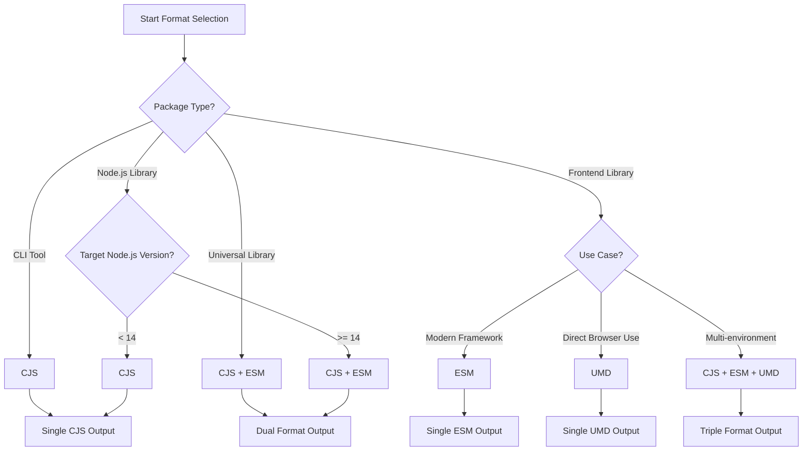

# Build Formats & Configuration Guide

This document provides detailed information about build format selection, build tool configuration, and optimization strategies in the fe-base project, helping developers choose appropriate build solutions for different types of packages.

## 📋 Table of Contents

- [Output Format Details](#output-format-details)
- [Format Selection Strategy](#format-selection-strategy)
- [Build Tool Configuration](#build-tool-configuration)
- [package.json Configuration](#packagejson-configuration)
- [Advanced Configuration Tips](#advanced-configuration-tips)
- [Performance Optimization](#performance-optimization)
- [Best Practices](#best-practices)
- [Common Issues](#common-issues)

## Output Format Details

### Main Module Formats

The fe-base project supports three main output formats, each with specific use cases:

| Format  | Full Name                   | File Extension | Environment         | Features                                   |
| ------- | --------------------------- | -------------- | ------------------- | ------------------------------------------ |
| **CJS** | CommonJS                    | `.cjs`         | Node.js             | Synchronous loading, backward compatible   |
| **ESM** | ES Modules                  | `.mjs`         | Modern environments | Asynchronous loading, tree-shaking support |
| **UMD** | Universal Module Definition | `.umd.js`      | Browser/Node.js     | Universal format, larger bundle size       |

### CommonJS (CJS) Format

#### Features & Advantages

```javascript
// Output example (dist/index.cjs)
'use strict';

Object.defineProperty(exports, '__esModule', { value: true });

const logger = require('@qlover/logger');

function createUtils() {
  return {
    log: logger.log
  };
}

exports.createUtils = createUtils;
```

**Features**:

- ✅ Native Node.js support, no transformation needed
- ✅ Synchronous loading, fast startup
- ✅ Good compatibility, supports all Node.js versions
- ⚠️ No tree-shaking support
- ⚠️ Requires bundler support in browsers

**Use Cases**:

- Node.js server applications
- CLI tools
- Libraries requiring synchronous loading
- Packages compatible with older Node.js versions

#### Build Configuration

```typescript
// tsup.config.ts - CJS configuration
export default defineConfig({
  entry: ['src/index.ts'],
  format: ['cjs'],
  target: 'node18',
  outDir: 'dist',
  outExtension: ({ format }) => ({
    js: format === 'cjs' ? '.cjs' : '.js'
  })
});
```

### ES Modules (ESM) Format

#### Features & Advantages

```javascript
// Output example (dist/index.mjs)
import { log } from '@qlover/logger';

function createUtils() {
  return {
    log
  };
}

export { createUtils };
```

**Features**:

- ✅ Tree-shaking support, reduced bundle size
- ✅ Asynchronous loading, code splitting support
- ✅ Modern JavaScript standard
- ✅ Better static analysis support
- ⚠️ Requires Node.js 14+ or modern browsers
- ⚠️ Some toolchains may not fully support

**Use Cases**:

- Modern frontend applications
- Libraries supporting tree-shaking
- Micro-frontend architecture
- Modern Node.js applications

#### Build Configuration

```typescript
// tsup.config.ts - ESM configuration
export default defineConfig({
  entry: ['src/index.ts'],
  format: ['esm'],
  target: 'es2020',
  outDir: 'dist',
  outExtension: ({ format }) => ({
    js: format === 'esm' ? '.mjs' : '.js'
  })
});
```

### Universal Module Definition (UMD) Format

#### Features & Advantages

```javascript
// Output example (dist/index.umd.js)
(function (global, factory) {
  typeof exports === 'object' && typeof module !== 'undefined'
    ? factory(exports)
    : typeof define === 'function' && define.amd
      ? define(['exports'], factory)
      : ((global = global || self), factory((global.MyLib = {})));
})(this, function (exports) {
  'use strict';

  function createUtils() {
    return { log: console.log };
  }

  exports.createUtils = createUtils;
});
```

**Features**:

- ✅ Compatible with AMD, CommonJS, and global variables
- ✅ Can be used directly in browsers
- ✅ No bundler required
- ⚠️ Larger file size
- ⚠️ No tree-shaking support
- ⚠️ Mainly for library distribution

**Use Cases**:

- Libraries for direct browser use
- Universal libraries supporting multiple module systems
- CDN-distributed packages
- Backward-compatible component libraries

#### Build Configuration

```typescript
// tsup.config.ts - UMD configuration
export default defineConfig({
  entry: ['src/index.ts'],
  format: ['umd'],
  globalName: 'MyLib',
  target: 'es2015',
  outDir: 'dist',
  minify: true
});
```

## Format Selection Strategy

### Decision Flow Chart



### Format Selection for Different Package Types

#### 1. CLI Tool Packages

```json
{
  "main": "dist/index.cjs",
  "bin": {
    "my-cli": "dist/cli.cjs"
  },
  "files": ["dist"]
}
```

**Recommended Format**: CJS
**Reasons**:

- CLI tools need fast startup
- Primarily run in Node.js environment
- No tree-shaking needed

**Build Configuration**:

```typescript
export default defineConfig({
  entry: {
    index: 'src/index.ts',
    cli: 'src/cli.ts'
  },
  format: ['cjs'],
  target: 'node18',
  bundle: true,
  minify: true,
  outExtension: () => ({ js: '.cjs' })
});
```

#### 2. Node.js Library Packages

```json
{
  "main": "dist/index.cjs",
  "module": "dist/index.mjs",
  "exports": {
    ".": {
      "import": "./dist/index.mjs",
      "require": "./dist/index.cjs",
      "types": "./dist/index.d.ts"
    }
  }
}
```

**Recommended Format**: CJS + ESM
**Reasons**:

- Compatible with different Node.js versions
- Supports both modern and traditional import methods
- Allows users to choose appropriate format

**Build Configuration**:

```typescript
export default defineConfig({
  entry: ['src/index.ts'],
  format: ['cjs', 'esm'],
  target: ['node18', 'es2020'],
  dts: true,
  sourcemap: true,
  outExtension: ({ format }) => ({
    js: format === 'cjs' ? '.cjs' : '.mjs'
  })
});
```

#### 3. Frontend Component Libraries

```json
{
  "main": "dist/index.cjs",
  "module": "dist/index.mjs",
  "unpkg": "dist/index.umd.js",
  "exports": {
    ".": {
      "import": "./dist/index.mjs",
      "require": "./dist/index.cjs",
      "types": "./dist/index.d.ts"
    },
    "./style.css": "./dist/style.css"
  }
}
```

**Recommended Format**: CJS + ESM + UMD
**Reasons**:

- ESM supports tree-shaking
- CJS compatible with legacy build tools
- UMD supports direct CDN usage

**Build Configuration**:

```typescript
export default defineConfig([
  // ESM and CJS versions
  {
    entry: ['src/index.ts'],
    format: ['cjs', 'esm'],
    target: 'es2020',
    external: ['react', 'react-dom'],
    dts: true,
    sourcemap: true,
    outExtension: ({ format }) => ({
      js: format === 'cjs' ? '.cjs' : '.mjs'
    })
  },
  // UMD version
  {
    entry: ['src/index.ts'],
    format: ['umd'],
    globalName: 'MyComponents',
    target: 'es2015',
    minify: true,
    outExtension: () => ({ js: '.umd.js' })
  }
]);
```

#### 4. Utility Library Packages

```json
{
  "main": "dist/index.cjs",
  "module": "dist/index.mjs",
  "browser": "dist/index.umd.js",
  "exports": {
    ".": {
      "browser": "./dist/index.umd.js",
      "import": "./dist/index.mjs",
      "require": "./dist/index.cjs",
      "types": "./dist/index.d.ts"
    },
    "./server": {
      "import": "./dist/server.mjs",
      "require": "./dist/server.cjs",
      "types": "./dist/server.d.ts"
    }
  }
}
```

**Recommended Format**: All formats supported
**Reasons**:

- Supports multiple use cases
- Provides maximum compatibility
- Allows on-demand selection

## Build Tool Configuration

### tsup Configuration Details

#### Basic Configuration Template

```typescript
// tsup.config.ts
import { defineConfig } from 'tsup';
import type { Options } from 'tsup';

const baseConfig: Options = {
  entry: ['src/index.ts'],
  clean: true,
  dts: true,
  sourcemap: true,
  treeshake: true,
  splitting: false
};

export default defineConfig([
  // CommonJS version
  {
    ...baseConfig,
    format: ['cjs'],
    target: 'node18',
    outExtension: () => ({ js: '.cjs' })
  },
  // ES Modules version
  {
    ...baseConfig,
    format: ['esm'],
    target: 'es2020',
    outExtension: () => ({ js: '.mjs' })
  }
]);
```

#### Advanced Configuration Options

##### 1. Multiple Entry Points Configuration

```typescript
export default defineConfig({
  entry: {
    index: 'src/index.ts',
    utils: 'src/utils/index.ts',
    cli: 'src/cli.ts'
  },
  format: ['cjs', 'esm'],
  outDir: 'dist'
  // Generate different output files for different entry points
});
```

##### 2. Conditional Build Configuration

```typescript
export default defineConfig((options) => {
  const isProduction = !options.watch;

  return {
    entry: ['src/index.ts'],
    format: ['cjs', 'esm'],
    minify: isProduction,
    sourcemap: !isProduction,
    dts: isProduction
    // Skip type definitions in development for faster builds
  };
});
```

##### 3. External Dependencies Configuration

```typescript
import pkg from './package.json';

export default defineConfig({
  entry: ['src/index.ts'],
  format: ['cjs', 'esm'],
  external: [
    // Exclude all dependencies
    ...Object.keys(pkg.dependencies || {}),
    // Exclude all peerDependencies
    ...Object.keys(pkg.peerDependencies || {}),
    // Exclude Node.js built-in modules
    'fs',
    'path',
    'url',
    'util'
  ]
});
```

##### 4. Code Splitting Configuration

```typescript
export default defineConfig({
  entry: ['src/index.ts'],
  format: ['esm'],
  splitting: true, // Enable code splitting
  target: 'es2020'
  // Only enable splitting for ESM format
});
```

### Rollup Configuration (Advanced Scenarios)

#### Basic Rollup Configuration

```typescript
// rollup.config.ts
import { defineConfig } from 'rollup';
import typescript from '@rollup/plugin-typescript';
import { nodeResolve } from '@rollup/plugin-node-resolve';
import commonjs from '@rollup/plugin-commonjs';
import { terser } from 'rollup-plugin-terser';

export default defineConfig([
  // ESM version
  {
    input: 'src/index.ts',
    output: {
      file: 'dist/index.mjs',
      format: 'esm',
      sourcemap: true
    },
    plugins: [
      nodeResolve(),
      commonjs(),
      typescript({
        declaration: true,
        outDir: 'dist'
      })
    ],
    external: ['react', 'react-dom']
  },
  // UMD version
  {
    input: 'src/index.ts',
    output: {
      file: 'dist/index.umd.js',
      format: 'umd',
      name: 'MyLib',
      globals: {
        react: 'React',
        'react-dom': 'ReactDOM'
      }
    },
    plugins: [nodeResolve(), commonjs(), typescript(), terser()],
    external: ['react', 'react-dom']
  }
]);
```

#### Advanced Rollup Configuration

```typescript
// Support building multiple packages
import { readdirSync } from 'fs';
import { join } from 'path';

const packagesDir = 'packages';
const packages = readdirSync(packagesDir);

export default packages.map((pkg) => ({
  input: join(packagesDir, pkg, 'src/index.ts'),
  output: [
    {
      file: join(packagesDir, pkg, 'dist/index.cjs'),
      format: 'cjs'
    },
    {
      file: join(packagesDir, pkg, 'dist/index.mjs'),
      format: 'esm'
    }
  ],
  plugins: [
    nodeResolve(),
    commonjs(),
    typescript({
      tsconfig: join(packagesDir, pkg, 'tsconfig.json')
    })
  ]
}));
```

### Vite Configuration (Library Mode)

#### Basic Vite Library Configuration

```typescript
// vite.config.ts
import { defineConfig } from 'vite';
import { resolve } from 'path';
import dts from 'vite-plugin-dts';

export default defineConfig({
  build: {
    lib: {
      entry: resolve(__dirname, 'src/index.ts'),
      name: 'MyLib',
      formats: ['es', 'cjs', 'umd'],
      fileName: (format) => {
        switch (format) {
          case 'es':
            return 'index.mjs';
          case 'cjs':
            return 'index.cjs';
          case 'umd':
            return 'index.umd.js';
          default:
            return `index.${format}.js`;
        }
      }
    },
    rollupOptions: {
      external: ['react', 'react-dom'],
      output: {
        globals: {
          react: 'React',
          'react-dom': 'ReactDOM'
        }
      }
    }
  },
  plugins: [
    dts({
      insertTypesEntry: true
    })
  ]
});
```

#### Multi-package Vite Configuration

```typescript
// packages/*/vite.config.ts
import { defineConfig } from 'vite';
import { resolve } from 'path';
import pkg from './package.json';

export default defineConfig({
  build: {
    lib: {
      entry: resolve(__dirname, 'src/index.ts'),
      name: pkg.name.replace('@qlover/', ''),
      formats: ['es', 'cjs']
    },
    rollupOptions: {
      external: Object.keys(pkg.peerDependencies || {})
    }
  }
});
```

## package.json Configuration

### Entry Point Configuration Details

#### 1. Traditional Entry Points

```json
{
  "main": "dist/index.cjs", // CommonJS entry
  "module": "dist/index.mjs", // ES Modules entry
  "browser": "dist/index.umd.js", // Browser entry
  "types": "dist/index.d.ts", // TypeScript type definitions
  "unpkg": "dist/index.umd.js", // CDN entry
  "jsdelivr": "dist/index.umd.js" // CDN entry
}
```

#### 2. Modern exports Configuration

```json
{
  "exports": {
    ".": {
      "types": "./dist/index.d.ts",
      "import": "./dist/index.mjs",
      "require": "./dist/index.cjs",
      "browser": "./dist/index.umd.js"
    },
    "./utils": {
      "types": "./dist/utils.d.ts",
      "import": "./dist/utils.mjs",
      "require": "./dist/utils.cjs"
    },
    "./package.json": "./package.json"
  }
}
```

#### 3. Conditional Exports Configuration

```json
{
  "exports": {
    ".": {
      "node": {
        "import": "./dist/index.node.mjs",
        "require": "./dist/index.node.cjs"
      },
      "browser": {
        "import": "./dist/index.browser.mjs",
        "require": "./dist/index.browser.cjs"
      },
      "default": "./dist/index.mjs"
    }
  }
}
```

#### 4. Complete package.json Configuration Example

```json
{
  "name": "@qlover/my-package",
  "version": "1.0.0",
  "description": "A sample package",
  "keywords": ["utility", "typescript"],
  "main": "dist/index.cjs",
  "module": "dist/index.mjs",
  "types": "dist/index.d.ts",
  "exports": {
    ".": {
      "types": "./dist/index.d.ts",
      "import": "./dist/index.mjs",
      "require": "./dist/index.cjs"
    }
  },
  "files": ["dist", "README.md", "CHANGELOG.md"],
  "engines": {
    "node": ">=18.0.0"
  },
  "sideEffects": false,
  "publishConfig": {
    "access": "public"
  }
}
```

### Important Field Descriptions

#### 1. `sideEffects` Field

```json
{
  // No side effects, supports tree-shaking
  "sideEffects": false,

  // Or specify files with side effects
  "sideEffects": ["dist/polyfills.js", "*.css"]
}
```

#### 2. `engines` Field

```json
{
  "engines": {
    "node": ">=18.0.0", // Minimum Node.js version
    "npm": ">=8.0.0", // Minimum npm version
    "pnpm": ">=8.0.0" // Minimum pnpm version
  }
}
```

#### 3. `files` Field

```json
{
  "files": [
    "dist", // Build artifacts
    "src", // Source code (optional)
    "README.md", // Documentation
    "CHANGELOG.md", // Changelog
    "LICENSE" // License
  ]
}
```

## Advanced Configuration Tips

### Environment-Specific Builds

#### 1. Node.js vs Browser Builds

```typescript
// tsup.config.ts
export default defineConfig([
  // Node.js version
  {
    entry: ['src/index.ts'],
    format: ['cjs', 'esm'],
    platform: 'node',
    target: 'node18',
    outDir: 'dist/node',
    external: ['fs', 'path']
  },
  // Browser version
  {
    entry: ['src/index.browser.ts'],
    format: ['esm', 'umd'],
    platform: 'browser',
    target: 'es2020',
    outDir: 'dist/browser',
    globalName: 'MyLib'
  }
]);
```

#### 2. Development vs Production Builds

```typescript
export default defineConfig((options) => {
  const isDev = options.watch;

  return {
    entry: ['src/index.ts'],
    format: ['cjs', 'esm'],
    minify: !isDev,
    sourcemap: isDev ? 'inline' : true,
    dts: !isDev, // Skip type generation in development
    onSuccess: isDev ? 'echo "Build completed"' : undefined
  };
});
```

### Code Splitting Strategies

#### 1. Manual Code Splitting

```typescript
// src/index.ts
export { default as utils } from './utils';
export { default as helpers } from './helpers';

// Users can import on-demand
import { utils } from 'my-package';
```

#### 2. Dynamic Import Support

```typescript
// tsup.config.ts
export default defineConfig({
  entry: ['src/index.ts'],
  format: ['esm'],
  splitting: true,
  target: 'es2020'
  // Generate multiple chunk files
});
```

### Type Definition Optimization

#### 1. Type Definition Generation Configuration

```typescript
export default defineConfig({
  entry: ['src/index.ts'],
  format: ['cjs', 'esm'],
  dts: {
    resolve: true, // Resolve external types
    only: false, // Generate both JS and .d.ts
    entry: ['src/index.ts', 'src/utils.ts'] // Multiple entry points
  }
});
```

#### 2. Type Definition Separation

```json
{
  "exports": {
    ".": {
      "types": "./dist/types/index.d.ts",
      "import": "./dist/esm/index.mjs",
      "require": "./dist/cjs/index.cjs"
    }
  }
}
```

## Performance Optimization

### Build Performance Optimization

#### 1. Incremental Builds

```typescript
// tsup.config.ts
export default defineConfig({
  entry: ['src/index.ts'],
  format: ['cjs', 'esm'],
  watch: process.env.NODE_ENV === 'development'
  // Enable watch mode in development
});
```

#### 2. Parallel Builds

```bash
# package.json
{
  "scripts": {
    "build": "run-p build:*",
    "build:cjs": "tsup --format cjs",
    "build:esm": "tsup --format esm",
    "build:types": "tsc --emitDeclarationOnly"
  }
}
```

#### 3. Cache Optimization

```typescript
export default defineConfig({
  entry: ['src/index.ts'],
  format: ['cjs', 'esm'],
  // Enable esbuild cache
  esbuildOptions: (options) => {
    options.cache = true;
  }
});
```

### Output Optimization

#### 1. File Size Optimization

```typescript
export default defineConfig([
  // Development version
  {
    entry: ['src/index.ts'],
    format: ['esm'],
    minify: false,
    outExtension: () => ({ js: '.development.mjs' })
  },
  // Production version
  {
    entry: ['src/index.ts'],
    format: ['esm'],
    minify: true,
    outExtension: () => ({ js: '.production.mjs' })
  }
]);
```

#### 2. Tree-shaking Optimization

```typescript
// Ensure code supports tree-shaking
export default defineConfig({
  entry: ['src/index.ts'],
  format: ['esm'],
  treeshake: true,
  // Mark as side-effect free
  esbuildOptions: (options) => {
    options.treeShaking = true;
  }
});
```

## Best Practices

### Build Configuration Best Practices

#### 1. Unified Configuration Template

```typescript
// scripts/build-config.ts
import { defineConfig, type Options } from 'tsup';
import pkg from '../package.json';

export function createBuildConfig(options: Partial<Options> = {}): Options {
  return {
    entry: ['src/index.ts'],
    format: ['cjs', 'esm'],
    target: ['node18', 'es2020'],
    dts: true,
    sourcemap: true,
    clean: true,
    external: Object.keys(pkg.peerDependencies || {}),
    outExtension: ({ format }) => ({
      js: format === 'cjs' ? '.cjs' : '.mjs'
    }),
    ...options
  };
}
```

#### 2. Package Type-Specific Configuration

```typescript
// packages/cli/tsup.config.ts
import { createBuildConfig } from '../../scripts/build-config';

export default defineConfig(
  createBuildConfig({
    format: ['cjs'],
    bundle: true,
    minify: true,
    outExtension: () => ({ js: '.cjs' })
  })
);
```

#### 3. Environment Variable Configuration

```typescript
export default defineConfig({
  entry: ['src/index.ts'],
  format: ['cjs', 'esm'],
  env: {
    NODE_ENV: 'production',
    PACKAGE_VERSION: process.env.npm_package_version
  }
});
```

### Publishing Configuration Best Practices

#### 1. Pre-publish Validation

```json
{
  "scripts": {
    "prepublishOnly": "pnpm build && pnpm test",
    "prepack": "clean-package",
    "postpack": "clean-package restore"
  }
}
```

#### 2. File Inclusion Strategy

```json
{
  "files": [
    "dist",
    "!dist/**/*.test.*",
    "!dist/**/*.spec.*",
    "README.md",
    "CHANGELOG.md"
  ]
}
```

#### 3. Version Compatibility Identification

```json
{
  "engines": {
    "node": ">=18.0.0"
  },
  "browserslist": ["> 1%", "last 2 versions", "not dead"]
}
```

## Common Issues

### Build Configuration Issues

#### Q: Built files cannot be imported correctly

**Cause**: Incorrect entry point configuration or format mismatch

**Solution**:

```json
{
  "main": "dist/index.cjs",
  "module": "dist/index.mjs",
  "exports": {
    ".": {
      "import": "./dist/index.mjs",
      "require": "./dist/index.cjs",
      "types": "./dist/index.d.ts"
    }
  }
}
```

#### Q: TypeScript type definitions missing

**Cause**: Type definition files not generated or configured

**Solution**:

```typescript
// tsup.config.ts
export default defineConfig({
  entry: ['src/index.ts'],
  format: ['cjs', 'esm'],
  dts: true, // Generate type definitions
  // or
  dts: {
    entry: ['src/index.ts'],
    resolve: true
  }
});
```

### Format Compatibility Issues

#### Q: ESM modules cannot be used in CommonJS environment

**Cause**: No CommonJS format build artifacts provided

**Solution**:

```typescript
export default defineConfig([
  {
    entry: ['src/index.ts'],
    format: ['cjs'],
    outExtension: () => ({ js: '.cjs' })
  },
  {
    entry: ['src/index.ts'],
    format: ['esm'],
    outExtension: () => ({ js: '.mjs' })
  }
]);
```

#### Q: UMD format errors in browser

**Cause**: Global variable name conflicts or incorrect external dependency configuration

**Solution**:

```typescript
export default defineConfig({
  entry: ['src/index.ts'],
  format: ['umd'],
  globalName: 'MyUniqueLibName', // Use unique global variable name
  external: ['react'],
  esbuildOptions: (options) => {
    options.globalName = 'MyUniqueLibName';
  }
});
```

### Performance Issues

#### Q: Build speed is very slow

**Cause**: Not utilizing cache or parallel builds

**Solution**:

```typescript
export default defineConfig({
  entry: ['src/index.ts'],
  format: ['cjs', 'esm'],
  // Enable cache
  esbuildOptions: (options) => {
    options.cache = true;
  }
});
```

```json
{
  "scripts": {
    "build": "run-p build:cjs build:esm",
    "build:cjs": "tsup --format cjs",
    "build:esm": "tsup --format esm"
  }
}
```

#### Q: Build artifacts too large

**Cause**: Not enabling tree-shaking or including unnecessary dependencies

**Solution**:

```typescript
export default defineConfig({
  entry: ['src/index.ts'],
  format: ['esm'],
  treeshake: true,
  minify: true,
  external: ['lodash', 'react'] // Externalize large dependencies
});
```

```json
{
  "sideEffects": false // Mark as side-effect free
}
```

## �� Related Documents

- [Project Build System](./project-build-system.md) - Learn about build system architecture
- [Dependency Management Strategy](./dependency-management.md) - Learn about dependency management
- [Build Guide Homepage](./index.md) - Return to guide homepage

## 🔗 External Resources

- [tsup Official Documentation](https://tsup.egoist.dev/)
- [Rollup Official Documentation](https://rollupjs.org/)
- [Vite Library Mode Documentation](https://vitejs.dev/guide/build.html#library-mode)
- [Node.js ES Modules Documentation](https://nodejs.org/api/esm.html)

---

_Correct packaging configuration is the key to successful library release. Choose the appropriate format based on use case and provide the best development experience._

## 🌐 Other Language Versions

- **[🇺🇸 English](../../en/builder-guide/build-formats-config.md)** - English version of this document
- **[🏠 Return Homepage](../index.md)** - Return to Chinese document homepage
