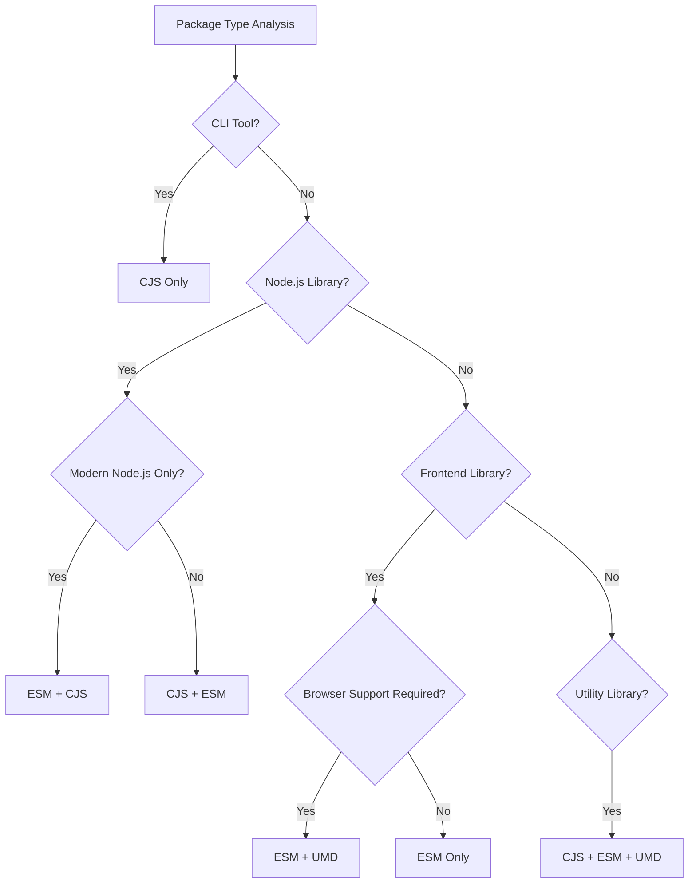

# Build Formats & Configuration

This document provides comprehensive guidance on packaging format selection and build configuration for the fe-base project, covering output format choices, build tool configuration, package.json setup, and optimization strategies.

## 📋 Table of Contents

- [Output Format Details](#output-format-details)
- [Format Selection Strategy](#format-selection-strategy)
- [Build Tool Configuration](#build-tool-configuration)
- [package.json Configuration](#packagejson-configuration)
- [Advanced Configuration Techniques](#advanced-configuration-techniques)
- [Performance Optimization](#performance-optimization)
- [Best Practices](#best-practices)
- [Common Questions](#common-questions)

## Output Format Details

The fe-base project supports three main output formats, each serving different use cases and environments.

### CommonJS (CJS)

#### Characteristics
- **Extension**: `.js` or `.cjs`
- **Module System**: `require()` / `module.exports`
- **Environment**: Node.js native support
- **Loading**: Synchronous
- **Compatibility**: Excellent with older Node.js versions

#### Use Cases
```typescript
// Input: src/index.ts
export function hello(name: string) {
  return `Hello, ${name}!`;
}

// Output: dist/index.js (CJS)
"use strict";
Object.defineProperty(exports, "__esModule", { value: true });
exports.hello = void 0;
function hello(name) {
    return `Hello, ${name}!`;
}
exports.hello = hello;
```

**Best for**:
- ✅ Node.js libraries and tools
- ✅ CLI applications
- ✅ Server-side applications
- ✅ Legacy Node.js environment support

### ES Modules (ESM)

#### Characteristics
- **Extension**: `.mjs` or `.js` (with `"type": "module"`)
- **Module System**: `import` / `export`
- **Environment**: Modern browsers and Node.js 14+
- **Loading**: Asynchronous, supports lazy loading
- **Tree-shaking**: Excellent support

#### Use Cases
```typescript
// Input: src/index.ts
export function hello(name: string) {
  return `Hello, ${name}!`;
}

// Output: dist/index.mjs (ESM)
function hello(name) {
    return `Hello, ${name}!`;
}

export { hello };
```

**Best for**:
- ✅ Modern web applications
- ✅ Libraries requiring tree-shaking
- ✅ Frontend frameworks (React, Vue, etc.)
- ✅ Modern Node.js applications

### Universal Module Definition (UMD)

#### Characteristics
- **Extension**: `.umd.js`
- **Module System**: Compatible with AMD, CommonJS, and global variables
- **Environment**: Browsers, Node.js, AMD loaders
- **Loading**: Synchronous
- **Size**: Larger due to compatibility wrapper

#### Use Cases
```typescript
// Input: src/index.ts
export function hello(name: string) {
  return `Hello, ${name}!`;
}

// Output: dist/index.umd.js (UMD)
(function (global, factory) {
    typeof exports === 'object' && typeof module !== 'undefined' ? factory(exports) :
    typeof define === 'function' && define.amd ? define(['exports'], factory) :
    (global = typeof globalThis !== 'undefined' ? globalThis : global || self, factory(global.MyLib = {}));
})(this, (function (exports) {
    'use strict';

    function hello(name) {
        return `Hello, ${name}!`;
    }

    exports.hello = hello;
}));
```

**Best for**:
- ✅ Browser libraries (CDN distribution)
- ✅ Libraries requiring maximum compatibility
- ✅ Legacy browser support
- ✅ Direct `<script>` tag usage

## Format Selection Strategy

### Decision Flowchart



### Package Type Recommendations

#### 1. CLI Tools
```json
{
  "name": "@qlover/fe-scripts",
  "main": "./dist/index.js",
  "bin": {
    "fe-scripts": "./dist/cli.js"
  }
}
```

**Recommended Formats**: CJS only
**Reasoning**: 
- CLI tools run in Node.js environment
- CJS has better compatibility with older Node.js versions
- Smaller bundle size without ESM wrapper

**tsup Configuration**:
```typescript
export default defineConfig({
  entry: ['src/index.ts', 'src/cli.ts'],
  format: ['cjs'],
  target: 'node18',
  bundle: true,
  minify: true,
  sourcemap: false
});
```

#### 2. Node.js Libraries
```json
{
  "name": "@qlover/logger",
  "main": "./dist/index.js",
  "module": "./dist/index.mjs",
  "exports": {
    ".": {
      "import": "./dist/index.mjs",
      "require": "./dist/index.js"
    }
  }
}
```

**Recommended Formats**: CJS + ESM
**Reasoning**:
- CJS for compatibility with existing Node.js projects
- ESM for modern projects and better tree-shaking
- Dual package support

**tsup Configuration**:
```typescript
export default defineConfig({
  entry: ['src/index.ts'],
  format: ['cjs', 'esm'],
  target: ['node18', 'es2020'],
  dts: true,
  sourcemap: true,
  clean: true
});
```

#### 3. Frontend Libraries
```json
{
  "name": "@qlover/fe-corekit",
  "main": "./dist/index.js",
  "module": "./dist/index.mjs",
  "unpkg": "./dist/index.umd.js",
  "exports": {
    ".": {
      "import": "./dist/index.mjs",
      "require": "./dist/index.js"
    }
  }
}
```

**Recommended Formats**: ESM + UMD (+ CJS if Node.js support needed)
**Reasoning**:
- ESM for modern bundlers and tree-shaking
- UMD for direct browser usage and CDN
- CJS if Node.js SSR support is required

**tsup Configuration**:
```typescript
export default defineConfig([
  // ESM and CJS
  {
    entry: ['src/index.ts'],
    format: ['esm', 'cjs'],
    target: 'es2020',
    dts: true,
    sourcemap: true
  },
  // UMD
  {
    entry: ['src/index.ts'],
    format: ['umd'],
    target: 'es2015',
    globalName: 'FeCorekit',
    minify: true
  }
]);
```

#### 4. Utility Libraries
```json
{
  "name": "@qlover/env-loader",
  "main": "./dist/index.js",
  "module": "./dist/index.mjs",
  "unpkg": "./dist/index.umd.js",
  "exports": {
    ".": {
      "import": "./dist/index.mjs",
      "require": "./dist/index.js",
      "browser": "./dist/index.umd.js"
    }
  }
}
```

**Recommended Formats**: CJS + ESM + UMD
**Reasoning**:
- Maximum compatibility across all environments
- Utility libraries often used in various contexts
- Small size makes multiple formats acceptable

## Build Tool Configuration

### tsup Configuration Examples

#### Basic Configuration
```typescript
// tsup.config.ts
import { defineConfig } from 'tsup';

export default defineConfig({
  entry: ['src/index.ts'],
  format: ['cjs', 'esm'],
  target: 'es2020',
  bundle: true,
  minify: true,
  sourcemap: false
});
```

#### Multi-Entry Configuration
```typescript
export default defineConfig({
  entry: {
    index: 'src/index.ts',
    cli: 'src/cli.ts',
    utils: 'src/utils/index.ts'
  },
  format: ['cjs', 'esm'],
  target: 'node18',
  dts: true,
  sourcemap: true,
  clean: true,
  outDir: 'dist'
});
```

#### Conditional Configuration
```typescript
export default defineConfig((options) => ({
  entry: ['src/index.ts'],
  format: ['cjs', 'esm'],
  target: 'es2020',
  dts: true,
  sourcemap: !options.watch, // No sourcemap in watch mode
  minify: !!process.env.NODE_ENV === 'production',
  clean: true
}));
```

#### External Dependencies Configuration
```typescript
import pkg from './package.json';

export default defineConfig({
  entry: ['src/index.ts'],
  format: ['cjs', 'esm'],
  external: [
    // Externalize all dependencies
    ...Object.keys(pkg.dependencies || {}),
    // Externalize peer dependencies
    ...Object.keys(pkg.peerDependencies || {}),
    // Node.js built-ins
    'fs', 'path', 'util'
  ],
  dts: true,
  sourcemap: true,
  clean: true
});
```

#### Code Splitting Configuration
```typescript
export default defineConfig({
  entry: ['src/index.ts'],
  format: ['esm'],
  target: 'es2020',
  splitting: true,
  chunk: ['vendor'],
  dts: true,
  sourcemap: true,
  clean: true,
  outDir: 'dist'
});
```

### Rollup Configuration for Advanced Cases

When tsup doesn't meet advanced requirements, use Rollup directly:

```typescript
// rollup.config.js
import typescript from '@rollup/plugin-typescript';
import resolve from '@rollup/plugin-node-resolve';
import commonjs from '@rollup/plugin-commonjs';
import { terser } from 'rollup-plugin-terser';

export default [
  // ESM build
  {
    input: 'src/index.ts',
    output: {
      file: 'dist/index.mjs',
      format: 'esm',
      sourcemap: true
    },
    plugins: [
      resolve(),
      commonjs(),
      typescript({
        tsconfig: './tsconfig.json'
      })
    ],
    external: ['react', 'react-dom']
  },
  // UMD build
  {
    input: 'src/index.ts',
    output: {
      file: 'dist/index.umd.js',
      format: 'umd',
      name: 'MyLibrary',
      globals: {
        react: 'React',
        'react-dom': 'ReactDOM'
      }
    },
    plugins: [
      resolve(),
      commonjs(),
      typescript({
        tsconfig: './tsconfig.json'
      }),
      terser()
    ],
    external: ['react', 'react-dom']
  }
];
```

### Vite Configuration for Libraries

```typescript
// vite.config.ts
import { defineConfig } from 'vite';
import { resolve } from 'path';
import dts from 'vite-plugin-dts';

export default defineConfig({
  build: {
    lib: {
      entry: resolve(__dirname, 'src/index.ts'),
      name: 'MyLibrary',
      formats: ['es', 'cjs', 'umd'],
      fileName: (format) => `index.${format}.js`
    },
    rollupOptions: {
      external: ['react', 'react-dom'],
      output: {
        globals: {
          react: 'React',
          'react-dom': 'ReactDOM'
        }
      }
    },
    sourcemap: true,
    minify: 'terser'
  },
  plugins: [
    dts({
      insertTypesEntry: true
    })
  ]
});
```

## package.json Configuration

### Traditional Entry Points

#### Basic Configuration
```json
{
  "name": "@qlover/my-package",
  "version": "1.0.0",
  "main": "./dist/index.js",
  "module": "./dist/index.mjs",
  "types": "./dist/index.d.ts",
  "files": [
    "dist",
    "README.md"
  ]
}
```

#### CLI Package Configuration
```json
{
  "name": "@qlover/fe-scripts",
  "version": "1.0.0",
  "main": "./dist/index.js",
  "bin": {
    "fe-scripts": "./dist/cli.js"
  },
  "types": "./dist/index.d.ts",
  "files": [
    "dist",
    "bin"
  ]
}
```

### Modern Exports Configuration

#### Dual Package (CJS + ESM)
```json
{
  "name": "@qlover/logger",
  "version": "1.0.0",
  "type": "commonjs",
  "main": "./dist/index.js",
  "module": "./dist/index.mjs",
  "types": "./dist/index.d.ts",
  "exports": {
    ".": {
      "types": "./dist/index.d.ts",
      "import": "./dist/index.mjs",
      "require": "./dist/index.js"
    }
  }
}
```

#### Multi-Entry Exports
```json
{
  "name": "@qlover/fe-corekit",
  "version": "1.0.0",
  "exports": {
    ".": {
      "types": "./dist/index.d.ts",
      "import": "./dist/index.mjs",
      "require": "./dist/index.js"
    },
    "./utils": {
      "types": "./dist/utils.d.ts",
      "import": "./dist/utils.mjs",
      "require": "./dist/utils.js"
    },
    "./components": {
      "types": "./dist/components.d.ts",
      "import": "./dist/components.mjs",
      "require": "./dist/components.js"
    }
  }
}
```

#### Conditional Exports
```json
{
  "name": "@qlover/universal-lib",
  "version": "1.0.0",
  "exports": {
    ".": {
      "types": "./dist/index.d.ts",
      "browser": "./dist/index.umd.js",
      "import": "./dist/index.mjs",
      "require": "./dist/index.js",
      "default": "./dist/index.js"
    }
  }
}
```

#### Development and Production Builds
```json
{
  "name": "@qlover/dev-prod-lib",
  "version": "1.0.0",
  "exports": {
    ".": {
      "types": "./dist/index.d.ts",
      "development": {
        "import": "./dist/index.dev.mjs",
        "require": "./dist/index.dev.js"
      },
      "production": {
        "import": "./dist/index.prod.mjs",
        "require": "./dist/index.prod.js"
      },
      "import": "./dist/index.mjs",
      "require": "./dist/index.js"
    }
  }
}
```

### TypeScript Configuration

#### Basic TypeScript Support
```json
{
  "name": "@qlover/typed-lib",
  "version": "1.0.0",
  "main": "./dist/index.js",
  "module": "./dist/index.mjs",
  "types": "./dist/index.d.ts",
  "typesVersions": {
    "*": {
      "*": ["./dist/*"]
    }
  }
}
```

#### Multiple Type Entry Points
```json
{
  "name": "@qlover/multi-typed-lib",
  "version": "1.0.0",
  "exports": {
    ".": {
      "types": "./dist/index.d.ts",
      "import": "./dist/index.mjs",
      "require": "./dist/index.js"
    },
    "./utils": {
      "types": "./dist/utils.d.ts",
      "import": "./dist/utils.mjs",
      "require": "./dist/utils.js"
    }
  },
  "typesVersions": {
    "*": {
      "utils": ["./dist/utils.d.ts"]
    }
  }
}
```

## Advanced Configuration Techniques

### Environment-Specific Builds

#### Development vs Production
```typescript
// tsup.config.ts
export default defineConfig((options) => [
  // Development build
  {
    entry: ['src/index.ts'],
    format: ['cjs', 'esm'],
    target: 'es2020',
    dts: true,
    sourcemap: true,
    clean: true,
    define: {
      __DEV__: 'true',
      'process.env.NODE_ENV': '"development"'
    },
    outDir: 'dist/dev'
  },
  // Production build
  {
    entry: ['src/index.ts'],
    format: ['cjs', 'esm'],
    target: 'es2020',
    dts: true,
    minify: true,
    define: {
      __DEV__: 'false',
      'process.env.NODE_ENV': '"production"'
    },
    outDir: 'dist/prod'
  }
]);
```

### Platform-Specific Builds

#### Browser vs Node.js
```typescript
export default defineConfig([
  // Node.js build
  {
    entry: ['src/index.ts'],
    format: ['cjs', 'esm'],
    platform: 'node',
    target: 'node18',
    external: ['fs', 'path', 'util'],
    outDir: 'dist/node'
  },
  // Browser build
  {
    entry: ['src/index.ts'],
    format: ['esm', 'umd'],
    platform: 'browser',
    target: 'es2020',
    globalName: 'MyLib',
    outDir: 'dist/browser'
  }
]);
```

### Build Performance Optimization

#### Incremental Builds
```typescript
export default defineConfig({
  entry: ['src/index.ts'],
  format: ['cjs', 'esm'],
  target: 'es2020',
  dts: true,
  sourcemap: true,
  clean: false, // Don't clean for incremental builds
  watch: process.env.NODE_ENV === 'development',
  onSuccess: async () => {
    console.log('Build completed successfully!');
  }
});
```

#### Parallel Builds
```typescript
// Use multiple configurations for parallel builds
export default defineConfig([
  // Fast CJS build
  {
    entry: ['src/index.ts'],
    format: ['cjs'],
    target: 'node18',
    outDir: 'dist/cjs'
  },
  // ESM build with optimizations
  {
    entry: ['src/index.ts'],
    format: ['esm'],
    target: 'es2020',
    splitting: true,
    treeshake: true,
    outDir: 'dist/esm'
  }
]);
```

### Build Caching Strategies

#### Using esbuild Cache
```typescript
export default defineConfig({
  entry: ['src/index.ts'],
  format: ['cjs', 'esm'],
  target: 'es2020',
  esbuildOptions: (options) => {
    options.metafile = true;
    options.write = false;
  },
  plugins: [
    {
      name: 'cache-plugin',
      buildEnd(error) {
        if (!error) {
          // Save build metadata for caching
          console.log('Build cache updated');
        }
      }
    }
  ]
});
```

## Performance Optimization

### Bundle Size Optimization

#### Tree-shaking Configuration
```typescript
export default defineConfig({
  entry: ['src/index.ts'],
  format: ['esm'],
  target: 'es2020',
  treeshake: {
    preset: 'recommended',
    moduleSideEffects: false
  },
  dts: true,
  sourcemap: true
});
```

#### Code Splitting
```typescript
export default defineConfig({
  entry: {
    index: 'src/index.ts',
    utils: 'src/utils/index.ts',
    components: 'src/components/index.ts'
  },
  format: ['esm'],
  target: 'es2020',
  splitting: true,
  chunk: ['shared'],
  dts: true
});
```

### Build Speed Optimization

#### Selective Builds
```typescript
// package.json scripts
{
  "scripts": {
    "build": "tsup",
    "build:fast": "tsup --format cjs --no-dts",
    "build:types": "tsup --dts-only",
    "build:watch": "tsup --watch"
  }
}
```

#### Parallel Processing
```bash
# Use pnpm for parallel builds across packages
pnpm -r --parallel run build

# Use nx for intelligent builds
pnpm nx run-many --target=build --all --parallel
```

### Runtime Performance

#### Optimized Output
```typescript
export default defineConfig({
  entry: ['src/index.ts'],
  format: ['esm', 'cjs'],
  target: 'es2020',
  minify: true,
  minifyIdentifiers: true,
  minifySyntax: true,
  minifyWhitespace: true,
  treeShaking: true
});
```

## Best Practices

### Build Configuration Templates

#### 1. Library Package Template
```typescript
// tsup.config.ts
import { defineConfig } from 'tsup';
import pkg from './package.json';

export default defineConfig({
  entry: ['src/index.ts'],
  format: ['cjs', 'esm'],
  target: ['node18', 'es2020'],
  external: Object.keys(pkg.peerDependencies || {}),
  dts: true,
  sourcemap: true,
  clean: true,
  treeshake: true
});
```

#### 2. CLI Tool Template
```typescript
export default defineConfig({
  entry: ['src/index.ts', 'src/cli.ts'],
  format: ['cjs'],
  target: 'node18',
  bundle: true,
  minify: process.env.NODE_ENV === 'production',
  sourcemap: false,
  clean: true,
  shims: true // Add Node.js shims
});
```

#### 3. Universal Library Template
```typescript
export default defineConfig([
  // ESM and CJS for bundlers
  {
    entry: ['src/index.ts'],
    format: ['esm', 'cjs'],
    target: 'es2020',
    external: ['react', 'react-dom'],
    dts: true,
    sourcemap: true,
    clean: true
  },
  // UMD for browsers
  {
    entry: ['src/index.ts'],
    format: ['umd'],
    target: 'es2015',
    globalName: 'MyLib',
    minify: true,
    external: ['react', 'react-dom']
  }
]);
```

### Unified Build Configuration

#### Root Level Configuration
```typescript
// tools/tsup.base.config.ts
import { defineConfig } from 'tsup';
import type { Options } from 'tsup';

export const createBaseConfig = (options: Partial<Options> = {}): Options => ({
  target: 'es2020',
  dts: true,
  sourcemap: true,
  clean: true,
  treeshake: true,
  ...options
});

// Package specific configuration
// packages/logger/tsup.config.ts
import { createBaseConfig } from '../../tools/tsup.base.config';

export default defineConfig(
  createBaseConfig({
    entry: ['src/index.ts'],
    format: ['cjs', 'esm']
  })
);
```

### Environment-Specific Optimization

#### Development Optimization
```typescript
export default defineConfig((options) => ({
  entry: ['src/index.ts'],
  format: ['cjs', 'esm'],
  target: 'es2020',
  dts: !options.watch, // Skip types in watch mode
  sourcemap: true,
  clean: !options.watch,
  minify: false,
  splitting: false
}));
```

#### Production Optimization
```typescript
export default defineConfig({
  entry: ['src/index.ts'],
  format: ['cjs', 'esm'],
  target: 'es2020',
  dts: true,
  sourcemap: true,
  clean: true,
  minify: true,
  treeshake: true,
  splitting: true
});
```

## Common Questions

### Format Compatibility Issues

#### Q: "Cannot use import statement outside a module"
**Cause**: Trying to use ESM in a CommonJS environment

**Solution**:
```json
// Option 1: Add type: "module" to package.json
{
  "type": "module"
}

// Option 2: Use .mjs extension
{
  "exports": {
    ".": {
      "import": "./dist/index.mjs",
      "require": "./dist/index.js"
    }
  }
}

// Option 3: Configure tsup for dual output
export default defineConfig({
  format: ['cjs', 'esm'],
  outExtension({ format }) {
    return {
      js: format === 'esm' ? '.mjs' : '.js'
    };
  }
});
```

#### Q: "require() of ES modules is not supported"
**Cause**: Trying to require an ESM-only module

**Solution**:
```typescript
// Ensure CJS output is available
export default defineConfig({
  entry: ['src/index.ts'],
  format: ['cjs', 'esm'], // Include both formats
  target: 'node18'
});

// Or use dynamic import in CJS
const myModule = await import('esm-only-module');
```

### Build Configuration Issues

#### Q: Types not generated correctly
**Cause**: TypeScript configuration or tsup settings issue

**Solution**:
```typescript
// 1. Ensure dts is enabled
export default defineConfig({
  dts: true, // Enable type generation
  dts: {
    resolve: true // Resolve external types
  }
});

// 2. Check tsconfig.json
{
  "compilerOptions": {
    "declaration": true,
    "declarationMap": true,
    "outDir": "./dist"
  }
}

// 3. Verify package.json exports
{
  "exports": {
    ".": {
      "types": "./dist/index.d.ts", // Types first
      "import": "./dist/index.mjs",
      "require": "./dist/index.js"
    }
  }
}
```

#### Q: External dependencies being bundled
**Cause**: Dependencies not properly configured as external

**Solution**:
```typescript
import pkg from './package.json';

export default defineConfig({
  external: [
    // All dependencies
    ...Object.keys(pkg.dependencies || {}),
    // All peer dependencies
    ...Object.keys(pkg.peerDependencies || {}),
    // Node.js built-ins
    'fs', 'path', 'util', 'url'
  ]
});
```

### Performance Issues

#### Q: Slow build times
**Cause**: Inefficient build configuration or large dependency tree

**Solution**:
```typescript
// 1. Use incremental builds
export default defineConfig({
  clean: false, // Don't clean every time
  watch: process.env.NODE_ENV === 'development'
});

// 2. Selective builds for development
export default defineConfig((options) => ({
  dts: !options.watch, // Skip types in watch mode
  sourcemap: !options.watch, // Skip sourcemaps in watch mode
  minify: false // Skip minification in development
}));

// 3. Use parallel builds
// package.json
{
  "scripts": {
    "build": "pnpm -r --parallel run build"
  }
}
```

#### Q: Large bundle sizes
**Cause**: Unnecessary dependencies or inefficient bundling

**Solution**:
```bash
# 1. Analyze bundle
npm pack --dry-run

# 2. Check what's being bundled
npx esbuild-visualizer

# 3. Optimize configuration
export default defineConfig({
  treeshake: true,
  minify: true,
  external: ['large-dependency']
});
```

## 📚 Related Documentation

- [Project Build System](./project-build-system.md) - Learn about build system architecture
- [Dependency Management](./dependency-management.md) - Learn about dependency strategies
- [Build Guide Index](./index.md) - Return to guide home

## 🔗 External Resources

- [tsup Documentation](https://tsup.egoist.dev/)
- [Rollup.js Guide](https://rollupjs.org/guide/en/)
- [Package.json Exports](https://nodejs.org/api/packages.html#exports)
- [Node.js ES Modules](https://nodejs.org/api/esm.html)

---

*Proper build configuration is crucial for package usability and performance. Choose formats based on your target environment and user needs.* 