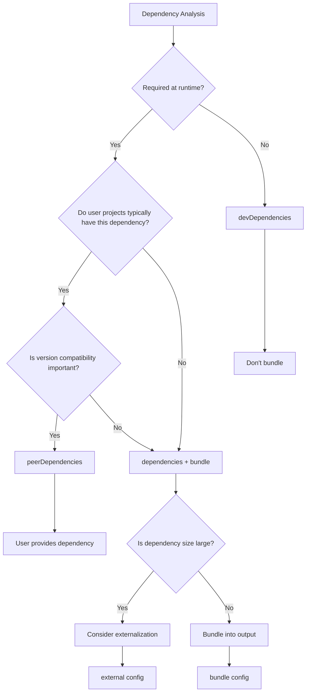

# Dependency Management Strategy

This document provides a comprehensive guide to dependency management strategies in the fe-base project, including dependency type selection, local package management, dependency bundling decisions, and best practices.

## 📋 Table of Contents

- [Dependency Types Explained](#dependency-types-explained)
- [Local Package Dependency Management](#local-package-dependency-management)
- [Dependency Bundling Strategy](#dependency-bundling-strategy)
- [Dependency Version Management](#dependency-version-management)
- [Dependency Security & Optimization](#dependency-security--optimization)
- [Best Practices](#best-practices)
- [Common Issues](#common-issues)

## Dependency Types Explained

### Quick Reference

| Dependency Type    | User Package Install            | Dev Environment  | Production Environment | Typical Usage              |
| ------------------ | ------------------------------- | ---------------- | ---------------------- | -------------------------- |
| `dependencies`     | ✅ Auto-installed               | ✅ Installed     | ✅ Installed           | Runtime libraries          |
| `devDependencies`  | ❌ Not installed                | ✅ Installed     | ❌ Not installed       | Build tools, testing       |
| `peerDependencies` | ❌ Not installed, shows warning | ❌ Not installed | ❌ Not installed       | Frameworks like React, Vue |

### npm Installation Behavior Explained

#### What happens when users install a package?

Suppose a user wants to install a package `my-awesome-package`:

```json
// my-awesome-package/package.json
{
  "name": "my-awesome-package",
  "dependencies": {
    "lodash": "^4.17.21",
    "axios": "^1.6.0"
  },
  "devDependencies": {
    "typescript": "^5.0.0",
    "tsup": "^8.0.0"
  },
  "peerDependencies": {
    "react": ">=16.8.0"
  }
}
```

#### npm install Installation Behavior

```bash
# User executes: npm install my-awesome-package
```

**Dependencies that will be auto-installed**:

```
node_modules/
├── my-awesome-package/ # Main package
├── lodash/ # ✅ dependencies - auto-installed
├── axios/ # ✅ dependencies - auto-installed
└── (other transitive dependencies...)
```

**Dependencies that will NOT be installed**:

```
❌ typescript  (devDependencies - users don't need this)
❌ tsup        (devDependencies - users don't need this)
❌ react       (peerDependencies - users need to install manually)
```

**peerDependencies Warning**:

```bash
npm WARN peerDependencies my-awesome-package@1.0.0 requires a peer of react@>=16.8.0 but none is installed.
```

#### Installation Scenario Comparison

| Installation Scenario      | dependencies      | devDependencies  | peerDependencies                |
| -------------------------- | ----------------- | ---------------- | ------------------------------- |
| **User installs package**  | ✅ Auto-installed | ❌ Not installed | ❌ Not installed, shows warning |
| **Developer development**  | ✅ Installed      | ✅ Installed     | ❌ Not installed, shows warning |
| **Production environment** | ✅ Installed      | ❌ Not installed | ❌ Not installed                |

```bash
# Developer in package directory
npm install                 # Installs dependencies + devDependencies
npm install --production    # Only installs dependencies

# User installs package
npm install my-package      # Only installs dependencies
```

### dependencies (Production Dependencies)

#### Definition & Characteristics

```json
{
  "dependencies": {
    "@qlover/logger": "workspace:*",
    "lodash": "^4.17.21",
    "axios": "^1.6.0"
  }
}
```

**Characteristics**:

- ✅ **User installation**: Automatically installed to user's `node_modules`
- ✅ **Development environment**: Always installed
- ✅ **Production environment**: Always installed (`npm install --production`)
- ✅ **Use case**: Runtime-required dependencies

#### Use Cases

**1. Runtime-required utility libraries**

```typescript
// packages/fe-corekit/src/utils.ts
import { merge } from 'lodash'; // Required at runtime
import { request } from 'axios'; // Required at runtime

export function mergeConfig(config: any) {
  return merge(defaultConfig, config);
}
```

**2. Local package dependencies**

```json
{
  "dependencies": {
    "@qlover/logger": "workspace:*" // Local package dependency
  }
}
```

**3. Core functionality dependencies**

```typescript
// Core dependencies for CLI tools
import { Command } from 'commander';
import chalk from 'chalk';

// These are essential for CLI tool operation
```

#### Decision Criteria

Criteria for placing dependencies in `dependencies`:

- ✅ Code contains `import` or `require` statements
- ✅ Must exist at runtime
- ✅ Users need this dependency when using the package
- ✅ Dependency size is acceptable

### devDependencies (Development Dependencies)

#### Definition & Characteristics

```json
{
  "devDependencies": {
    "@types/node": "^20.0.0",
    "typescript": "~5.4.5",
    "tsup": "^8.4.0",
    "vitest": "^2.1.8",
    "eslint": "^8.57.0"
  }
}
```

**Characteristics**:

- ❌ **User installation**: Not installed (users don't need these tools)
- ✅ **Development environment**: Installed (`npm install`)
- ❌ **Production environment**: Not installed (`npm install --production`)
- ✅ **Use case**: Build, testing, development tools

#### Use Cases

**1. Build tools**

```json
{
  "devDependencies": {
    "tsup": "^8.4.0", // TypeScript build tool
    "rollup": "^4.24.2", // Module bundler
    "vite": "^6.1.0" // Development server
  }
}
```

**2. Type definitions**

```json
{
  "devDependencies": {
    "@types/node": "^20.0.0", // Node.js type definitions
    "@types/lodash": "^4.14.0" // lodash type definitions
  }
}
```

**3. Testing frameworks**

```json
{
  "devDependencies": {
    "vitest": "^2.1.8", // Testing framework
    "@vitest/ui": "^2.1.8", // Testing UI
    "jsdom": "^25.0.1" // DOM simulation environment
  }
}
```

**4. Code quality tools**

```json
{
  "devDependencies": {
    "eslint": "^8.57.0", // Code linting
    "prettier": "^3.0.0", // Code formatting
    "husky": "^9.0.0" // Git hooks
  }
}
```

#### Decision Criteria

Criteria for placing dependencies in `devDependencies`:

- ✅ Only used during development/build time
- ✅ Not present in runtime code
- ✅ Users don't need to install these dependencies
- ✅ Build tools, testing tools, type definitions, etc.

### peerDependencies (Peer Dependencies)

#### Definition & Characteristics

```json
{
  "peerDependencies": {
    "react": ">=16.8.0",
    "react-dom": ">=16.8.0",
    "typescript": ">=4.0.0"
  },
  "peerDependenciesMeta": {
    "typescript": {
      "optional": true
    }
  }
}
```

**Characteristics**:

- ❌ **User installation**: Not auto-installed, shows warning
- ❌ **Development environment**: Not auto-installed (requires manual installation)
- ❌ **Production environment**: Not auto-installed
- ⚠️ **User responsibility**: Users need to manually install these dependencies

#### Use Cases

**1. React component libraries**

```json
// Component library's package.json
{
  "peerDependencies": {
    "react": ">=16.8.0",
    "react-dom": ">=16.8.0"
  }
}
```

```typescript
// Component library code using React
import React from 'react';

export function MyComponent() {
  return <div>Hello World</div>;
}
```

**In user projects**:

```json
{
  "dependencies": {
    "react": "^18.0.0", // Provided by user
    "react-dom": "^18.0.0", // Provided by user
    "my-component-lib": "^1.0.0" // Using component library
  }
}
```

**2. Plugin systems**

```json
// Webpack plugin's package.json
{
  "peerDependencies": {
    "webpack": ">=4.0.0"
  }
}
```

**3. TypeScript type support**

```json
{
  "peerDependencies": {
    "typescript": ">=4.0.0"
  },
  "peerDependenciesMeta": {
    "typescript": {
      "optional": true // Optional peer dependency
    }
  }
}
```

#### Decision Criteria

Criteria for setting dependencies as `peerDependencies`:

- ✅ Host project usually already has this dependency installed
- ✅ Need to maintain compatibility with host project version
- ✅ Duplicate installation would cause issues (like React, Vue, etc.)
- ✅ Plugin or extension type packages

## Local Package Dependency Management

### workspace:\* Mechanism

#### Basic Principle

```json
{
  "dependencies": {
    "@qlover/logger": "workspace:*",
    "@qlover/env-loader": "workspace:*"
  }
}
```

**During development**: pnpm creates symlinks

```bash
node_modules/@qlover/logger -> ../../packages/logger
```

**During publishing**: Automatically replaced with specific versions

```json
{
  "dependencies": {
    "@qlover/logger": "^1.2.3"
  }
}
```

### Local Package Dependency Best Practices

#### 1. Dependency Declaration Strategy

```json
{
  "dependencies": {
    // ✅ Correct: Use workspace:* to reference local packages
    "@qlover/logger": "workspace:*",

    // ❌ Incorrect: Direct version number usage
    "@qlover/logger": "^1.0.0"
  }
}
```

#### 2. Build Order Management

```bash
# pnpm automatically builds in dependency order
pnpm -r run build

# Build order:
# 1. logger (no dependencies)
# 2. env-loader (no dependencies)
# 3. fe-corekit (depends on logger)
# 4. fe-scripts (depends on fe-corekit, logger)
```

#### 3. Development Hot Reload

```bash
# Start development mode in dependent package
cd packages/logger
pnpm dev  # Watch file changes, auto-rebuild

# Dependents automatically get latest build artifacts
```

### Circular Dependency Detection & Resolution

#### Detecting Circular Dependencies

```bash
# Use tools to detect circular dependencies
npx madge --circular packages/*/src/index.ts

# Or use custom script
pnpm check-circular-deps
```

#### Resolving Circular Dependencies

```typescript
// ❌ Circular dependency example
// packages/a/src/index.ts
import { funcB } from '@qlover/b';

// packages/b/src/index.ts
import { funcA } from '@qlover/a';
```

**Solutions**:

1. **Extract common logic**

```typescript
// Create packages/shared/src/index.ts
export const sharedFunc = () => {
  /* ... */
};

// packages/a/src/index.ts
import { sharedFunc } from '@qlover/shared';

// packages/b/src/index.ts
import { sharedFunc } from '@qlover/shared';
```

2. **Redesign package structure**

```
packages/
├── core/          # Core functionality, no dependencies
├── utils/         # Utility functions, depends on core
├── components/    # Components, depends on core + utils
└── app/           # Application, depends on all packages
```

## Dependency Bundling Strategy

### Core Decision Framework

Decision flow for whether dependencies should be bundled:



### Strategies for Different Package Types

#### 1. CLI Tool Package Strategy

**Characteristics**: Runs independently, users don't directly reference code

```json
{
  "dependencies": {
    "commander": "^12.0.0", // Bundle: CLI core functionality
    "chalk": "^5.3.0", // Bundle: Output beautification
    "inquirer": "^12.0.0", // Bundle: Interactive functionality
    "@qlover/logger": "workspace:*" // Bundle: Local dependency
  },
  "devDependencies": {
    "typescript": "~5.4.5", // Don't bundle: Build tool
    "@types/node": "^20.0.0" // Don't bundle: Type definitions
  }
}
```

**Build configuration**:

```typescript
// tsup.config.ts
export default defineConfig({
  entry: ['src/index.ts'],
  format: ['cjs'],
  target: 'node18',
  bundle: true, // Bundle all dependencies
  minify: true, // Minify code
  sourcemap: false, // CLI tools usually don't need sourcemap
  clean: true
});
```

#### 2. General Library Package Strategy

**Characteristics**: Referenced by other projects, need to consider size and compatibility

```json
{
  "dependencies": {
    "@qlover/logger": "workspace:*" // Bundle: Local dependency
  },
  "devDependencies": {
    "lodash": "^4.17.21", // Don't bundle: Common dependency
    "typescript": "~5.4.5", // Don't bundle: Build tool
    "@types/lodash": "^4.14.0" // Don't bundle: Type definitions
  },
  "peerDependencies": {
    "lodash": ">=4.0.0" // User provides: Avoid duplication
  }
}
```

**Build configuration**:

```typescript
// tsup.config.ts
export default defineConfig({
  entry: ['src/index.ts'],
  format: ['cjs', 'esm'],
  target: ['node18', 'es2020'],
  external: ['lodash'], // Externalize common dependencies
  dts: true, // Generate type definitions
  sourcemap: true, // Provide sourcemap
  clean: true
});
```

#### 3. Component Library Package Strategy

**Characteristics**: React/Vue components, depends on frameworks

```json
{
  "dependencies": {
    "classnames": "^2.3.0", // Bundle: Small utility library
    "@qlover/logger": "workspace:*" // Bundle: Local dependency
  },
  "devDependencies": {
    "react": "^18.0.0", // Don't bundle: Used during development
    "react-dom": "^18.0.0", // Don't bundle: Used during development
    "@types/react": "^18.0.0" // Don't bundle: Type definitions
  },
  "peerDependencies": {
    "react": ">=16.8.0", // User provides: Framework dependency
    "react-dom": ">=16.8.0" // User provides: Framework dependency
  }
}
```

**Build configuration**:

```typescript
// tsup.config.ts
export default defineConfig({
  entry: ['src/index.ts'],
  format: ['cjs', 'esm'],
  target: 'es2020',
  external: ['react', 'react-dom'], // Externalize framework dependencies
  jsx: 'preserve', // Preserve JSX
  dts: true,
  sourcemap: true,
  clean: true
});
```

### Dependency Externalization Strategy

#### 1. Automatic Externalization

```typescript
// tsup.config.ts
import { defineConfig } from 'tsup';

export default defineConfig({
  external: [
    // Auto-externalize all dependencies
    ...Object.keys(pkg.dependencies || {}),

    // Auto-externalize all peerDependencies
    ...Object.keys(pkg.peerDependencies || {}),

    // Node.js built-in modules
    'fs',
    'path',
    'url',
    'util'
  ]
});
```

#### 2. Selective Externalization

```typescript
export default defineConfig({
  external: [
    // Externalize large dependencies
    'lodash',
    'moment',
    'react',
    'react-dom',

    // Externalize Node.js-specific dependencies
    'fs-extra',
    'glob'

    // Keep local dependencies bundled
    // '@qlover/logger' not in external
  ]
});
```

#### 3. Conditional Externalization

```typescript
export default defineConfig([
  // Browser version: externalize more dependencies
  {
    entry: ['src/index.ts'],
    format: ['esm'],
    platform: 'browser',
    external: ['react', 'react-dom', 'lodash']
  },

  // Node.js version: bundle more dependencies
  {
    entry: ['src/index.ts'],
    format: ['cjs'],
    platform: 'node',
    external: ['fs', 'path'] // Only externalize Node.js built-in modules
  }
]);
```

## Dependency Version Management

### Version Range Strategy

#### 1. Exact Version vs Range Version

```json
{
  "dependencies": {
    // ✅ Recommended: Use range versions, allow patch updates
    "lodash": "^4.17.21",

    // ⚠️ Caution: Exact version, can't get security updates
    "axios": "1.6.0",

    // ✅ Appropriate: Lock major version, allow minor version updates
    "react": "^18.0.0"
  }
}
```

#### 2. Version Range Meanings

```json
{
  "dependencies": {
    "package-a": "1.2.3", // Exact version
    "package-b": "^1.2.3", // >=1.2.3 <2.0.0
    "package-c": "~1.2.3", // >=1.2.3 <1.3.0
    "package-d": ">=1.2.3", // >=1.2.3
    "package-e": "1.2.x", // >=1.2.0 <1.3.0
    "package-f": "*" // Latest version (not recommended)
  }
}
```

### Unified Version Management

#### 1. Root-level Version Management

```json
// Root package.json
{
  "pnpm": {
    "overrides": {
      "typescript": "~5.4.5", // Unified TS version
      "eslint": "^8.57.0", // Unified ESLint version
      "@types/node": "^20.0.0" // Unified Node.js type version
    }
  }
}
```

#### 2. Version Sync Checking

```bash
# Check dependencies with version inconsistencies
pnpm list --depth=0 | grep -E "different|mismatch"

# Update all packages to latest versions
pnpm update -r

# Check outdated dependencies
pnpm outdated -r
```

#### 3. Lock File Management

```bash
# Generate exact lock file
pnpm install --frozen-lockfile

# Update lock file
pnpm install --no-frozen-lockfile

# Verify lock file integrity
pnpm install --audit
```

## Dependency Security & Optimization

### Security Auditing

#### 1. Regular Security Checks

```bash
# Check for known security vulnerabilities
pnpm audit

# Automatically fix security issues
pnpm audit --fix

# Generate security report
pnpm audit --json > security-report.json
```

#### 2. Dependency Analysis

```bash
# Analyze dependency tree
pnpm list --depth=3

# Check specific package dependencies
pnpm why package-name

# Check duplicate dependencies
pnpm list --depth=0 | sort | uniq -d
```

### Performance Optimization

#### 1. Reduce Dependency Count

```typescript
// ❌ Import entire library
import _ from 'lodash';

// ✅ Import only needed functions
import { merge } from 'lodash/merge';

// ✅ Use smaller alternatives
import merge from 'lodash.merge';
```

#### 2. Lazy Loading

```typescript
// ❌ Static import of all functionality
import { format, parse, isValid } from 'date-fns';

// ✅ Dynamic import
const formatDate = async (date: Date) => {
  const { format } = await import('date-fns');
  return format(date, 'yyyy-MM-dd');
};
```

#### 3. Bundle Analysis

```bash
# Analyze package size
npm pack --dry-run

# Use bundle analyzer
npx vite-bundle-analyzer dist/

# Check tree-shaking effectiveness
npx webpack-bundle-analyzer dist/
```

## Best Practices

### Dependency Management Principles

#### 1. Minimization Principle

```json
{
  "dependencies": {
    // ✅ Only include runtime-required dependencies
    "@qlover/logger": "workspace:*"
  },
  "devDependencies": {
    // ✅ Development tools in devDependencies
    "typescript": "~5.4.5",
    "tsup": "^8.4.0"
  }
}
```

#### 2. Version Compatibility Principle

```json
{
  "peerDependencies": {
    // ✅ Use loose version ranges
    "react": ">=16.8.0",

    // ✅ Support multiple major versions
    "typescript": ">=4.0.0"
  }
}
```

#### 3. Security Principle

```json
{
  "dependencies": {
    // ✅ Regular updates, fix security vulnerabilities
    "axios": "^1.6.0"

    // ✅ Avoid deprecated packages
    // "request": "^2.88.0"  // Deprecated, use axios instead
  }
}
```

### Development Workflow Best Practices

#### 1. Dependency Addition Process

```bash
# 1. Analyze dependency type
# Runtime needed? -> dependencies
# Only development needed? -> devDependencies
# Users typically have it? -> peerDependencies

# 2. Add dependency
pnpm add lodash                    # dependencies
pnpm add -D typescript            # devDependencies
pnpm add -P react                 # peerDependencies

# 3. Update build configuration
# Configure external in tsup.config.ts

# 4. Test build
pnpm build && pnpm test
```

#### 2. Dependency Update Process

```bash
# 1. Check outdated dependencies
pnpm outdated

# 2. Update non-breaking versions
pnpm update

# 3. Manually update major versions
pnpm add package-name@latest

# 4. Test compatibility
pnpm test && pnpm build

# 5. Update lock file
git add pnpm-lock.yaml
```

#### 3. Dependency Cleanup Process

```bash
# 1. Find unused dependencies
npx depcheck

# 2. Remove unused dependencies
pnpm remove unused-package

# 3. Clean node_modules
rm -rf node_modules && pnpm install

# 4. Verify build
pnpm build
```

## Common Issues

### Dependency Resolution Issues

#### Q: `Cannot find module '@qlover/logger'`

**Cause**: Local package dependency not properly built or linked

**Solution**:

```bash
# 1. Check if package exists
ls packages/logger/

# 2. Check if package is built
ls packages/logger/dist/

# 3. Rebuild dependency package
pnpm --filter @qlover/logger build

# 4. Re-link dependencies
pnpm install --force
```

#### Q: Version conflict errors

**Cause**: Different packages depend on incompatible versions of the same library

**Solution**:

```bash
# 1. View conflicting dependencies
pnpm list package-name

# 2. Use overrides to unify versions
# In root package.json:
{
  "pnpm": {
    "overrides": {
      "package-name": "^1.0.0"
    }
  }
}

# 3. Reinstall
rm pnpm-lock.yaml && pnpm install
```

### Build Configuration Issues

#### Q: Dependencies incorrectly bundled/externalized

**Cause**: Incorrect external settings in build configuration

**Solution**:

```typescript
// tsup.config.ts
export default defineConfig({
  // ✅ Correct: externalize peer dependencies
  external: Object.keys(pkg.peerDependencies || {})

  // ✅ Correct: bundle local dependencies
  // Don't put workspace:* dependencies in external
});
```

#### Q: Missing type definitions

**Cause**: Dependency type definitions not properly handled

**Solution**:

```bash
# 1. Install type definitions
pnpm add -D @types/package-name

# 2. Or configure in tsconfig.json
{
  "compilerOptions": {
    "skipLibCheck": true  // Skip library type checking
  }
}

# 3. Rebuild
pnpm build
```

### Performance Issues

#### Q: Dependency installation is slow

**Cause**: Network issues or dependency tree too large

**Solution**:

```bash
# 1. Use domestic mirror
pnpm config set registry https://registry.npmmirror.com/

# 2. Enable caching
pnpm config set store-dir ~/.pnpm-store

# 3. Parallel installation
pnpm config set network-concurrency 10

# 4. Clean cache
pnpm store prune
```

#### Q: Build output size too large

**Cause**: Unnecessary dependencies being bundled

**Solution**:

```bash
# 1. Analyze package contents
npm pack --dry-run

# 2. Check if dependencies are necessary
npx depcheck

# 3. Optimize build configuration
# Add more external in tsup.config.ts

# 4. Use tree-shaking
export default defineConfig({
  treeshake: true,
  minify: true
});
```

## 📚 Related Documentation

- [Project Build System](./project-build-system.md) - Learn about build system architecture
- [Build Formats & Configuration](./build-formats-config.md) - Learn about build configuration
- [Builder Guide Home](./index.md) - Return to guide home

## 🔗 External Resources

- [pnpm Dependency Management Documentation](https://pnpm.io/cli/add)
- [npm Dependency Types Documentation](https://docs.npmjs.com/specifying-dependencies-and-devdependencies-in-a-package-json-file)
- [Semantic Versioning Specification](https://semver.org/)

## 🌐 Other Language Versions

- **[🇨🇳 中文](../../zh/builder-guide/dependency-management.md)** - Chinese version of this document
- **[🏠 Home](../index.md)** - Return to English documentation home

---

_Proper dependency management is the foundation of healthy project development. Follow best practices, regularly audit and optimize dependencies._
