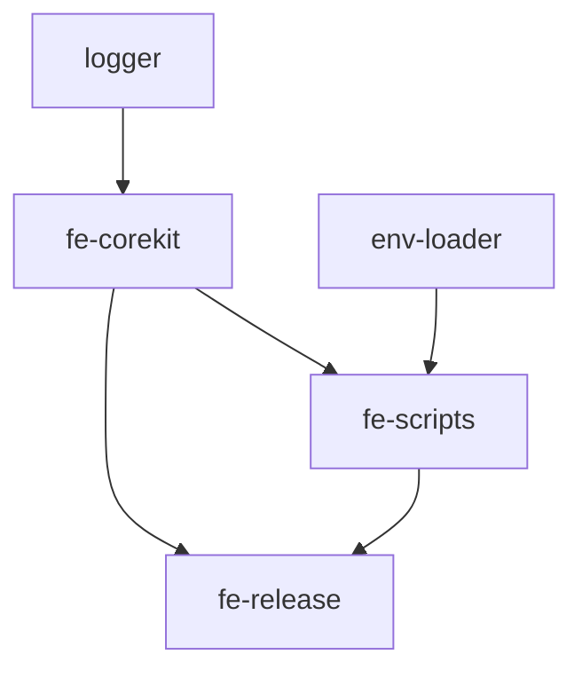

# Project Build System

This document provides detailed information about the fe-base project's build system architecture, toolchain, and daily development workflow.

## 📋 Table of Contents

- [Architecture Overview](#architecture-overview)
- [Technology Stack Selection](#technology-stack-selection)
- [pnpm Workspace Management](#pnpm-workspace-management)
- [Build Commands Detailed](#build-commands-detailed)
- [Development Workflow](#development-workflow)
- [Build Optimization](#build-optimization)
- [Common Issues](#common-issues)

## Architecture Overview

### Monorepo Architecture

fe-base adopts a **Monorepo** (monolithic repository) architecture, managing multiple related npm packages within a single Git repository.

```
fe-base/
├── packages/
│   ├── fe-corekit/           # Core toolkit
│   ├── fe-scripts/           # Script tools
│   ├── fe-release/           # Release tool
│   ├── logger/               # Logging tool
│   ├── env-loader/           # Environment variable loader
│   └── ...                   # Other packages
├── pnpm-workspace.yaml       # Workspace configuration
├── package.json              # Root package configuration
└── nx.json                   # nx configuration
```

### Advantages of Monorepo

✅ **Unified Management**

- All packages use the same build tools and configurations
- Unified code standards and quality checks
- Centralized dependency version management

✅ **Development Efficiency**

- Packages can directly reference each other without publishing to npm
- Changes are immediately reflected in dependent packages
- Unified development and testing environment

✅ **Version Synchronization**

- Can uniformly manage version releases for all packages
- Avoid version compatibility issues
- Simplify release process

## Technology Stack Selection

### Core Toolchain

| Tool           | Version  | Purpose          | Selection Reason                                         |
| -------------- | -------- | ---------------- | -------------------------------------------------------- |
| **pnpm**       | >= 8.0.0 | Package manager  | Saves disk space, native workspace support               |
| **nx**         | 20.6.4   | Build system     | Incremental builds, smart caching, task orchestration    |
| **tsup**       | ^8.4.0   | TypeScript build | Based on esbuild, fast, simple configuration             |
| **TypeScript** | ~5.4.5   | Type system      | Type safety, improves code quality                       |
| **Vite**       | ^6.1.0   | Development tool | Modern development experience, fast HMR                  |
| **Rollup**     | ^4.24.2  | Module bundler   | Professional library bundling tool, multi-format support |

### Why Choose These Tools?

#### pnpm vs npm/yarn

```bash
# Disk space comparison
npm/yarn:  ~200MB (independent dependency installation per project)
pnpm:      ~50MB  (global shared dependencies, hard links)

# Installation speed comparison
npm:       ~30s
yarn:      ~25s
pnpm:      ~15s
```

#### nx vs Other Build Tools

```bash
# Incremental build effectiveness
Full build:     ~120s (all packages)
nx incremental: ~20s  (only build changed packages)
nx cache:       ~5s   (using build cache)
```

#### tsup vs webpack/rollup

```bash
# Build speed comparison
webpack:    ~45s
rollup:     ~30s
tsup:       ~8s   (based on esbuild)
```

## pnpm Workspace Management

### Workspace Configuration

```yaml
# pnpm-workspace.yaml
packages:
  - packages/*
  - tools/*
  - examples/*
```

This configuration tells pnpm:

- Each subdirectory in `packages/` is an independent package
- `tools/` directory contains development tools
- `examples/` directory contains example projects

### Recursive Build Mechanism

pnpm automatically analyzes dependencies between packages and executes builds in the correct order:

```bash
# Recursively build all packages
pnpm -r run build

# Build order example:
# 1. logger (no dependencies)
# 2. env-loader (no dependencies)
# 3. fe-corekit (depends on logger)
# 4. fe-scripts (depends on fe-corekit, logger)
# 5. fe-release (depends on all above packages)
```

**Dependency relationship graph**:



### workspace:\* Dependency Mechanism

#### Symlinks During Development

```json
{
  "dependencies": {
    "@qlover/logger": "workspace:*"
  }
}
```

pnpm creates symlinks:

```bash
node_modules/@qlover/logger -> ../../packages/logger
```

#### Version Replacement During Publishing

When publishing, `workspace:*` is automatically replaced with specific versions:

```json
{
  "dependencies": {
    "@qlover/logger": "^1.2.3"
  }
}
```

### Key Principle: Install First, Build Later

```bash
# ❌ Wrong approach
pnpm install
# At this point, local package dependencies won't work because there are no build artifacts

# ✅ Correct approach
pnpm install && pnpm build
# Build immediately after installing dependencies to generate necessary build artifacts
```

**Why is building necessary?**

1. TypeScript source code needs to be compiled to JavaScript
2. Other packages reference the `dist/` directory, not `src/` source code
3. Type definition files (`.d.ts`) need to be generated

## Build Commands Detailed

### Main Build Commands

```json
{
  "scripts": {
    "build": "pnpm -r --workspace-concurrency=4 run build && pnpm rebuild",
    "nx:build": "nx affected:build",
    "clean:build": "fe-clean -f packages/*/dist -r",
    "build:fe-release": "pnpm --filter @qlover/fe-release build",
    "build:logger": "pnpm --filter @qlover/logger build"
  }
}
```

### Command Explanations

#### 1. `pnpm build` - Complete Build

```bash
pnpm build
```

**Execution flow**:

1. `pnpm -r --workspace-concurrency=4 run build`
   - `-r`: Recursively execute all packages
   - `--workspace-concurrency=4`: Maximum 4 packages concurrently
   - Build in dependency order
2. `pnpm rebuild`
   - Re-link local package dependencies
   - Ensure dependency relationships are correct

**Use cases**:

- After project initialization
- Complete build before release
- When resolving dependency issues

#### 2. `pnpm nx:build` - Incremental Build

```bash
pnpm nx:build
```

**Execution flow**:

1. nx analyzes file changes
2. Determines affected packages
3. Only builds changed packages and their dependents

**Use cases**:

- Daily development
- Optimizing build time in CI/CD
- Improving efficiency in large projects

#### 3. `pnpm clean:build` - Clean Build

```bash
pnpm clean:build
```

**Execution flow**:

1. Delete all packages' `dist/` directories
2. Clean build cache

**Use cases**:

- Resolving build cache issues
- Starting fresh clean builds
- Cleanup before releases

#### 4. Single Package Build

```bash
# Build specific package
pnpm --filter @qlover/logger build

# Build package and its dependencies
pnpm --filter @qlover/fe-scripts... build

# Build package and its dependents
pnpm --filter ...@qlover/logger build
```

### Build Optimization Strategies

#### 1. Concurrency Control

```bash
# Adjust concurrency based on machine performance
pnpm -r --workspace-concurrency=2 run build  # Low-spec machines
pnpm -r --workspace-concurrency=8 run build  # High-spec machines
```

#### 2. Build Caching

```json
// nx.json
{
  "tasksRunnerOptions": {
    "default": {
      "runner": "nx/tasks-runners/default",
      "options": {
        "cacheableOperations": ["build", "test", "lint"]
      }
    }
  }
}
```

#### 3. Incremental Build Configuration

```json
// package.json (each package)
{
  "nx": {
    "targets": {
      "build": {
        "dependsOn": ["^build"],
        "inputs": ["production", "^production"],
        "outputs": ["{projectRoot}/dist"]
      }
    }
  }
}
```

## Development Workflow

### Complete Development Process

#### 1. Project Initialization

```bash
# Clone project
git clone <repository-url>
cd fe-base

# Install dependencies and build
pnpm install && pnpm build

# Verify installation
pnpm test
```

#### 2. Daily Development

```bash
# Start development mode (if supported)
cd packages/your-package
pnpm dev

# Or use incremental build
pnpm nx:build

# Run tests
pnpm test

# Code linting
pnpm lint
```

#### 3. Watch Mode Development

```bash
# Start watch mode in package directory
cd packages/fe-corekit
pnpm dev

# Automatically rebuild on file changes
# Other projects depending on this package will immediately see changes
```

#### 4. Pre-commit Checks

```bash
# Complete pre-commit checks
pnpm lint && pnpm build && pnpm test

# Or use simplified command (if configured)
pnpm pre-commit
```

### Development Best Practices

#### 1. Branch Development Strategy

```bash
# Create feature branch
git checkout -b feature/new-feature

# Regular build and test during development
pnpm nx:build && pnpm test

# Complete check before commit
pnpm build && pnpm test && pnpm lint
```

#### 2. Package Dependency Development

```bash
# When modifying a dependency package
cd packages/logger
pnpm dev  # Start watch mode

# Test dependents in another terminal
cd packages/fe-corekit
pnpm test  # Will automatically use latest logger build artifacts
```

#### 3. Debugging Tips

```bash
# Check package build status
ls packages/*/dist/

# Check dependency links
pnpm list --filter @qlover/fe-corekit

# Re-link dependencies
pnpm install --force
```

## Build Optimization

### Performance Optimization

#### 1. Build Cache Strategy

```bash
# Utilize nx cache
export NX_CACHE_DIRECTORY=.nx/cache

# Clear cache (if needed)
nx reset
```

#### 2. Parallel Build Optimization

```json
{
  "scripts": {
    "build:fast": "pnpm -r --workspace-concurrency=8 run build:fast",
    "build:production": "pnpm -r --workspace-concurrency=2 run build"
  }
}
```

#### 3. Selective Building

```bash
# Only build changed packages
pnpm nx affected:build

# Only build specific scope
pnpm --filter "./packages/fe-*" run build
```

### Build Monitoring

#### 1. Build Time Analysis

```bash
# Add time statistics
time pnpm build

# Detailed build analysis
pnpm build --verbose
```

#### 2. Build Artifact Analysis

```bash
# Check build artifact sizes
du -h packages/*/dist/

# Analyze package contents
npm pack --dry-run
```

## Common Issues

### Build Failure Issues

#### Q: `Cannot find module '@qlover/logger'`

**Cause**: Dependency package not built

**Solution**:

```bash
# Check if package is built
ls packages/logger/dist/

# Rebuild dependency package
pnpm --filter @qlover/logger build

# Or rebuild all packages
pnpm build
```

#### Q: TypeScript Type Errors

**Cause**: Missing or outdated type definition files

**Solution**:

```bash
# Regenerate type definitions
pnpm --filter @qlover/logger build

# Check type definition files
ls packages/logger/dist/*.d.ts
```

### Dependency Linking Issues

#### Q: Local Package Changes Not Taking Effect

**Cause**: Not rebuilt or linking issues

**Solution**:

```bash
# Rebuild modified package
pnpm --filter modified-package build

# Re-link dependencies
pnpm install --force

# Clean and rebuild
pnpm clean:build && pnpm build
```

#### Q: `workspace:*` Dependencies Cannot Be Resolved

**Cause**: pnpm workspace configuration or dependency declaration issues

**Solution**:

```bash
# Check workspace configuration
cat pnpm-workspace.yaml

# Check if package names are correct
grep -r "workspace:\*" packages/*/package.json

# Reinstall dependencies
rm -rf node_modules && pnpm install
```

### Build Cache Issues

#### Q: Build Artifacts Not Updated After Code Changes

**Cause**: Build tool cache issues

**Solution**:

```bash
# Clear build cache
pnpm clean:build

# Clear nx cache
nx reset

# Rebuild
pnpm build
```

#### Q: Sudden Build Speed Slowdown

**Cause**: Cache invalidation or dependency changes

**Solution**:

```bash
# Check build cache
ls -la .nx/cache/

# Analyze build time
time pnpm build

# Use incremental build
pnpm nx:build
```

### Version Management Issues

#### Q: Version Conflicts Between Different Package Dependencies

**Cause**: Different packages depend on different versions of the same library

**Solution**:

```bash
# Check dependency tree
pnpm list

# View specific package dependencies
pnpm why package-name

# Unified version management
# Use pnpm.overrides in root package.json
```

## 📚 Related Documentation

- [Dependency Management Strategy](./dependency-management.md) - Learn how to manage package dependencies
- [Build Formats & Configuration](./build-formats-config.md) - Learn about packaging configuration
- [Build Guide Home](./index.md) - Return to guide home

## 🔗 External Resources

- [pnpm Workspace Official Documentation](https://pnpm.io/workspaces)
- [nx Build System Documentation](https://nx.dev/)
- [tsup Build Tool Documentation](https://tsup.egoist.dev/)

---

_Mastering the build system is the foundation of efficient development. If you have questions, please refer to the common issues section or seek team help._

## 🌐 Other Language Versions

- **[🇨🇳 中文](../../zh/builder-guide/project-build-system.md)** - Chinese version of this document
- **[🏠 Back to Home](../index.md)** - Return to English documentation home
