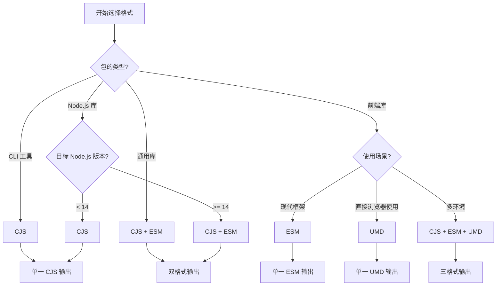

# 打包格式与配置指南

本文档详细介绍 fe-base 项目中的打包格式选择、构建工具配置和优化策略，帮助开发者为不同类型的包选择合适的打包方案。

## 📋 目录

- [输出格式详解](#输出格式详解)
- [格式选择策略](#格式选择策略)
- [构建工具配置](#构建工具配置)
- [package.json 配置](#packagejson-配置)
- [高级配置技巧](#高级配置技巧)
- [性能优化](#性能优化)
- [最佳实践](#最佳实践)
- [常见问题](#常见问题)

## 输出格式详解

### 主要模块格式

fe-base 项目支持三种主要的输出格式，每种格式都有其特定的适用场景：

| 格式 | 全称 | 文件扩展名 | 适用环境 | 特点 |
|------|------|------------|----------|------|
| **CJS** | CommonJS | `.cjs` | Node.js | 同步加载，向后兼容 |
| **ESM** | ES Modules | `.mjs` | 现代环境 | 异步加载，支持 tree-shaking |
| **UMD** | Universal Module Definition | `.umd.js` | 浏览器/Node.js | 通用格式，体积较大 |

### CommonJS (CJS) 格式

#### 特点与优势
```javascript
// 输出示例 (dist/index.cjs)
'use strict';

Object.defineProperty(exports, '__esModule', { value: true });

const logger = require('@qlover/logger');

function createUtils() {
  return {
    log: logger.log
  };
}

exports.createUtils = createUtils;
```

**特点**：
- ✅ Node.js 原生支持，无需转换
- ✅ 同步加载，启动速度快
- ✅ 兼容性好，支持所有 Node.js 版本
- ⚠️ 不支持 tree-shaking
- ⚠️ 浏览器需要打包工具支持

**适用场景**：
- Node.js 服务端应用
- CLI 工具
- 需要同步加载的库
- 兼容旧版本 Node.js 的包

#### 构建配置
```typescript
// tsup.config.ts - CJS 配置
export default defineConfig({
  entry: ['src/index.ts'],
  format: ['cjs'],
  target: 'node18',
  outDir: 'dist',
  outExtension: ({ format }) => ({
    js: format === 'cjs' ? '.cjs' : '.js'
  })
});
```

### ES Modules (ESM) 格式

#### 特点与优势
```javascript
// 输出示例 (dist/index.mjs)
import { log } from '@qlover/logger';

function createUtils() {
  return {
    log
  };
}

export { createUtils };
```

**特点**：
- ✅ 支持 tree-shaking，减少包体积
- ✅ 异步加载，支持代码分割
- ✅ 现代 JavaScript 标准
- ✅ 更好的静态分析支持
- ⚠️ 需要 Node.js 14+ 或现代浏览器
- ⚠️ 某些工具链可能不完全支持

**适用场景**：
- 现代前端应用
- 支持 tree-shaking 的库
- 微前端架构
- 现代 Node.js 应用

#### 构建配置
```typescript
// tsup.config.ts - ESM 配置
export default defineConfig({
  entry: ['src/index.ts'],
  format: ['esm'],
  target: 'es2020',
  outDir: 'dist',
  outExtension: ({ format }) => ({
    js: format === 'esm' ? '.mjs' : '.js'
  })
});
```

### Universal Module Definition (UMD) 格式

#### 特点与优势
```javascript
// 输出示例 (dist/index.umd.js)
(function (global, factory) {
  typeof exports === 'object' && typeof module !== 'undefined' ? factory(exports) :
  typeof define === 'function' && define.amd ? define(['exports'], factory) :
  (global = global || self, factory(global.MyLib = {}));
}(this, (function (exports) {
  'use strict';

  function createUtils() {
    return { log: console.log };
  }

  exports.createUtils = createUtils;
})));
```

**特点**：
- ✅ 兼容 AMD、CommonJS 和全局变量
- ✅ 可以直接在浏览器中使用
- ✅ 不需要打包工具
- ⚠️ 文件体积较大
- ⚠️ 不支持 tree-shaking
- ⚠️ 主要用于库的发布

**适用场景**：
- 需要直接在浏览器中使用的库
- 支持多种模块系统的通用库
- CDN 分发的包
- 向后兼容的组件库

#### 构建配置
```typescript
// tsup.config.ts - UMD 配置
export default defineConfig({
  entry: ['src/index.ts'],
  format: ['umd'],
  globalName: 'MyLib',
  target: 'es2015',
  outDir: 'dist',
  minify: true
});
```

## 格式选择策略

### 决策流程图



### 不同包类型的格式选择

#### 1. CLI 工具包
```json
{
  "main": "dist/index.cjs",
  "bin": {
    "my-cli": "dist/cli.cjs"
  },
  "files": ["dist"]
}
```

**推荐格式**：CJS
**原因**：
- CLI 工具需要快速启动
- 主要在 Node.js 环境运行
- 不需要 tree-shaking

**构建配置**：
```typescript
export default defineConfig({
  entry: {
    index: 'src/index.ts',
    cli: 'src/cli.ts'
  },
  format: ['cjs'],
  target: 'node18',
  bundle: true,
  minify: true,
  outExtension: () => ({ js: '.cjs' })
});
```

#### 2. Node.js 库包
```json
{
  "main": "dist/index.cjs",
  "module": "dist/index.mjs",
  "exports": {
    ".": {
      "import": "./dist/index.mjs",
      "require": "./dist/index.cjs",
      "types": "./dist/index.d.ts"
    }
  }
}
```

**推荐格式**：CJS + ESM
**原因**：
- 兼容不同的 Node.js 版本
- 支持现代和传统的导入方式
- 允许用户选择合适的格式

**构建配置**：
```typescript
export default defineConfig({
  entry: ['src/index.ts'],
  format: ['cjs', 'esm'],
  target: ['node18', 'es2020'],
  dts: true,
  sourcemap: true,
  outExtension: ({ format }) => ({
    js: format === 'cjs' ? '.cjs' : '.mjs'
  })
});
```

#### 3. 前端组件库
```json
{
  "main": "dist/index.cjs",
  "module": "dist/index.mjs",
  "unpkg": "dist/index.umd.js",
  "exports": {
    ".": {
      "import": "./dist/index.mjs",
      "require": "./dist/index.cjs",
      "types": "./dist/index.d.ts"
    },
    "./style.css": "./dist/style.css"
  }
}
```

**推荐格式**：CJS + ESM + UMD
**原因**：
- ESM 支持 tree-shaking
- CJS 兼容旧的构建工具
- UMD 支持 CDN 直接使用

**构建配置**：
```typescript
export default defineConfig([
  // ESM 和 CJS 版本
  {
    entry: ['src/index.ts'],
    format: ['cjs', 'esm'],
    target: 'es2020',
    external: ['react', 'react-dom'],
    dts: true,
    sourcemap: true,
    outExtension: ({ format }) => ({
      js: format === 'cjs' ? '.cjs' : '.mjs'
    })
  },
  // UMD 版本
  {
    entry: ['src/index.ts'],
    format: ['umd'],
    globalName: 'MyComponents',
    target: 'es2015',
    minify: true,
    outExtension: () => ({ js: '.umd.js' })
  }
]);
```

#### 4. 工具库包
```json
{
  "main": "dist/index.cjs",
  "module": "dist/index.mjs",
  "browser": "dist/index.umd.js",
  "exports": {
    ".": {
      "browser": "./dist/index.umd.js",
      "import": "./dist/index.mjs",
      "require": "./dist/index.cjs",
      "types": "./dist/index.d.ts"
    },
    "./server": {
      "import": "./dist/server.mjs",
      "require": "./dist/server.cjs",
      "types": "./dist/server.d.ts"
    }
  }
}
```

**推荐格式**：全格式支持
**原因**：
- 支持多种使用场景
- 提供最大的兼容性
- 允许按需选择

## 构建工具配置

### tsup 配置详解

#### 基础配置模板
```typescript
// tsup.config.ts
import { defineConfig } from 'tsup';
import type { Options } from 'tsup';

const baseConfig: Options = {
  entry: ['src/index.ts'],
  clean: true,
  dts: true,
  sourcemap: true,
  treeshake: true,
  splitting: false
};

export default defineConfig([
  // CommonJS 版本
  {
    ...baseConfig,
    format: ['cjs'],
    target: 'node18',
    outExtension: () => ({ js: '.cjs' })
  },
  // ES Modules 版本
  {
    ...baseConfig,
    format: ['esm'],
    target: 'es2020',
    outExtension: () => ({ js: '.mjs' })
  }
]);
```

#### 高级配置选项

##### 1. 多入口点配置
```typescript
export default defineConfig({
  entry: {
    index: 'src/index.ts',
    utils: 'src/utils/index.ts',
    cli: 'src/cli.ts'
  },
  format: ['cjs', 'esm'],
  outDir: 'dist',
  // 为不同入口点生成不同的输出文件
});
```

##### 2. 条件构建配置
```typescript
export default defineConfig((options) => {
  const isProduction = !options.watch;
  
  return {
    entry: ['src/index.ts'],
    format: ['cjs', 'esm'],
    minify: isProduction,
    sourcemap: !isProduction,
    dts: isProduction,
    // 开发时不生成类型定义，提升构建速度
  };
});
```

##### 3. 外部依赖配置
```typescript
import pkg from './package.json';

export default defineConfig({
  entry: ['src/index.ts'],
  format: ['cjs', 'esm'],
  external: [
    // 排除所有 dependencies
    ...Object.keys(pkg.dependencies || {}),
    // 排除所有 peerDependencies
    ...Object.keys(pkg.peerDependencies || {}),
    // 排除 Node.js 内置模块
    'fs', 'path', 'url', 'util'
  ]
});
```

##### 4. 代码分割配置
```typescript
export default defineConfig({
  entry: ['src/index.ts'],
  format: ['esm'],
  splitting: true,  // 启用代码分割
  target: 'es2020',
  // 只在 ESM 格式下启用分割
});
```

### Rollup 配置（高级场景）

#### 基础 Rollup 配置
```typescript
// rollup.config.ts
import { defineConfig } from 'rollup';
import typescript from '@rollup/plugin-typescript';
import { nodeResolve } from '@rollup/plugin-node-resolve';
import commonjs from '@rollup/plugin-commonjs';
import { terser } from 'rollup-plugin-terser';

export default defineConfig([
  // ESM 版本
  {
    input: 'src/index.ts',
    output: {
      file: 'dist/index.mjs',
      format: 'esm',
      sourcemap: true
    },
    plugins: [
      nodeResolve(),
      commonjs(),
      typescript({
        declaration: true,
        outDir: 'dist'
      })
    ],
    external: ['react', 'react-dom']
  },
  // UMD 版本
  {
    input: 'src/index.ts',
    output: {
      file: 'dist/index.umd.js',
      format: 'umd',
      name: 'MyLib',
      globals: {
        react: 'React',
        'react-dom': 'ReactDOM'
      }
    },
    plugins: [
      nodeResolve(),
      commonjs(),
      typescript(),
      terser()
    ],
    external: ['react', 'react-dom']
  }
]);
```

#### 高级 Rollup 配置
```typescript
// 支持多个包的构建
import { readdirSync } from 'fs';
import { join } from 'path';

const packagesDir = 'packages';
const packages = readdirSync(packagesDir);

export default packages.map(pkg => ({
  input: join(packagesDir, pkg, 'src/index.ts'),
  output: [
    {
      file: join(packagesDir, pkg, 'dist/index.cjs'),
      format: 'cjs'
    },
    {
      file: join(packagesDir, pkg, 'dist/index.mjs'),
      format: 'esm'
    }
  ],
  plugins: [
    nodeResolve(),
    commonjs(),
    typescript({
      tsconfig: join(packagesDir, pkg, 'tsconfig.json')
    })
  ]
}));
```

### Vite 配置（库模式）

#### 基础 Vite 库配置
```typescript
// vite.config.ts
import { defineConfig } from 'vite';
import { resolve } from 'path';
import dts from 'vite-plugin-dts';

export default defineConfig({
  build: {
    lib: {
      entry: resolve(__dirname, 'src/index.ts'),
      name: 'MyLib',
      formats: ['es', 'cjs', 'umd'],
      fileName: (format) => {
        switch (format) {
          case 'es': return 'index.mjs';
          case 'cjs': return 'index.cjs';
          case 'umd': return 'index.umd.js';
          default: return `index.${format}.js`;
        }
      }
    },
    rollupOptions: {
      external: ['react', 'react-dom'],
      output: {
        globals: {
          react: 'React',
          'react-dom': 'ReactDOM'
        }
      }
    }
  },
  plugins: [
    dts({
      insertTypesEntry: true
    })
  ]
});
```

#### 多包 Vite 配置
```typescript
// packages/*/vite.config.ts
import { defineConfig } from 'vite';
import { resolve } from 'path';
import pkg from './package.json';

export default defineConfig({
  build: {
    lib: {
      entry: resolve(__dirname, 'src/index.ts'),
      name: pkg.name.replace('@qlover/', ''),
      formats: ['es', 'cjs']
    },
    rollupOptions: {
      external: Object.keys(pkg.peerDependencies || {})
    }
  }
});
```

## package.json 配置

### 入口点配置详解

#### 1. 传统入口点
```json
{
  "main": "dist/index.cjs",          // CommonJS 入口
  "module": "dist/index.mjs",        // ES Modules 入口
  "browser": "dist/index.umd.js",    // 浏览器入口
  "types": "dist/index.d.ts",        // TypeScript 类型定义
  "unpkg": "dist/index.umd.js",      // CDN 入口
  "jsdelivr": "dist/index.umd.js"    // CDN 入口
}
```

#### 2. 现代 exports 配置
```json
{
  "exports": {
    ".": {
      "types": "./dist/index.d.ts",
      "import": "./dist/index.mjs",
      "require": "./dist/index.cjs",
      "browser": "./dist/index.umd.js"
    },
    "./utils": {
      "types": "./dist/utils.d.ts",
      "import": "./dist/utils.mjs",
      "require": "./dist/utils.cjs"
    },
    "./package.json": "./package.json"
  }
}
```

#### 3. 条件导出配置
```json
{
  "exports": {
    ".": {
      "node": {
        "import": "./dist/index.node.mjs",
        "require": "./dist/index.node.cjs"
      },
      "browser": {
        "import": "./dist/index.browser.mjs",
        "require": "./dist/index.browser.cjs"
      },
      "default": "./dist/index.mjs"
    }
  }
}
```

#### 4. 完整的 package.json 配置示例
```json
{
  "name": "@qlover/my-package",
  "version": "1.0.0",
  "description": "A sample package",
  "keywords": ["utility", "typescript"],
  "main": "dist/index.cjs",
  "module": "dist/index.mjs",
  "types": "dist/index.d.ts",
  "exports": {
    ".": {
      "types": "./dist/index.d.ts",
      "import": "./dist/index.mjs",
      "require": "./dist/index.cjs"
    }
  },
  "files": [
    "dist",
    "README.md",
    "CHANGELOG.md"
  ],
  "engines": {
    "node": ">=18.0.0"
  },
  "sideEffects": false,
  "publishConfig": {
    "access": "public"
  }
}
```

### 重要字段说明

#### 1. `sideEffects` 字段
```json
{
  // 无副作用，支持 tree-shaking
  "sideEffects": false,
  
  // 或指定有副作用的文件
  "sideEffects": [
    "dist/polyfills.js",
    "*.css"
  ]
}
```

#### 2. `engines` 字段
```json
{
  "engines": {
    "node": ">=18.0.0",      // 最低 Node.js 版本
    "npm": ">=8.0.0",        // 最低 npm 版本
    "pnpm": ">=8.0.0"        // 最低 pnpm 版本
  }
}
```

#### 3. `files` 字段
```json
{
  "files": [
    "dist",              // 构建产物
    "src",               // 源码（可选）
    "README.md",         // 文档
    "CHANGELOG.md",      // 变更日志
    "LICENSE"            // 许可证
  ]
}
```

## 高级配置技巧

### 环境特定构建

#### 1. Node.js vs 浏览器构建
```typescript
// tsup.config.ts
export default defineConfig([
  // Node.js 版本
  {
    entry: ['src/index.ts'],
    format: ['cjs', 'esm'],
    platform: 'node',
    target: 'node18',
    outDir: 'dist/node',
    external: ['fs', 'path']
  },
  // 浏览器版本
  {
    entry: ['src/index.browser.ts'],
    format: ['esm', 'umd'],
    platform: 'browser',
    target: 'es2020',
    outDir: 'dist/browser',
    globalName: 'MyLib'
  }
]);
```

#### 2. 开发 vs 生产构建
```typescript
export default defineConfig((options) => {
  const isDev = options.watch;
  
  return {
    entry: ['src/index.ts'],
    format: ['cjs', 'esm'],
    minify: !isDev,
    sourcemap: isDev ? 'inline' : true,
    dts: !isDev,  // 开发时跳过类型生成
    onSuccess: isDev ? 'echo "Build completed"' : undefined
  };
});
```

### 代码分割策略

#### 1. 手动代码分割
```typescript
// src/index.ts
export { default as utils } from './utils';
export { default as helpers } from './helpers';

// 用户可以按需导入
import { utils } from 'my-package';
```

#### 2. 动态导入支持
```typescript
// tsup.config.ts
export default defineConfig({
  entry: ['src/index.ts'],
  format: ['esm'],
  splitting: true,
  target: 'es2020',
  // 生成多个 chunk 文件
});
```

### 类型定义优化

#### 1. 类型定义生成配置
```typescript
export default defineConfig({
  entry: ['src/index.ts'],
  format: ['cjs', 'esm'],
  dts: {
    resolve: true,      // 解析外部类型
    only: false,        // 同时生成 JS 和 .d.ts
    entry: ['src/index.ts', 'src/utils.ts']  // 多个入口点
  }
});
```

#### 2. 类型定义分离
```json
{
  "exports": {
    ".": {
      "types": "./dist/types/index.d.ts",
      "import": "./dist/esm/index.mjs",
      "require": "./dist/cjs/index.cjs"
    }
  }
}
```

## 性能优化

### 构建性能优化

#### 1. 增量构建
```typescript
// tsup.config.ts
export default defineConfig({
  entry: ['src/index.ts'],
  format: ['cjs', 'esm'],
  watch: process.env.NODE_ENV === 'development',
  // 开发时启用监听模式
});
```

#### 2. 并行构建
```bash
# package.json
{
  "scripts": {
    "build": "run-p build:*",
    "build:cjs": "tsup --format cjs",
    "build:esm": "tsup --format esm",
    "build:types": "tsc --emitDeclarationOnly"
  }
}
```

#### 3. 缓存优化
```typescript
export default defineConfig({
  entry: ['src/index.ts'],
  format: ['cjs', 'esm'],
  // 启用 esbuild 缓存
  esbuildOptions: (options) => {
    options.cache = true;
  }
});
```

### 输出优化

#### 1. 文件体积优化
```typescript
export default defineConfig([
  // 开发版本
  {
    entry: ['src/index.ts'],
    format: ['esm'],
    minify: false,
    outExtension: () => ({ js: '.development.mjs' })
  },
  // 生产版本
  {
    entry: ['src/index.ts'],
    format: ['esm'],
    minify: true,
    outExtension: () => ({ js: '.production.mjs' })
  }
]);
```

#### 2. Tree-shaking 优化
```typescript
// 确保代码支持 tree-shaking
export default defineConfig({
  entry: ['src/index.ts'],
  format: ['esm'],
  treeshake: true,
  // 标记为无副作用
  esbuildOptions: (options) => {
    options.treeShaking = true;
  }
});
```

## 最佳实践

### 构建配置最佳实践

#### 1. 统一的配置模板
```typescript
// scripts/build-config.ts
import { defineConfig, type Options } from 'tsup';
import pkg from '../package.json';

export function createBuildConfig(options: Partial<Options> = {}): Options {
  return {
    entry: ['src/index.ts'],
    format: ['cjs', 'esm'],
    target: ['node18', 'es2020'],
    dts: true,
    sourcemap: true,
    clean: true,
    external: Object.keys(pkg.peerDependencies || {}),
    outExtension: ({ format }) => ({
      js: format === 'cjs' ? '.cjs' : '.mjs'
    }),
    ...options
  };
}
```

#### 2. 包类型特定配置
```typescript
// packages/cli/tsup.config.ts
import { createBuildConfig } from '../../scripts/build-config';

export default defineConfig(
  createBuildConfig({
    format: ['cjs'],
    bundle: true,
    minify: true,
    outExtension: () => ({ js: '.cjs' })
  })
);
```

#### 3. 环境变量配置
```typescript
export default defineConfig({
  entry: ['src/index.ts'],
  format: ['cjs', 'esm'],
  env: {
    NODE_ENV: 'production',
    PACKAGE_VERSION: process.env.npm_package_version
  }
});
```

### 发布配置最佳实践

#### 1. 发布前验证
```json
{
  "scripts": {
    "prepublishOnly": "pnpm build && pnpm test",
    "prepack": "clean-package",
    "postpack": "clean-package restore"
  }
}
```

#### 2. 文件包含策略
```json
{
  "files": [
    "dist",
    "!dist/**/*.test.*",
    "!dist/**/*.spec.*",
    "README.md",
    "CHANGELOG.md"
  ]
}
```

#### 3. 版本兼容性标识
```json
{
  "engines": {
    "node": ">=18.0.0"
  },
  "browserslist": [
    "> 1%",
    "last 2 versions",
    "not dead"
  ]
}
```

## 常见问题

### 构建配置问题

#### Q: 构建后的文件无法正确导入
**原因**：入口点配置不正确或格式不匹配

**解决方案**：
```json
{
  "main": "dist/index.cjs",
  "module": "dist/index.mjs",
  "exports": {
    ".": {
      "import": "./dist/index.mjs",
      "require": "./dist/index.cjs",
      "types": "./dist/index.d.ts"
    }
  }
}
```

#### Q: TypeScript 类型定义缺失
**原因**：没有生成或配置类型定义文件

**解决方案**：
```typescript
// tsup.config.ts
export default defineConfig({
  entry: ['src/index.ts'],
  format: ['cjs', 'esm'],
  dts: true,  // 生成类型定义
  // 或者
  dts: {
    entry: ['src/index.ts'],
    resolve: true
  }
});
```

### 格式兼容性问题

#### Q: ESM 模块在 CommonJS 环境中无法使用
**原因**：没有提供 CommonJS 格式的构建产物

**解决方案**：
```typescript
export default defineConfig([
  {
    entry: ['src/index.ts'],
    format: ['cjs'],
    outExtension: () => ({ js: '.cjs' })
  },
  {
    entry: ['src/index.ts'],
    format: ['esm'],
    outExtension: () => ({ js: '.mjs' })
  }
]);
```

#### Q: UMD 格式在浏览器中报错
**原因**：全局变量名冲突或外部依赖配置错误

**解决方案**：
```typescript
export default defineConfig({
  entry: ['src/index.ts'],
  format: ['umd'],
  globalName: 'MyUniqueLibName',  // 使用唯一的全局变量名
  external: ['react'],
  esbuildOptions: (options) => {
    options.globalName = 'MyUniqueLibName';
  }
});
```

### 性能问题

#### Q: 构建速度很慢
**原因**：没有利用缓存或并行构建

**解决方案**：
```typescript
export default defineConfig({
  entry: ['src/index.ts'],
  format: ['cjs', 'esm'],
  // 启用缓存
  esbuildOptions: (options) => {
    options.cache = true;
  }
});
```

```json
{
  "scripts": {
    "build": "run-p build:cjs build:esm",
    "build:cjs": "tsup --format cjs",
    "build:esm": "tsup --format esm"
  }
}
```

#### Q: 构建产物体积过大
**原因**：没有启用 tree-shaking 或包含了不必要的依赖

**解决方案**：
```typescript
export default defineConfig({
  entry: ['src/index.ts'],
  format: ['esm'],
  treeshake: true,
  minify: true,
  external: ['lodash', 'react']  // 外部化大型依赖
});
```

```json
{
  "sideEffects": false  // 标记为无副作用
}
```

## 📚 相关文档

- [项目构建系统](./project-build-system.md) - 了解构建系统架构
- [依赖管理策略](./dependency-management.md) - 学习依赖管理
- [构建指南首页](./index.md) - 返回指南首页

## 🔗 外部资源

- [tsup 官方文档](https://tsup.egoist.dev/)
- [Rollup 官方文档](https://rollupjs.org/)
- [Vite 库模式文档](https://vitejs.dev/guide/build.html#library-mode)
- [Node.js ES Modules 文档](https://nodejs.org/api/esm.html)

---

*正确的打包配置是库成功发布的关键。根据使用场景选择合适的格式，提供最佳的开发体验。*

## 🌐 其他语言版本

- **[🇺🇸 English](../../en/builder-guide/build-formats-config.md)** - English version of this document
- **[🏠 返回首页](../index.md)** - 返回中文文档首页
