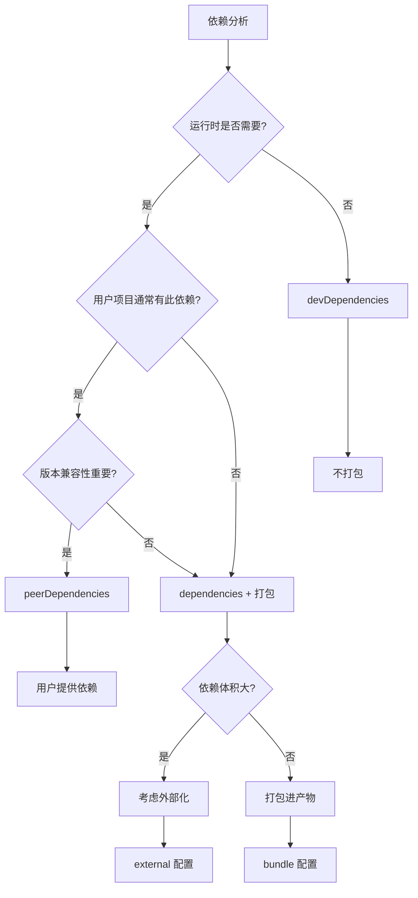

# 依赖管理策略

本文档详细介绍 fe-base 项目中的依赖管理策略，包括依赖类型选择、本地包管理、依赖打包决策和最佳实践。

## 📋 目录

- [依赖类型详解](#依赖类型详解)
- [本地包依赖管理](#本地包依赖管理)
- [依赖打包策略](#依赖打包策略)
- [依赖版本管理](#依赖版本管理)
- [依赖安全与优化](#依赖安全与优化)
- [最佳实践](#最佳实践)
- [常见问题](#常见问题)

## 依赖类型详解

### 快速参考

| 依赖类型           | 用户安装包时        | 开发环境  | 生产环境  | 典型用途           |
| ------------------ | ------------------- | --------- | --------- | ------------------ |
| `dependencies`     | ✅ 自动安装         | ✅ 安装   | ✅ 安装   | 运行时需要的库     |
| `devDependencies`  | ❌ 不安装           | ✅ 安装   | ❌ 不安装 | 构建工具、测试框架 |
| `peerDependencies` | ❌ 不安装，显示警告 | ❌ 不安装 | ❌ 不安装 | React、Vue等框架   |

### npm 安装行为详解

#### 用户安装包时会发生什么？

假设用户要安装一个包 `my-awesome-package`：

```json
// my-awesome-package/package.json
{
  "name": "my-awesome-package",
  "dependencies": {
    "lodash": "^4.17.21",
    "axios": "^1.6.0"
  },
  "devDependencies": {
    "typescript": "^5.0.0",
    "tsup": "^8.0.0"
  },
  "peerDependencies": {
    "react": ">=16.8.0"
  }
}
```

#### npm install 安装行为

```bash
# 用户执行：npm install my-awesome-package
```

**会被自动安装的依赖**：

```
node_modules/
├── my-awesome-package/     # 主包
├── lodash/                 # ✅ dependencies - 自动安装
├── axios/                  # ✅ dependencies - 自动安装
└── (其他传递依赖...)
```

**不会被安装的依赖**：

```
❌ typescript  (devDependencies - 用户不需要)
❌ tsup        (devDependencies - 用户不需要)
❌ react       (peerDependencies - 需要用户手动安装)
```

**peerDependencies 警告**：

```bash
npm WARN peerDependencies my-awesome-package@1.0.0 requires a peer of react@>=16.8.0 but none is installed.
```

#### 不同安装场景对比

| 安装场景       | dependencies | devDependencies | peerDependencies    |
| -------------- | ------------ | --------------- | ------------------- |
| **用户安装包** | ✅ 自动安装  | ❌ 不安装       | ❌ 不安装，显示警告 |
| **开发者开发** | ✅ 安装      | ✅ 安装         | ❌ 不安装，显示警告 |
| **生产环境**   | ✅ 安装      | ❌ 不安装       | ❌ 不安装           |

```bash
# 开发者在包目录下
npm install                 # 安装 dependencies + devDependencies
npm install --production    # 只安装 dependencies

# 用户安装包
npm install my-package      # 只安装 dependencies
```

### dependencies（生产依赖）

#### 定义与特征

```json
{
  "dependencies": {
    "@qlover/logger": "workspace:*",
    "lodash": "^4.17.21",
    "axios": "^1.6.0"
  }
}
```

**特征**：

- ✅ **用户安装时**：会被自动安装到用户的 `node_modules`
- ✅ **开发环境**：总是被安装
- ✅ **生产环境**：总是被安装（`npm install --production`）
- ✅ **使用场景**：运行时必需的依赖

#### 使用场景

**1. 运行时必需的工具库**

```typescript
// packages/fe-corekit/src/utils.ts
import { merge } from 'lodash'; // 运行时需要
import { request } from 'axios'; // 运行时需要

export function mergeConfig(config: any) {
  return merge(defaultConfig, config);
}
```

**2. 本地包依赖**

```json
{
  "dependencies": {
    "@qlover/logger": "workspace:*" // 本地包依赖
  }
}
```

**3. 核心功能依赖**

```typescript
// CLI 工具的核心依赖
import { Command } from 'commander';
import chalk from 'chalk';

// 这些是 CLI 工具运行必需的
```

#### 判断标准

将依赖放入 `dependencies` 的判断标准：

- ✅ 代码中有 `import` 或 `require` 语句
- ✅ 运行时必须存在
- ✅ 用户使用包时需要这个依赖
- ✅ 依赖体积可接受

### devDependencies（开发依赖）

#### 定义与特征

```json
{
  "devDependencies": {
    "@types/node": "^20.0.0",
    "typescript": "~5.4.5",
    "tsup": "^8.4.0",
    "vitest": "^2.1.8",
    "eslint": "^8.57.0"
  }
}
```

**特征**：

- ❌ **用户安装时**：不会被安装（用户不需要这些工具）
- ✅ **开发环境**：会被安装（`npm install`）
- ❌ **生产环境**：不会被安装（`npm install --production`）
- ✅ **使用场景**：构建、测试、开发工具

#### 使用场景

**1. 构建工具**

```json
{
  "devDependencies": {
    "tsup": "^8.4.0", // TypeScript 构建工具
    "rollup": "^4.24.2", // 模块打包工具
    "vite": "^6.1.0" // 开发服务器
  }
}
```

**2. 类型定义**

```json
{
  "devDependencies": {
    "@types/node": "^20.0.0", // Node.js 类型定义
    "@types/lodash": "^4.14.0" // lodash 类型定义
  }
}
```

**3. 测试框架**

```json
{
  "devDependencies": {
    "vitest": "^2.1.8", // 测试框架
    "@vitest/ui": "^2.1.8", // 测试 UI
    "jsdom": "^25.0.1" // DOM 模拟环境
  }
}
```

**4. 代码质量工具**

```json
{
  "devDependencies": {
    "eslint": "^8.57.0", // 代码检查
    "prettier": "^3.0.0", // 代码格式化
    "husky": "^9.0.0" // Git hooks
  }
}
```

#### 判断标准

将依赖放入 `devDependencies` 的判断标准：

- ✅ 只在开发/构建时使用
- ✅ 不会出现在运行时代码中
- ✅ 用户不需要安装这些依赖
- ✅ 构建工具、测试工具、类型定义等

### peerDependencies（同级依赖）

#### 定义与特征

```json
{
  "peerDependencies": {
    "react": ">=16.8.0",
    "react-dom": ">=16.8.0",
    "typescript": ">=4.0.0"
  },
  "peerDependenciesMeta": {
    "typescript": {
      "optional": true
    }
  }
}
```

**特征**：

- ❌ **用户安装时**：不会被自动安装，显示警告信息
- ❌ **开发环境**：不会被自动安装（需要手动安装）
- ❌ **生产环境**：不会被自动安装
- ⚠️ **用户责任**：需要用户手动安装这些依赖

#### 使用场景

**1. React 组件库**

```json
// 组件库的 package.json
{
  "peerDependencies": {
    "react": ">=16.8.0",
    "react-dom": ">=16.8.0"
  }
}
```

```typescript
// 组件库代码中使用 React
import React from 'react';

export function MyComponent() {
  return <div>Hello World</div>;
}
```

**用户项目中**：

```json
{
  "dependencies": {
    "react": "^18.0.0", // 用户提供
    "react-dom": "^18.0.0", // 用户提供
    "my-component-lib": "^1.0.0" // 使用组件库
  }
}
```

**2. 插件系统**

```json
// Webpack 插件的 package.json
{
  "peerDependencies": {
    "webpack": ">=4.0.0"
  }
}
```

**3. TypeScript 类型支持**

```json
{
  "peerDependencies": {
    "typescript": ">=4.0.0"
  },
  "peerDependenciesMeta": {
    "typescript": {
      "optional": true // 可选的 peer dependency
    }
  }
}
```

#### 判断标准

将依赖设为 `peerDependencies` 的判断标准：

- ✅ 宿主项目通常已经安装了这个依赖
- ✅ 需要与宿主项目的版本保持兼容
- ✅ 重复安装会导致问题（如 React、Vue 等）
- ✅ 插件或扩展类型的包

## 本地包依赖管理

### workspace:\* 机制

#### 基本原理

```json
{
  "dependencies": {
    "@qlover/logger": "workspace:*",
    "@qlover/env-loader": "workspace:*"
  }
}
```

**开发时**：pnpm 创建软链接

```bash
node_modules/@qlover/logger -> ../../packages/logger
```

**发布时**：自动替换为具体版本

```json
{
  "dependencies": {
    "@qlover/logger": "^1.2.3"
  }
}
```

### 本地包依赖最佳实践

#### 1. 依赖声明策略

```json
{
  "dependencies": {
    // ✅ 正确：使用 workspace:* 引用本地包
    "@qlover/logger": "workspace:*",

    // ❌ 错误：直接使用版本号
    "@qlover/logger": "^1.0.0"
  }
}
```

#### 2. 构建顺序管理

```bash
# pnpm 会自动按依赖顺序构建
pnpm -r run build

# 构建顺序：
# 1. logger (无依赖)
# 2. env-loader (无依赖)
# 3. fe-corekit (依赖 logger)
# 4. fe-scripts (依赖 fe-corekit, logger)
```

#### 3. 开发时热更新

```bash
# 在被依赖的包中启动开发模式
cd packages/logger
pnpm dev  # 监听文件变化，自动重新构建

# 依赖方会自动获得最新的构建产物
```

### 循环依赖检测与解决

#### 检测循环依赖

```bash
# 使用工具检测循环依赖
npx madge --circular packages/*/src/index.ts

# 或使用自定义脚本
pnpm check-circular-deps
```

#### 解决循环依赖

```typescript
// ❌ 循环依赖示例
// packages/a/src/index.ts
import { funcB } from '@qlover/b';

// packages/b/src/index.ts
import { funcA } from '@qlover/a';
```

**解决方案**：

1. **提取公共逻辑**

```typescript
// 创建 packages/shared/src/index.ts
export const sharedFunc = () => {
  /* ... */
};

// packages/a/src/index.ts
import { sharedFunc } from '@qlover/shared';

// packages/b/src/index.ts
import { sharedFunc } from '@qlover/shared';
```

2. **重新设计包结构**

```
packages/
├── core/          # 核心功能，无依赖
├── utils/         # 工具函数，依赖 core
├── components/    # 组件，依赖 core + utils
└── app/           # 应用，依赖所有包
```

## 依赖打包策略

### 核心决策框架

依赖是否应该打包的决策流程：



### 不同包类型的策略

#### 1. CLI 工具包策略

**特点**：独立运行，用户不会直接引用代码

```json
{
  "dependencies": {
    "commander": "^12.0.0", // 打包：CLI 核心功能
    "chalk": "^5.3.0", // 打包：输出美化
    "inquirer": "^12.0.0", // 打包：交互功能
    "@qlover/logger": "workspace:*" // 打包：本地依赖
  },
  "devDependencies": {
    "typescript": "~5.4.5", // 不打包：构建工具
    "@types/node": "^20.0.0" // 不打包：类型定义
  }
}
```

**构建配置**：

```typescript
// tsup.config.ts
export default defineConfig({
  entry: ['src/index.ts'],
  format: ['cjs'],
  target: 'node18',
  bundle: true, // 打包所有依赖
  minify: true, // 压缩代码
  sourcemap: false, // CLI 工具通常不需要 sourcemap
  clean: true
});
```

#### 2. 通用库包策略

**特点**：被其他项目引用，需要考虑体积和兼容性

```json
{
  "dependencies": {
    "@qlover/logger": "workspace:*" // 打包：本地依赖
  },
  "devDependencies": {
    "lodash": "^4.17.21", // 不打包：常见依赖
    "typescript": "~5.4.5", // 不打包：构建工具
    "@types/lodash": "^4.14.0" // 不打包：类型定义
  },
  "peerDependencies": {
    "lodash": ">=4.0.0" // 用户提供：避免重复
  }
}
```

**构建配置**：

```typescript
// tsup.config.ts
export default defineConfig({
  entry: ['src/index.ts'],
  format: ['cjs', 'esm'],
  target: ['node18', 'es2020'],
  external: ['lodash'], // 外部化常见依赖
  dts: true, // 生成类型定义
  sourcemap: true, // 提供 sourcemap
  clean: true
});
```

#### 3. 组件库包策略

**特点**：React/Vue 组件，依赖框架

```json
{
  "dependencies": {
    "classnames": "^2.3.0", // 打包：小工具库
    "@qlover/logger": "workspace:*" // 打包：本地依赖
  },
  "devDependencies": {
    "react": "^18.0.0", // 不打包：开发时使用
    "react-dom": "^18.0.0", // 不打包：开发时使用
    "@types/react": "^18.0.0" // 不打包：类型定义
  },
  "peerDependencies": {
    "react": ">=16.8.0", // 用户提供：框架依赖
    "react-dom": ">=16.8.0" // 用户提供：框架依赖
  }
}
```

**构建配置**：

```typescript
// tsup.config.ts
export default defineConfig({
  entry: ['src/index.ts'],
  format: ['cjs', 'esm'],
  target: 'es2020',
  external: ['react', 'react-dom'], // 外部化框架依赖
  jsx: 'preserve', // 保留 JSX
  dts: true,
  sourcemap: true,
  clean: true
});
```

### 依赖外部化策略

#### 1. 自动外部化

```typescript
// tsup.config.ts
import { defineConfig } from 'tsup';

export default defineConfig({
  external: [
    // 自动外部化所有 dependencies
    ...Object.keys(pkg.dependencies || {}),

    // 自动外部化所有 peerDependencies
    ...Object.keys(pkg.peerDependencies || {}),

    // Node.js 内置模块
    'fs',
    'path',
    'url',
    'util'
  ]
});
```

#### 2. 选择性外部化

```typescript
export default defineConfig({
  external: [
    // 外部化大型依赖
    'lodash',
    'moment',
    'react',
    'react-dom',

    // 外部化 Node.js 特定依赖
    'fs-extra',
    'glob'

    // 保持本地依赖打包
    // '@qlover/logger' 不在 external 中
  ]
});
```

#### 3. 条件外部化

```typescript
export default defineConfig([
  // Browser 版本：外部化更多依赖
  {
    entry: ['src/index.ts'],
    format: ['esm'],
    platform: 'browser',
    external: ['react', 'react-dom', 'lodash']
  },

  // Node.js 版本：打包更多依赖
  {
    entry: ['src/index.ts'],
    format: ['cjs'],
    platform: 'node',
    external: ['fs', 'path'] // 只外部化 Node.js 内置模块
  }
]);
```

## 依赖版本管理

### 版本范围策略

#### 1. 精确版本 vs 范围版本

```json
{
  "dependencies": {
    // ✅ 推荐：使用范围版本，允许补丁更新
    "lodash": "^4.17.21",

    // ⚠️ 谨慎：精确版本，无法获得安全更新
    "axios": "1.6.0",

    // ✅ 合适：主要版本锁定，允许次要版本更新
    "react": "^18.0.0"
  }
}
```

#### 2. 版本范围含义

```json
{
  "dependencies": {
    "package-a": "1.2.3", // 精确版本
    "package-b": "^1.2.3", // >=1.2.3 <2.0.0
    "package-c": "~1.2.3", // >=1.2.3 <1.3.0
    "package-d": ">=1.2.3", // >=1.2.3
    "package-e": "1.2.x", // >=1.2.0 <1.3.0
    "package-f": "*" // 最新版本（不推荐）
  }
}
```

### 版本统一管理

#### 1. 根级版本管理

```json
// 根 package.json
{
  "pnpm": {
    "overrides": {
      "typescript": "~5.4.5", // 统一 TS 版本
      "eslint": "^8.57.0", // 统一 ESLint 版本
      "@types/node": "^20.0.0" // 统一 Node.js 类型版本
    }
  }
}
```

#### 2. 版本同步检查

```bash
# 检查版本不一致的依赖
pnpm list --depth=0 | grep -E "different|mismatch"

# 更新所有包到最新版本
pnpm update -r

# 检查过时的依赖
pnpm outdated -r
```

#### 3. 锁定文件管理

```bash
# 生成精确的锁定文件
pnpm install --frozen-lockfile

# 更新锁定文件
pnpm install --no-frozen-lockfile

# 验证锁定文件完整性
pnpm install --audit
```

## 依赖安全与优化

### 安全审计

#### 1. 定期安全检查

```bash
# 检查已知安全漏洞
pnpm audit

# 自动修复安全问题
pnpm audit --fix

# 生成安全报告
pnpm audit --json > security-report.json
```

#### 2. 依赖分析

```bash
# 分析依赖树
pnpm list --depth=3

# 查看特定包的依赖
pnpm why package-name

# 检查重复依赖
pnpm list --depth=0 | sort | uniq -d
```

### 性能优化

#### 1. 减少依赖数量

```typescript
// ❌ 引入整个库
import _ from 'lodash';

// ✅ 只引入需要的函数
import { merge } from 'lodash/merge';

// ✅ 使用更小的替代方案
import merge from 'lodash.merge';
```

#### 2. 按需加载

```typescript
// ❌ 静态引入所有功能
import { format, parse, isValid } from 'date-fns';

// ✅ 动态引入
const formatDate = async (date: Date) => {
  const { format } = await import('date-fns');
  return format(date, 'yyyy-MM-dd');
};
```

#### 3. Bundle 分析

```bash
# 分析包体积
npm pack --dry-run

# 使用 bundle analyzer
npx vite-bundle-analyzer dist/

# 检查 tree-shaking 效果
npx webpack-bundle-analyzer dist/
```

## 最佳实践

### 依赖管理原则

#### 1. 最小化原则

```json
{
  "dependencies": {
    // ✅ 只包含运行时必需的依赖
    "@qlover/logger": "workspace:*"
  },
  "devDependencies": {
    // ✅ 开发工具放在 devDependencies
    "typescript": "~5.4.5",
    "tsup": "^8.4.0"
  }
}
```

#### 2. 版本兼容性原则

```json
{
  "peerDependencies": {
    // ✅ 使用宽松的版本范围
    "react": ">=16.8.0",

    // ✅ 支持多个主版本
    "typescript": ">=4.0.0"
  }
}
```

#### 3. 安全性原则

```json
{
  "dependencies": {
    // ✅ 定期更新，修复安全漏洞
    "axios": "^1.6.0"

    // ✅ 避免使用废弃的包
    // "request": "^2.88.0"  // 已废弃，使用 axios 替代
  }
}
```

### 开发工作流最佳实践

#### 1. 依赖添加流程

```bash
# 1. 分析依赖类型
# 运行时需要？-> dependencies
# 只开发时需要？-> devDependencies
# 用户通常已有？-> peerDependencies

# 2. 添加依赖
pnpm add lodash                    # dependencies
pnpm add -D typescript            # devDependencies
pnpm add -P react                 # peerDependencies

# 3. 更新构建配置
# 在 tsup.config.ts 中配置 external

# 4. 测试构建
pnpm build && pnpm test
```

#### 2. 依赖更新流程

```bash
# 1. 检查过时依赖
pnpm outdated

# 2. 更新非破坏性版本
pnpm update

# 3. 手动更新主版本
pnpm add package-name@latest

# 4. 测试兼容性
pnpm test && pnpm build

# 5. 更新锁定文件
git add pnpm-lock.yaml
```

#### 3. 依赖清理流程

```bash
# 1. 找出未使用的依赖
npx depcheck

# 2. 移除未使用的依赖
pnpm remove unused-package

# 3. 清理 node_modules
rm -rf node_modules && pnpm install

# 4. 验证构建
pnpm build
```

## 常见问题

### 依赖解析问题

#### Q: `Cannot find module '@qlover/logger'`

**原因**：本地包依赖未正确构建或链接

**解决方案**：

```bash
# 1. 检查包是否存在
ls packages/logger/

# 2. 检查包是否已构建
ls packages/logger/dist/

# 3. 重新构建依赖包
pnpm --filter @qlover/logger build

# 4. 重新链接依赖
pnpm install --force
```

#### Q: 版本冲突错误

**原因**：不同包依赖了同一库的不兼容版本

**解决方案**：

```bash
# 1. 查看冲突的依赖
pnpm list package-name

# 2. 使用 overrides 统一版本
# 在根 package.json 中：
{
  "pnpm": {
    "overrides": {
      "package-name": "^1.0.0"
    }
  }
}

# 3. 重新安装
rm pnpm-lock.yaml && pnpm install
```

### 打包配置问题

#### Q: 依赖被错误地打包/外部化

**原因**：构建配置中的 external 设置不正确

**解决方案**：

```typescript
// tsup.config.ts
export default defineConfig({
  // ✅ 正确：外部化 peer dependencies
  external: Object.keys(pkg.peerDependencies || {})

  // ✅ 正确：打包本地依赖
  // 不要把 workspace:* 依赖放在 external 中
});
```

#### Q: 类型定义缺失

**原因**：依赖的类型定义没有正确处理

**解决方案**：

```bash
# 1. 安装类型定义
pnpm add -D @types/package-name

# 2. 或者在 tsconfig.json 中配置
{
  "compilerOptions": {
    "skipLibCheck": true  // 跳过库的类型检查
  }
}

# 3. 重新构建
pnpm build
```

### 性能问题

#### Q: 安装依赖很慢

**原因**：网络问题或依赖树过大

**解决方案**：

```bash
# 1. 使用国内镜像
pnpm config set registry https://registry.npmmirror.com/

# 2. 启用缓存
pnpm config set store-dir ~/.pnpm-store

# 3. 并行安装
pnpm config set network-concurrency 10

# 4. 清理缓存
pnpm store prune
```

#### Q: 构建产物体积过大

**原因**：不必要的依赖被打包

**解决方案**：

```bash
# 1. 分析包内容
npm pack --dry-run

# 2. 检查依赖是否必要
npx depcheck

# 3. 优化构建配置
# 在 tsup.config.ts 中添加更多 external

# 4. 使用 tree-shaking
export default defineConfig({
  treeshake: true,
  minify: true
});
```

## 📚 相关文档

- [项目构建系统](./project-build-system.md) - 了解构建系统架构
- [打包格式与配置](./build-formats-config.md) - 学习打包配置
- [构建指南首页](./index.md) - 返回指南首页

## 🔗 外部资源

- [pnpm 依赖管理文档](https://pnpm.io/cli/add)
- [npm 依赖类型说明](https://docs.npmjs.com/specifying-dependencies-and-devdependencies-in-a-package-json-file)
- [语义化版本规范](https://semver.org/lang/zh-CN/)

## 🌐 其他语言版本

- **[🇺🇸 English](../../en/builder-guide/dependency-management.md)** - English version of this document
- **[🏠 返回首页](../index.md)** - 返回中文文档首页

---

_合理的依赖管理是项目健康发展的基础。遵循最佳实践，定期审计和优化依赖。_
