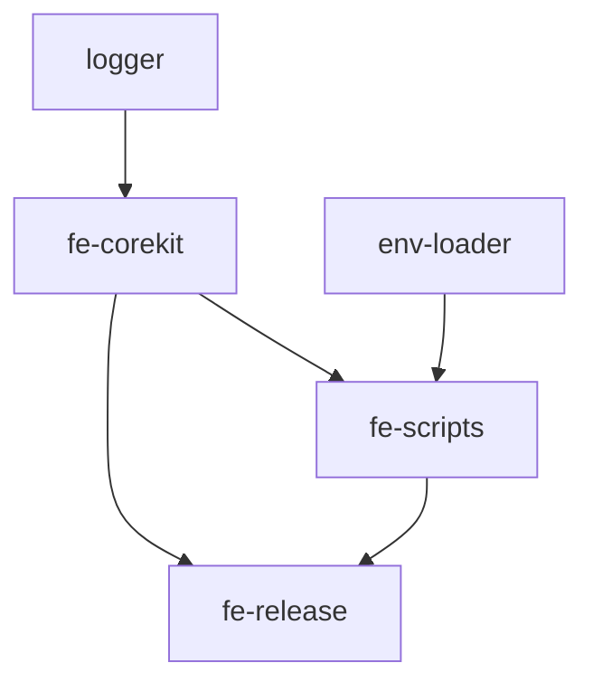

# 项目构建系统

本文档详细介绍 fe-base 项目的构建系统架构、工具链和日常开发流程。

## 📋 目录

- [架构概述](#架构概述)
- [技术栈选择](#技术栈选择)
- [pnpm Workspace 管理](#pnpm-workspace-管理)
- [构建命令详解](#构建命令详解)
- [开发工作流](#开发工作流)
- [构建优化](#构建优化)
- [常见问题](#常见问题)

## 架构概述

### Monorepo 架构

fe-base 采用 **Monorepo**（单体仓库）架构，在一个 Git 仓库中管理多个相关的 npm 包。

```
fe-base/
├── packages/
│   ├── fe-corekit/           # 核心工具包
│   ├── fe-scripts/           # 脚本工具
│   ├── fe-release/           # 发布工具
│   ├── logger/               # 日志工具
│   ├── env-loader/           # 环境变量加载器
│   └── ...                   # 其他包
├── pnpm-workspace.yaml       # workspace 配置
├── package.json              # 根包配置
└── nx.json                   # nx 配置
```

### Monorepo 的优势

✅ **统一管理**
- 所有包使用相同的构建工具和配置
- 统一的代码规范和质量检查
- 集中的依赖版本管理

✅ **开发效率**
- 包之间可以直接引用，无需发布到 npm
- 修改会立即反映到依赖方
- 统一的开发和测试环境

✅ **版本同步**
- 可以统一管理所有包的版本发布
- 避免版本不兼容问题
- 简化发布流程

## 技术栈选择

### 核心工具链

| 工具 | 版本 | 作用 | 选择理由 |
|------|------|------|----------|
| **pnpm** | >= 8.0.0 | 包管理器 | 节省磁盘空间，原生支持 workspace |
| **nx** | 20.6.4 | 构建系统 | 增量构建，智能缓存，任务编排 |
| **tsup** | ^8.4.0 | TypeScript 构建 | 基于 esbuild，速度快，配置简单 |
| **TypeScript** | ~5.4.5 | 类型系统 | 类型安全，提升代码质量 |
| **Vite** | ^6.1.0 | 开发工具 | 现代化开发体验，热更新快 |
| **Rollup** | ^4.24.2 | 模块打包 | 专业的库打包工具，支持多格式 |

### 为什么选择这些工具？

#### pnpm vs npm/yarn
```bash
# 磁盘空间对比
npm/yarn:  ~200MB (每个项目独立安装依赖)
pnpm:      ~50MB  (全局共享依赖，硬链接)

# 安装速度对比
npm:       ~30s
yarn:      ~25s
pnpm:      ~15s
```

#### nx vs 其他构建工具
```bash
# 增量构建效果
全量构建:    ~120s (所有包)
nx 增量:     ~20s  (只构建变更的包)
nx 缓存:     ~5s   (使用构建缓存)
```

#### tsup vs webpack/rollup
```bash
# 构建速度对比
webpack:    ~45s
rollup:     ~30s
tsup:       ~8s   (基于 esbuild)
```

## pnpm Workspace 管理

### Workspace 配置

```yaml
# pnpm-workspace.yaml
packages:
  - packages/*
  - tools/*
  - examples/*
```

这个配置告诉 pnpm：
- `packages/` 目录下的每个子目录都是一个独立的包
- `tools/` 目录包含开发工具
- `examples/` 目录包含示例项目

### 递归构建机制

pnpm 会自动分析包之间的依赖关系，按正确顺序执行构建：

```bash
# 递归构建所有包
pnpm -r run build

# 构建顺序示例：
# 1. logger (无依赖)
# 2. env-loader (无依赖)
# 3. fe-corekit (依赖 logger)
# 4. fe-scripts (依赖 fe-corekit, logger)
# 5. fe-release (依赖所有上述包)
```

**依赖关系图**：


### workspace:* 依赖机制

#### 开发时的软链接
```json
{
  "dependencies": {
    "@qlover/logger": "workspace:*"
  }
}
```

pnpm 会创建软链接：
```bash
node_modules/@qlover/logger -> ../../packages/logger
```

#### 发布时的版本替换
发布时 `workspace:*` 会自动替换为具体版本：
```json
{
  "dependencies": {
    "@qlover/logger": "^1.2.3"
  }
}
```

### 关键原则：先安装，后构建

```bash
# ❌ 错误做法
pnpm install
# 此时本地包依赖无法工作，因为没有构建产物

# ✅ 正确做法
pnpm install && pnpm build
# 安装依赖后立即构建，生成必要的构建产物
```

**为什么必须构建？**
1. TypeScript 源码需要编译成 JavaScript
2. 其他包引用的是 `dist/` 目录，不是 `src/` 源码
3. 类型定义文件（`.d.ts`）需要生成

## 构建命令详解

### 主要构建命令

```json
{
  "scripts": {
    "build": "pnpm -r --workspace-concurrency=4 run build && pnpm rebuild",
    "nx:build": "nx affected:build",
    "clean:build": "fe-clean -f packages/*/dist -r",
    "build:fe-release": "pnpm --filter @qlover/fe-release build",
    "build:logger": "pnpm --filter @qlover/logger build"
  }
}
```

### 命令详解

#### 1. `pnpm build` - 完整构建
```bash
pnpm build
```

**执行流程**：
1. `pnpm -r --workspace-concurrency=4 run build`
   - `-r`: 递归执行所有包
   - `--workspace-concurrency=4`: 最多并发 4 个包
   - 按依赖顺序构建
2. `pnpm rebuild`
   - 重新链接本地包依赖
   - 确保依赖关系正确

**使用场景**：
- 初始化项目后
- 发布前的完整构建
- 解决依赖问题时

#### 2. `pnpm nx:build` - 增量构建
```bash
pnpm nx:build
```

**执行流程**：
1. nx 分析文件变更
2. 确定受影响的包
3. 只构建变更的包及其依赖方

**使用场景**：
- 日常开发
- CI/CD 中优化构建时间
- 大型项目中提升效率

#### 3. `pnpm clean:build` - 清理构建
```bash
pnpm clean:build
```

**执行流程**：
1. 删除所有包的 `dist/` 目录
2. 清理构建缓存

**使用场景**：
- 解决构建缓存问题
- 重新开始干净的构建
- 发布前的清理

#### 4. 单包构建
```bash
# 构建特定包
pnpm --filter @qlover/logger build

# 构建包及其依赖
pnpm --filter @qlover/fe-scripts... build

# 构建包及其依赖方
pnpm --filter ...@qlover/logger build
```

### 构建优化策略

#### 1. 并发控制
```bash
# 根据机器性能调整并发数
pnpm -r --workspace-concurrency=2 run build  # 低配置机器
pnpm -r --workspace-concurrency=8 run build  # 高配置机器
```

#### 2. 构建缓存
```json
// nx.json
{
  "tasksRunnerOptions": {
    "default": {
      "runner": "nx/tasks-runners/default",
      "options": {
        "cacheableOperations": ["build", "test", "lint"]
      }
    }
  }
}
```

#### 3. 增量构建配置
```json
// package.json (每个包)
{
  "nx": {
    "targets": {
      "build": {
        "dependsOn": ["^build"],
        "inputs": ["production", "^production"],
        "outputs": ["{projectRoot}/dist"]
      }
    }
  }
}
```

## 开发工作流

### 完整的开发流程

#### 1. 项目初始化
```bash
# 克隆项目
git clone <repository-url>
cd fe-base

# 安装依赖并构建
pnpm install && pnpm build

# 验证安装
pnpm test
```

#### 2. 日常开发
```bash
# 启动开发模式（如果支持）
cd packages/your-package
pnpm dev

# 或者使用增量构建
pnpm nx:build

# 运行测试
pnpm test

# 代码检查
pnpm lint
```

#### 3. 监听模式开发
```bash
# 在包目录下启动监听模式
cd packages/fe-corekit
pnpm dev

# 文件变化时自动重新构建
# 其他依赖此包的项目会立即看到变更
```

#### 4. 提交前检查
```bash
# 完整的预提交检查
pnpm lint && pnpm build && pnpm test

# 或使用简化命令（如果配置了）
pnpm pre-commit
```

### 开发最佳实践

#### 1. 分支开发策略
```bash
# 创建功能分支
git checkout -b feature/new-feature

# 开发过程中定期构建测试
pnpm nx:build && pnpm test

# 提交前完整检查
pnpm build && pnpm test && pnpm lint
```

#### 2. 包依赖开发
```bash
# 当修改被依赖的包时
cd packages/logger
pnpm dev  # 启动监听模式

# 在另一个终端测试依赖方
cd packages/fe-corekit
pnpm test  # 会自动使用最新的 logger 构建产物
```

#### 3. 调试技巧
```bash
# 检查包的构建状态
ls packages/*/dist/

# 检查依赖链接
pnpm list --filter @qlover/fe-corekit

# 重新链接依赖
pnpm install --force
```

## 构建优化

### 性能优化

#### 1. 构建缓存策略
```bash
# 利用 nx 缓存
export NX_CACHE_DIRECTORY=.nx/cache

# 清理缓存（如果需要）
nx reset
```

#### 2. 并行构建优化
```json
{
  "scripts": {
    "build:fast": "pnpm -r --workspace-concurrency=8 run build:fast",
    "build:production": "pnpm -r --workspace-concurrency=2 run build"
  }
}
```

#### 3. 选择性构建
```bash
# 只构建变更的包
pnpm nx affected:build

# 只构建特定范围
pnpm --filter "./packages/fe-*" run build
```

### 构建监控

#### 1. 构建时间分析
```bash
# 添加时间统计
time pnpm build

# 详细的构建分析
pnpm build --verbose
```

#### 2. 构建产物分析
```bash
# 检查构建产物大小
du -h packages/*/dist/

# 分析包内容
npm pack --dry-run
```

## 常见问题

### 构建失败问题

#### Q: `Cannot find module '@qlover/logger'`
**原因**：被依赖的包没有构建

**解决方案**：
```bash
# 检查包是否已构建
ls packages/logger/dist/

# 重新构建依赖包
pnpm --filter @qlover/logger build

# 或重新构建所有包
pnpm build
```

#### Q: TypeScript 类型错误
**原因**：类型定义文件缺失或过期

**解决方案**：
```bash
# 重新生成类型定义
pnpm --filter @qlover/logger build

# 检查类型定义文件
ls packages/logger/dist/*.d.ts
```

### 依赖链接问题

#### Q: 本地包修改没有生效
**原因**：没有重新构建或链接问题

**解决方案**：
```bash
# 重新构建修改的包
pnpm --filter modified-package build

# 重新链接依赖
pnpm install --force

# 清理并重新构建
pnpm clean:build && pnpm build
```

#### Q: `workspace:*` 依赖无法解析
**原因**：pnpm workspace 配置或依赖声明问题

**解决方案**：
```bash
# 检查 workspace 配置
cat pnpm-workspace.yaml

# 检查包名是否正确
grep -r "workspace:\*" packages/*/package.json

# 重新安装依赖
rm -rf node_modules && pnpm install
```

### 构建缓存问题

#### Q: 修改代码后构建产物没有更新
**原因**：构建工具缓存问题

**解决方案**：
```bash
# 清理构建缓存
pnpm clean:build

# 清理 nx 缓存
nx reset

# 重新构建
pnpm build
```

#### Q: 构建速度突然变慢
**原因**：缓存失效或依赖变更

**解决方案**：
```bash
# 检查构建缓存
ls -la .nx/cache/

# 分析构建时间
time pnpm build

# 使用增量构建
pnpm nx:build
```

### 版本管理问题

#### Q: 不同包依赖版本冲突
**原因**：不同包依赖了同一库的不同版本

**解决方案**：
```bash
# 检查依赖树
pnpm list

# 查看特定包的依赖
pnpm why package-name

# 统一版本管理
# 在根 package.json 中使用 pnpm.overrides
```

## 📚 相关文档

- [依赖管理策略](./dependency-management.md) - 了解如何管理包依赖
- [打包格式与配置](./build-formats-config.md) - 学习打包配置
- [构建指南首页](./index.md) - 返回指南首页

## 🔗 外部资源

- [pnpm Workspace 官方文档](https://pnpm.io/workspaces)
- [nx 构建系统文档](https://nx.dev/)
- [tsup 构建工具文档](https://tsup.egoist.dev/)

---

*掌握构建系统是高效开发的基础。如有问题，请参考常见问题部分或寻求团队帮助。*
