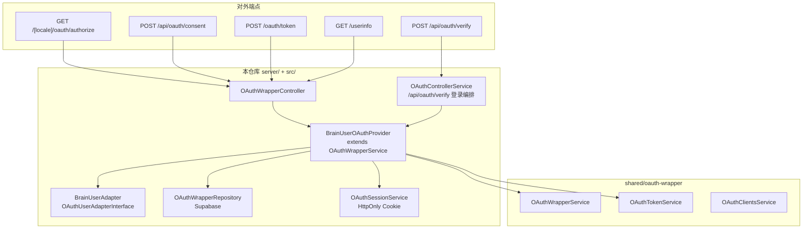
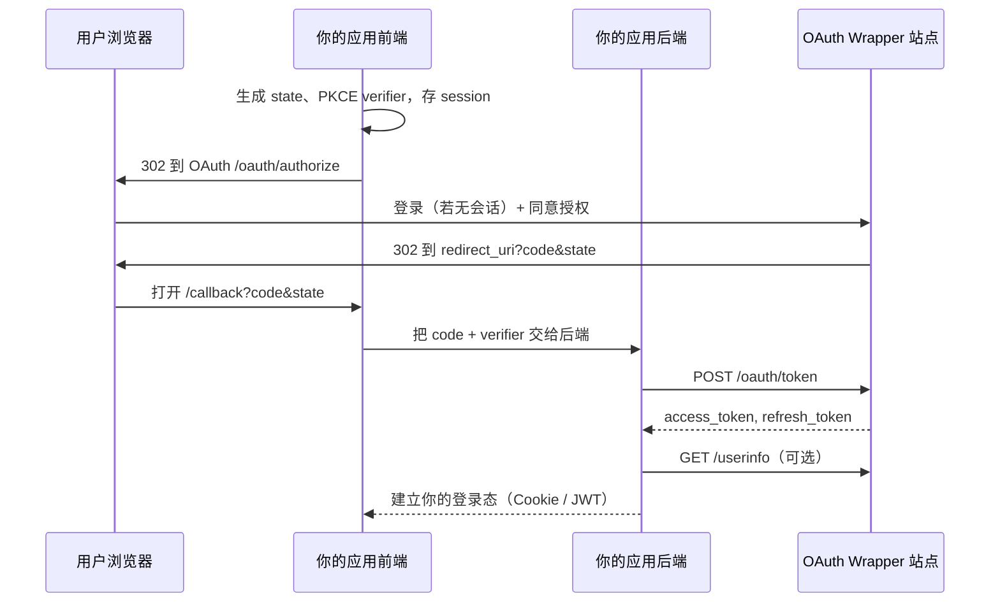
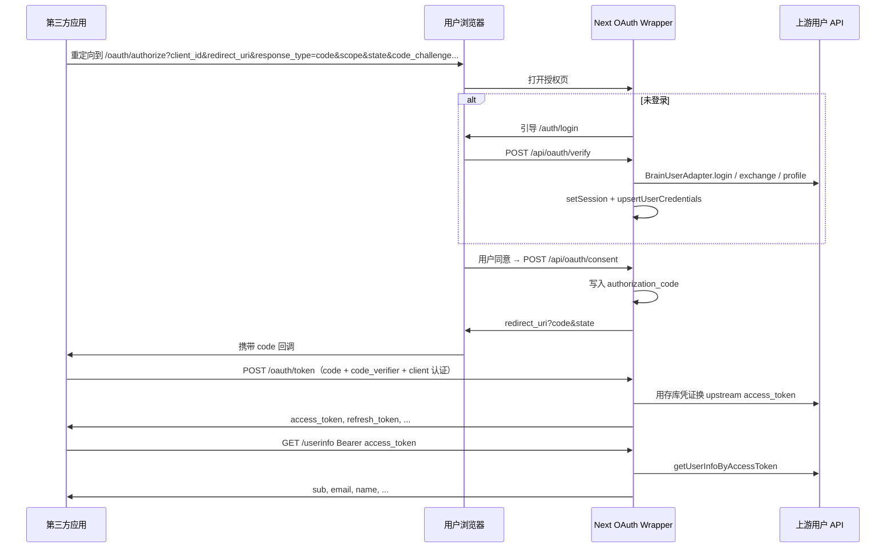
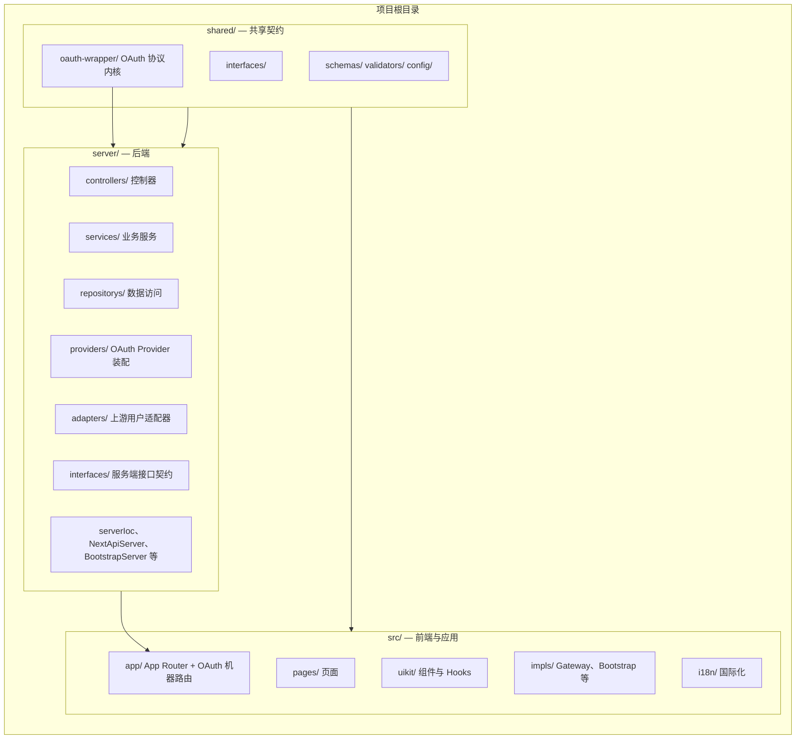
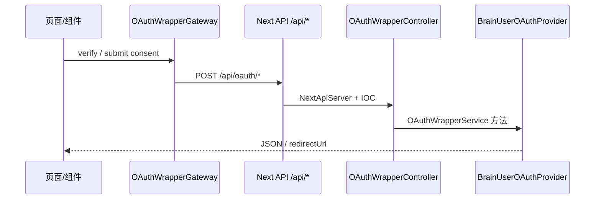

# Next OAuth（`examples/next-oauth`）

> English: [README.en.md](./README.en.md)

**模板定位**：基于 Next.js 的 OAuth 2.0 授权服务器示例。协议内核来自 `@qlover/oauth-wrapper`；本仓库负责会话、仓储与上游 Provider 装配。

**预置两种上游（IOC / 环境变量切换，默认不变）**：

| 方案 | 值 | 说明 |
| ---- | -- | ---- |
| **Supabase（默认）** | `supabase` | 现有行为：邮箱密码、OTP、GitHub/Google SSO |
| **Brain User（可选）** | `brain-user` | 把已有登录 API 包装成 OAuth 凭据源 |

```bash
# .env — 默认即可保持原逻辑
NEXT_PUBLIC_OAUTH_UPSTREAM_PROVIDER=supabase

# 改用 Brain User 时：
# NEXT_PUBLIC_OAUTH_UPSTREAM_PROVIDER=brain-user
```

绑定代码：`server/serverIoc.ts`；Provider：`server/providers/SupabaseOAuthProvider.ts`、`BrainUserOAuthProvider.ts`。

**TL;DR**：`npm install` → 将 `.env.template` 复制为 `.env` 并按注释填写 → 在 Supabase 执行 `makes/sql/` 脚本 → `npm run dev`（默认端口 **3300**）→ 生产：`npm run build` 后 `npm start`。

**文档**：站内 OAuth 集成说明见 [`/[locale]/docs/oauth`](./src/app/[locale]/docs/oauth/page.tsx)；国际化约定见 [docs/i18n.md](./docs/i18n.md)。

基于 **Next.js** 的 OAuth 2.0 授权服务器示例。整体保持清晰分层、前后端职责分离与面向接口编程。

---

## 技术栈

| 类别           | 技术                                     |
| -------------- | ---------------------------------------- |
| **框架**       | Next.js 16、App Router、React 19         |
| **OAuth**      | `shared/oauth-wrapper`（授权码、PKCE、换票、userinfo） |
| **校验**       | Zod（Schema 与请求/响应校验）            |
| **数据与鉴权** | Supabase（OAuth 表、SSR、PostgREST；默认 Provider）     |
| **上游可选**   | `@brain-toolkit/brain-user`（`BrainUserOAuthProvider`） |
| **UI**         | Tailwind + 自建组件（Heroicons、sonner）；antd 仅 demo |

| **国际化**     | next-intl                                |
| **主题**       | next-themes                              |
| **依赖注入**   | Inversify、SimpleIOCContainer（项目内）  |
| **工具库**     | dayjs、lodash、clsx                      |
| **语言与质量** | TypeScript 5、ESLint、Prettier、Vitest   |

**运行环境**：Node.js `^20.17.0` 或 `>=22.9.0`，npm `>=10.0.0`（见 `package.json` 的 `engines`）。

---

## OAuth Wrapper：架构与职责

### 两层分工

| 层级 | 路径 | 职责 |
| ---- | ---- | ---- |
| **协议内核（可复用）** | `shared/oauth-wrapper/` | RFC 6749 授权码流、PKCE 校验、consent 编排、换票、`userinfo` 映射；**不**依赖具体登录 API |
| **示例装配（本项目）** | `server/providers/`、`server/adapters/`、`server/repositorys/`、`server/services/`、`src/app/` | HttpOnly 会话 Cookie、Supabase 持久化、上游 `OAuthUserAdapter`、Next 路由与 UI |

换上游用户系统时，通常只改 **适配器 + Provider 类 + IOC 绑定**；`OAuthWrapperService` 等内核尽量不动。

### 内核模块（`shared/oauth-wrapper/`）

| 路径 | 说明 |
| ---- | ---- |
| `interfaces/OAuthUserAdapterInterface.ts` | 上游用户系统端口：`login`、`exchangeAccessToken`、`getUserInfo`、`getUserInfoByAccessToken` |
| `interfaces/OAuthWrapperRepositoryInterface.ts` | 授权码、refresh token、客户端、用户凭证等持久化端口 |
| `interfaces/OAuthSessionInterface.ts` | 授权页所需登录会话（本示例为 JWT Cookie） |
| `interfaces/OAuthServiceInterface.ts` | 对外暴露的 OAuth 服务能力聚合 |
| `services/OAuthWrapperService.ts` | 授权页解析、`processConsent`、换票委托、`getUserInfo` |
| `services/OAuthTokenService.ts` | `authorization_code` / `refresh_token` 换票 |
| `services/OAuthClientsService.ts` | 客户端注册与管理逻辑 |
| `schema/` | Zod Schema：`OAuthAuthorizeSchema`、`OAuthClientSchema`、`OAuthTokenSchema` 等 |
| `utils/` | PKCE、`authorizeUtil`、`oauthRedirectUtils`、`clientSecretHash` |

从包入口统一导出：

```ts
import {
  OAuthWrapperService,
  OAuthTokenService,
  OAuthUserAdapterInterface,
  OAuthRfcCodes
} from '@shared/oauth-wrapper';
```

### 本示例装配关系



**IOC 绑定**（更换 Provider 时的关键入口）：

```54:54:examples/next-oauth-wrapper/server/serverIoc.ts
    ioc.bind(I.OAuthWrapperProviderInterface, ioc.get(BrainUserOAuthProvider));
```

`BrainUserOAuthProvider` 将内核与示例实现接在一起：

```18:39:examples/next-oauth-wrapper/server/providers/BrainUserOAuthProvider.ts
export class BrainUserOAuthProvider
  extends OAuthWrapperService
  implements OAuthWrapperProviderInterface
{
  constructor(
    @inject(I.AppConfig) config: SeedServerConfigInterface,
    @inject(OAuthSessionService)
    oauthSession: OAuthSessionInterface<OAuthSessionPayload>,
    @inject(BrainUserAdapter) adapter: OAuthUserAdapterInterface,
    @inject(OAuthWrapperRepository) oauthRepo: OAuthWrapperRepositoryInterface
  ) {
    super(
      oauthSession,
      adapter,
      new OAuthTokenService(
        new TokenEncryption(config.encryptionKey),
        adapter,
        oauthRepo
      ),
      oauthRepo
    );
  }
```

---

## 快速开始

### 1. 安装与配置

```bash
cd examples/next-oauth-wrapper
npm install
cp .env.template .env   # Windows 下手动复制亦可
```

**OAuth / 安全相关变量**（完整列表见 `.env.template`）：

| 变量 | 用途 |
| ---- | ---- |
| `SITE_URL` | 站点根 URL，用于回调与 sitemap |
| `SUPABASE_URL` / `SUPABASE_ANON_KEY` | Supabase 项目连接（OAuth 表读写主要依赖此项） |
| `SUPABASE_SERVICE_ROLE_KEY` | **可选**，仅服务端；库表启用 RLS 且需绕过策略时配置（见下方「数据库」） |
| `SESSION_SECRET` | 签发 OAuth 授权用 HttpOnly 会话 Cookie（建议 `openssl rand -hex 32`） |
| `ENCRYPTION_KEY` | AES-256-GCM，加密存库的 upstream refresh token（`openssl rand -base64 32`） |
| `OAUTH_WRAPPER_API_BASE` | 上游用户 API 基址（本示例 `BrainUserAdapter` 通过 `@brain-toolkit/brain-user` 读取） |
| `OAUTH_WRAPPER_API_TIMEOUT` | 上游请求超时（毫秒，默认 `10000`） |
| `ADMIN_USER_IDS` | 可选，逗号分隔的上游用户 ID，可访问开发者控制台 |

其余变量（`JWT_SECRET`、日志、AI 等）见 `server/ServerConfig.ts` 与 `.env.template` 注释。

### 2. 数据库

在 Supabase SQL Editor（或等价环境）按顺序执行：

1. `makes/sql/001-base-tables.sql` — 基础表（`request_logs` 等，可按需启用 RLS）
2. `makes/sql/002-oauth-clients.sql` — OAuth 客户端、授权码、refresh token、用户凭证（表前缀 `n_oauth_wrapper__*`）

**RLS 与密钥：**

- 若 OAuth 相关表 **未启用 RLS**（或已对 `anon` / 服务端角色开放读写策略），配置 **`SUPABASE_URL` + `SUPABASE_ANON_KEY`** 即可；**不必**配置 `SUPABASE_SERVICE_ROLE_KEY`。
- 仓库自带 `002-oauth-clients.sql` 末尾包含 `enable row level security`（默认无公开 policy）。仅在这种 **已启用 RLS 且不允许 anon 直写** 的部署下，才需要 **service role**，或改为自行添加合适的 RLS policy 而继续用 anon。

`OAuthWrapperRepository` 通过 `shared/supabase/admin.ts` 的 `createAdminClient()` 连接数据库：优先 `SUPABASE_SERVICE_ROLE_KEY`，未配置时回退 `SUPABASE_ANON_KEY`。

### 3. 启动

```bash
npm run dev          # localhost，端口 3102
npm run dev:staging  # 预发配置
npm run dev:prod     # 生产配置态本地调试
```

常用脚本：`type-check`、`test`（Vitest）、`lint`、`format`，见 `package.json`。

### 4. 首次体验（推荐路径）

1. 打开 `http://localhost:3102`（或带 locale 的首页，如 `/zh`）。
2. 使用 **`/auth/login`** 或 **`POST /api/oauth/verify`** 登录，建立 OAuth 授权所需的 **HttpOnly 会话**（由 `OAuthControllerService` → `BrainUserAdapter` 完成）。
3. 进入 **开发者控制台** `/{locale}/developer/apps`，创建 OAuth 客户端（`redirect_uris`、`scopes`、机密/公共客户端等）。
4. 任选其一验证完整流：
   - **站内 Playground**：`/{locale}/oauth/playground` — 不跳转外部 `redirect_uri`，在站内完成授权、换票与 userinfo；
   - **真实第三方应用**：按下文「[第三方应用接入 OAuth 登录](#第三方应用接入-oauth-登录)」接回调地址并换票。

---

## 如何使用 OAuth Wrapper（端到端）

### 协议能力与限制

- **支持**：`response_type=code`、**PKCE（S256）**（公共客户端必需；机密客户端建议）、`grant_type=authorization_code`、`grant_type=refresh_token`。
- **OIDC 风格 userinfo**：`GET /userinfo`，`Authorization: Bearer <access_token>`。
- **不支持**（当前内核）：隐式流、客户端凭证流、设备码等。

机器端点 **不带 locale 前缀**，且由 `src/proxy.ts` 跳过会话中间件：

- `POST /oauth/token`
- `GET /userinfo`

### HTTP 端点一览

| 端点 | 方法 | 说明 |
| ---- | ---- | ---- |
| `/[locale]/oauth/authorize` | GET | 授权同意页（需已登录会话） |
| `/api/oauth/verify` | POST | 邮箱密码登录，写入会话 + 上游凭证（JSON body：`email`, `password`） |
| `/api/oauth/consent` | POST | 用户同意/拒绝，返回 `redirectUrl`（含 `code` 或 `error`） |
| `/api/oauth/playground/validate` | POST | Playground：校验授权查询参数 |
| `/oauth/token` | POST | 换票（`application/x-www-form-urlencoded`，支持 HTTP Basic 客户端认证） |
| `/userinfo` | GET | Bearer access token 换取用户信息 |
| `/api/clients` | GET/POST | 已登录用户管理 OAuth 客户端（需 `ServerAuthPlugin`） |
| `/api/clients/[clientId]/...` | 多种 | 轮换密钥、更新、删除等 |

路由常量见 `shared/config/route.ts`、`shared/config/apiRoutes.ts`。

---

## 第三方应用接入 OAuth 登录

面向**你自己的 Web / 移动 / 后端服务**：把本仓库部署的站点当作 OAuth 授权服务器，用「授权码 + PKCE」让用户登录，并在你的应用里拿到 `access_token` 与用户信息。

> 终端用户的账号密码在 **OAuth 站点**登录（`/auth/login`），不是你的应用直接调上游密码 API；你的应用只负责跳转、收 `code`、换票。

### 接入前准备

1. 部署本示例并配置 `SITE_URL`（如 `http://localhost:3102`）。
2. 用**开发者账号**登录 OAuth 站点，在 `/{locale}/developer/apps` 创建客户端，记下：
   - `client_id`
   - `redirect_uri`（须与下文回调地址**完全一致**，可配置多个，每行一个）
   - `client_secret`（仅**机密客户端**；创建时只显示一次）
   - 允许的 `scope`（如 `openid profile email`）
3. 确认客户端类型：
   - **公共客户端**（SPA、原生 App）：必须带 PKCE，换票不传 `client_secret`
   - **机密客户端**（有后端的 Web）：建议 PKCE + 在后端用 `client_secret` 换票

### 端点（以 `SITE_URL` 为前缀）

| 用途 | URL |
| ---- | --- |
| 发起授权（浏览器跳转） | `{SITE_URL}/{locale}/oauth/authorize` |
| 换票 / 刷新 | `POST {SITE_URL}/oauth/token` |
| 用户信息 | `GET {SITE_URL}/userinfo` |

`locale` 取 `en` 或 `zh`（与 `shared/config/i18n.ts` 的 `supportedLngs` 一致）。`/oauth/token`、`/userinfo` **无** locale 前缀。

### 推荐流程（有后端）



**安全要点**：`client_secret`、`code` 换票必须在**你的后端**完成；`state` 与 `code_verifier` 用服务端 session 或签名 Cookie 绑定，回调时校验 `state` 防 CSRF。

### 最小可运行示例（Node.js + Express）

假设你的应用跑在 `http://localhost:4000`，已在开发者控制台注册：

- `client_id`: `my-app`
- `redirect_uri`: `http://localhost:4000/oauth/callback`
- 公共客户端（无 secret，必须 PKCE）

`.env`（你的应用侧）：

```env
OAUTH_SITE_URL=http://localhost:3102
OAUTH_CLIENT_ID=my-app
OAUTH_REDIRECT_URI=http://localhost:4000/oauth/callback
OAUTH_LOCALE=zh
```

```js
// minimal-oauth-client.mjs — 仅演示，生产请用框架 session、HTTPS、错误处理
import crypto from 'crypto';
import express from 'express';

const SITE = process.env.OAUTH_SITE_URL;
const CLIENT_ID = process.env.OAUTH_CLIENT_ID;
const REDIRECT_URI = process.env.OAUTH_REDIRECT_URI;
const LOCALE = process.env.OAUTH_LOCALE ?? 'zh';

const app = express();
const sessions = new Map(); // 演示用；生产换 redis / 加密 cookie

function base64Url(buf) {
  return buf.toString('base64url');
}

function createPkce() {
  const verifier = base64Url(crypto.randomBytes(32));
  const challenge = base64Url(
    crypto.createHash('sha256').update(verifier).digest()
  );
  return { verifier, challenge };
}

// 1) 点击「使用 OAuth 登录」
app.get('/login', (req, res) => {
  const state = base64Url(crypto.randomBytes(16));
  const { verifier, challenge } = createPkce();
  sessions.set(state, { verifier });

  const params = new URLSearchParams({
    response_type: 'code',
    client_id: CLIENT_ID,
    redirect_uri: REDIRECT_URI,
    scope: 'openid profile email',
    state,
    code_challenge: challenge,
    code_challenge_method: 'S256'
  });

  res.redirect(`${SITE}/${LOCALE}/oauth/authorize?${params}`);
});

// 2) OAuth 站点同意后跳回此处
app.get('/oauth/callback', async (req, res) => {
  const { code, state, error, error_description } = req.query;
  if (error) {
    return res.status(400).send(`${error}: ${error_description ?? ''}`);
  }

  const saved = sessions.get(String(state));
  if (!saved) return res.status(400).send('invalid state');
  sessions.delete(String(state));

  // 3) 后端换票（机密客户端在此追加 client_secret）
  const body = new URLSearchParams({
    grant_type: 'authorization_code',
    code: String(code),
    redirect_uri: REDIRECT_URI,
    client_id: CLIENT_ID,
    code_verifier: saved.verifier
  });

  const tokenRes = await fetch(`${SITE}/oauth/token`, {
    method: 'POST',
    headers: { 'Content-Type': 'application/x-www-form-urlencoded' },
    body
  });
  const tokens = await tokenRes.json();
  if (!tokenRes.ok) {
    return res.status(401).json(tokens);
  }

  // 4) 拉用户信息（也可只用 access_token 调你自己的 API）
  const userRes = await fetch(`${SITE}/userinfo`, {
    headers: { Authorization: `Bearer ${tokens.access_token}` }
  });
  const user = await userRes.json();

  // 5) 在此建立你的会话，例如写 Cookie
  res.json({ ok: true, user, expires_in: tokens.expires_in });
});

app.listen(4000, () => console.log('http://localhost:4000/login'));
```

本地验证顺序：

1. `npm run dev` 启动 OAuth 站点（3102）
2. `node minimal-oauth-client.mjs` 启动示例客户端（4000）
3. 浏览器打开 `http://localhost:4000/login` → 在 OAuth 站点登录并同意 → 回调 JSON 中含 `user.sub` / `user.email`

未登录访问授权页时，OAuth 站点中间件会跳到 `/auth/login?redirect=...`，登录成功后回到授权页（`LoginForm` 读取 `redirect` 参数）。

### 前端（浏览器）只需做两件事

```ts
// 发起登录：拼 URL 并跳转（PKCE 可用 @shared/oauth-wrapper/utils/pkce 同源逻辑）
const authorizeUrl =
  `${OAUTH_SITE_URL}/zh/oauth/authorize?` +
  new URLSearchParams({
    response_type: 'code',
    client_id: CLIENT_ID,
    redirect_uri: REDIRECT_URI,
    scope: 'openid profile email',
    state,
    code_challenge: challenge,
    code_challenge_method: 'S256'
  });
window.location.href = authorizeUrl;

// 回调页：不要把 code 换票写在浏览器里（除非公共客户端且无 secret）
// 把 ?code=&state=  POST 给你的后端 /api/auth/oauth/callback
```

项目内可参考：`src/uikit/utils/oauthPlaygroundUtils.ts` 的 `buildAuthorizeUrl`、`parseOAuthCallbackUrl`。

### 机密客户端换票

`client_secret` 只出现在服务端。换票时二选一：

```http
# 表单字段
client_secret=YOUR_SECRET

# 或 HTTP Basic（client_id:client_secret）
Authorization: Basic base64(client_id:client_secret)
```

### 刷新 access_token

```bash
curl -X POST "${SITE_URL}/oauth/token" \
  -H "Content-Type: application/x-www-form-urlencoded" \
  -d "grant_type=refresh_token&refresh_token=REFRESH&client_id=CLIENT_ID&client_secret=SECRET"
```

响应形状与首次换票相同（`access_token`、`expires_in`，可能轮换 `refresh_token`）。详见站内文档 `/{locale}/docs/oauth`。

### 纯 SPA（无后端）注意

仅当客户端注册为**公共客户端**时，可在浏览器用 PKCE 调 `POST /oauth/token`（不传 `client_secret`）。仍须校验 `state`、短期存放 `code_verifier`。生产环境更推荐**机密客户端 + 后端换票**。

### 与本仓库 Playground 的关系

- **Playground**（`/{locale}/oauth/playground`）：在 OAuth 域名内模拟全流程，适合调试参数。
- **上文 Express 示例**：真实 `redirect_uri` 回到**你的域名**，与线上一致。

---

### 授权码 + PKCE 流程（协议细节）



**步骤说明**（第三方接入步骤见上一节「第三方应用接入 OAuth 登录」）：

1. **注册客户端**  
   登录后于 `/{locale}/developer/apps` 创建应用，记下 `client_id`、回调 `redirect_uri`；机密客户端保存 `client_secret`（仅创建时明文展示一次）。

2. **引导用户授权**  
   将浏览器重定向到（示例，需替换为实际 `SITE_URL` 与 locale）：

   ```
   GET {SITE_URL}/zh/oauth/authorize
     ?client_id=...
     &redirect_uri=...
     &response_type=code
     &scope=openid profile email
     &state=...
     &code_challenge=...
     &code_challenge_method=S256
   ```

   PKCE：授权前生成 `code_verifier`，`code_challenge = BASE64URL(SHA256(code_verifier))`；换票时提交 `code_verifier`。工具函数见 `@shared/oauth-wrapper/utils/pkce`。

3. **终端用户登录（本站点）**  
   若会话 Cookie 不存在，先访问 `/auth/login` 或调用：

   ```bash
   curl -X POST http://localhost:3102/api/oauth/verify \
     -H "Content-Type: application/json" \
     -d '{"email":"user@example.com","password":"***"}' \
     -c cookies.txt
   ```

4. **用户同意**  
   授权页由 `OAuthWrapperController.resolveAuthorizePage` 校验参数；前端通过 `OAuthWrapperGateway.submit` 调用 `POST /api/oauth/consent`，内核 `OAuthWrapperService.processConsent` 签发一次性授权码（约 5 分钟有效）。

5. **换票**  

   ```bash
   curl -X POST http://localhost:3102/oauth/token \
     -H "Content-Type: application/x-www-form-urlencoded" \
     -d "grant_type=authorization_code&code=...&redirect_uri=...&client_id=...&code_verifier=..."
   ```

   机密客户端可附加 `client_secret` 或使用 HTTP Basic。

6. **Userinfo**  

   ```bash
   curl http://localhost:3102/userinfo \
     -H "Authorization: Bearer ACCESS_TOKEN"
   ```

### 站内 Playground

路径：`/{locale}/oauth/playground`。  
使用已注册客户端的真实参数，在**不离开站点**的情况下模拟授权、换票与 userinfo。  
实现见 `src/uikit/components-app/oauth/OAuthPlayground.tsx`（依赖 `OAuthWrapperGateway` 与 `@shared/oauth-wrapper/utils/pkce`）。

### 控制器与网关（追代码入口）

| 场景 | 服务端 | 客户端 |
| ---- | ------ | ------ |
| 登录 | `OAuthWrapperController.verifyLogin` → `OAuthControllerService` | `OAuthWrapperGateway.verify` → `POST /api/oauth/verify` |
| 授权页数据 | `resolveAuthorizePage` | 授权页 SSR 调用同一方法 |
| 同意 | `submitConsent` | `OAuthWrapperGateway.submit` |
| 换票 / userinfo | `exchangeToken` / `getUserInfo` | 第三方直接调机器端点 |

---

## 替换上游用户系统（自定义 Provider）

OAuth 协议面（`/oauth/authorize`、`/oauth/token`、`/userinfo`）**不用改**。最小接入只需动 **Adapter + Provider + 一行 IOC**；会话、Supabase 仓储、`OAuthControllerService` 登录编排均可复用。

### 最小改动清单

| 步骤 | 文件 | 改动量 |
| ---- | ---- | ------ |
| 1 | `server/adapters/AcmeUserAdapter.ts` | **新建**：实现 `OAuthUserAdapterInterface`（4 个方法） |
| 2 | `server/providers/AcmeOAuthProvider.ts` | **新建**：复制 `BrainUserOAuthProvider.ts`，仅把注入的 Adapter 换成 `AcmeUserAdapter` |
| 3 | `server/serverIoc.ts` | **改 1 行**：`BrainUserOAuthProvider` → `AcmeOAuthProvider` |

以下用虚构的 **Acme User API** 举例（`ACME_API_BASE` 指向你的 REST 基址）。

#### 1）Adapter（唯一需要写业务逻辑的地方）

```ts
// server/adapters/AcmeUserAdapter.ts
import { injectable } from '@shared/container';
import type {
  OAuthUserAccessToken,
  OAuthUserAdapterInterface,
  OAuthUserCredentials,
  OAuthUserProfile
} from '@shared/oauth-wrapper';

@injectable()
export class AcmeUserAdapter implements OAuthUserAdapterInterface {
  protected get base(): string {
    const url = process.env.ACME_API_BASE?.replace(/\/$/, '');
    if (!url) throw new Error('ACME_API_BASE is required');
    return url;
  }

  public async login(
    email: string,
    password: string
  ): Promise<OAuthUserCredentials> {
    const res = await fetch(`${this.base}/login`, {
      method: 'POST',
      headers: { 'Content-Type': 'application/json' },
      body: JSON.stringify({ email, password })
    });
    const data = await res.json();
    const token = data.session_token as string | undefined;
    if (!res.ok || !token) throw new Error(data.message ?? 'Acme login failed');
    return { token };
  }

  public async exchangeAccessToken(params: {
    token: string;
    lang?: string;
  }): Promise<OAuthUserAccessToken> {
    const res = await fetch(`${this.base}/oauth/token`, {
      method: 'POST',
      headers: { Authorization: `Session ${params.token}` }
    });
    const data = await res.json();
    return {
      access_token: data.access_token,
      expires_in: data.expires_in ?? 3600,
      refresh_token: data.refresh_token ?? null
    };
  }

  public async getUserInfo(sessionToken: string): Promise<OAuthUserProfile> {
    return this.fetchProfile(`Session ${sessionToken}`);
  }

  public async getUserInfoByAccessToken(
    accessToken: string
  ): Promise<OAuthUserProfile> {
    return this.fetchProfile(`Bearer ${accessToken}`);
  }

  protected async fetchProfile(auth: string): Promise<OAuthUserProfile> {
    const res = await fetch(`${this.base}/me`, {
      headers: { Authorization: auth }
    });
    const u = await res.json();
    return { id: u.id, email: u.email, name: u.name };
  }
}
```

契约要点（与 `OAuthControllerService.verifyLogin` 对齐）：

- `login` 必须返回 **`{ token: string }`**（上游 session，用于授权页会话与换票前落库）
- `exchangeAccessToken` 返回 **`access_token`**、**`expires_in`**；若有长期凭证可带 **`refresh_token`**
- `getUserInfo` / `getUserInfoByAccessToken` 的 **`id`** 须能 `Number()` 成有限值，**`email`** 非空（userinfo 会用到）

#### 2）Provider（复制 Brain，只换 Adapter 类型）

```ts
// server/providers/AcmeOAuthProvider.ts — 与 BrainUserOAuthProvider 相同，仅类名与注入不同
import { AcmeUserAdapter } from '@server/adapters/AcmeUserAdapter';
// …其余 import 同 BrainUserOAuthProvider.ts

@injectable()
export class AcmeOAuthProvider
  extends OAuthWrapperService
  implements OAuthWrapperProviderInterface
{
  constructor(
    @inject(I.AppConfig) config: SeedServerConfigInterface,
    @inject(OAuthSessionService)
    oauthSession: OAuthSessionInterface<OAuthSessionPayload>,
    @inject(AcmeUserAdapter) adapter: OAuthUserAdapterInterface, // ← 唯一业务差异
    @inject(OAuthWrapperRepository) oauthRepo: OAuthWrapperRepositoryInterface
  ) {
    super(
      oauthSession,
      adapter,
      new OAuthTokenService(
        new TokenEncryption(config.encryptionKey),
        adapter,
        oauthRepo
      ),
      oauthRepo
    );
  }

  public getUserSchema(session: OAuthSessionPayload): Promise<UserSchema> {
    // 与 BrainUserOAuthProvider#getUserSchema 相同，或按 Acme 角色扩展
    return Promise.resolve({
      id: String(session.userId),
      email: session.email,
      role: UserRole.USER,
      password: '',
      credential_token: session.providerSessionToken,
      created_at: new Date().toISOString(),
      updated_at: null
    } as UserSchema);
  }
}
```

完整模板可直接复制 [`server/providers/BrainUserOAuthProvider.ts`](./server/providers/BrainUserOAuthProvider.ts)，全局替换 `Brain` → `Acme`。

#### 3）IOC（改一行）

```ts
// server/serverIoc.ts
import { AcmeOAuthProvider } from './providers/AcmeOAuthProvider';

ioc.bind(I.OAuthWrapperProviderInterface, ioc.get(AcmeOAuthProvider));
```

`.env` 增加 `ACME_API_BASE=https://your-user-api.example/v1`（名称自定，在 Adapter 内读取即可）。

验证：重启 `npm run dev` → `POST /api/oauth/verify` 能登录 → Playground 或真实 `client_id` 走授权换票 → `GET /userinfo` 有 `sub` / `email`。

### 不必改动的部分

- `shared/oauth-wrapper/*` — 授权码、PKCE、换票逻辑
- `OAuthWrapperRepository`、`OAuthSessionService`
- `OAuthWrapperController` 与各 `route.ts`
- `OAuthControllerService` — 已通过 `oauthProvider.getOAuthAdapter()` 调用你的 Adapter

仅当登录流程与默认不同（例如无 session token、或不必 `upsertUserCredentials`）时，再改 `server/services/OAuthControllerService.ts`。

---

## 1. 项目分层结构

顶层分为 **`server/`**、**`src/`**、**`shared/`**；另有 **`docs/`**（如 i18n 约定）、**`makes/sql/`**（库表脚本）、**`public/`**、**`__tests__/`** 等。

### 目录结构图



### `shared/oauth-wrapper/` — OAuth 协议内核

与具体登录 API 无关，可在其它 Next/Node 项目中整体或部分复用。详见上文 **「OAuth Wrapper：架构与职责」**。

### `server/` — 后端

| 路径 | 说明 |
| ---- | ---- |
| `server/controllers/` | `OAuthWrapperController`、`OAuthClientsController` 等 |
| `server/services/` | `OAuthControllerService`（登录编排）、`OAuthSessionService`、`UserService` 等 |
| `server/providers/` | `BrainUserOAuthProvider` — 内核 + 依赖组装 |
| `server/adapters/` | `BrainUserAdapter` — `OAuthUserAdapterInterface` 参考实现 |
| `server/repositorys/` | `OAuthWrapperRepository` — Supabase 实现 |
| `server/serverIoc.ts` | 服务端 IOC；**更换 OAuth Provider 的主要绑定点** |

### `src/` — 前端与 Next 应用

| 路径 | 说明 |
| ---- | ---- |
| `src/app/[locale]/oauth/` | 授权页、Playground |
| `src/app/oauth/token/`、`src/app/userinfo/` | OAuth 机器端点（无 locale） |
| `src/app/api/oauth/` | `verify`、`consent`、`playground/validate` |
| `src/impls/OAuthWrapperGateway.ts` | 浏览器侧登录与 consent API 封装 |
| `src/uikit/components-app/oauth/` | 授权卡片、Playground UI |

### `shared/` — 其余共享契约

| 路径 | 说明 |
| ---- | ---- |
| `shared/interfaces/` | 跨端 Gateway、Bootstrap、配置等接口 |
| `shared/schemas/`、`shared/validators/` | 用户、登录等 Zod 模型 |
| `shared/config/` | 路由、API 路径、IOC 标识、i18n |

---

## 2. 前后端分离（同一进程内）

浏览器访问同源 **`/api/*`** 与页面路由；OAuth 机器端点 **`/oauth/token`**、**`/userinfo`** 同样由 Next 提供，无需独立后端进程。

### 协作流程图



**中间件**：`src/proxy.ts` 对 OAuth 机器路径跳过 locale；对其余页面走 `oauthWrapperProxySession`（未登录且非公开路由时重定向登录）。

---

## 3. 面向接口编程

OAuth 相关契约优先阅读：

- `@shared/oauth-wrapper` — `OAuthServiceInterface`、`OAuthUserAdapterInterface`、`OAuthWrapperRepositoryInterface`
- `server/interfaces/OAuthWrapperProviderInterface.ts` — 扩展 `getUserSchema` 等站点能力

服务端 API 路由通过 **`NextApiServer`** + **server IOC** 解析 `OAuthWrapperController`，避免在 `route.ts` 中 `new` 具体类。

客户端对登录/consent 使用 **`OAuthWrapperGateway`**（见 `src/impls/ClientIOCRegister.ts`）；Playground 与授权页通过 `useIOC(OAuthWrapperGateway)` 调用。

### 带来的好处

- **可测试**：适配器与仓储可单独 Mock。
- **可替换上游**：协议面（authorize、token、userinfo）保持稳定。
- **契约集中**：RFC 错误码见 `shared/oauth-wrapper/config.ts` 的 `OAuthRfcCodes`，与 i18n 映射在 `shared/config/oauthErrors.ts`。

---

**总结**：**`shared/oauth-wrapper`** 实现可复用的 OAuth 2.0 授权服务器逻辑；本示例通过 **Provider + Adapter + Repository + Session** 接入 Brain User API，并暴露标准端点。开发时用 **`npm run dev`（3102）** 即可同时调试页面、Playground 与 `/oauth/token`、`/userinfo`。
