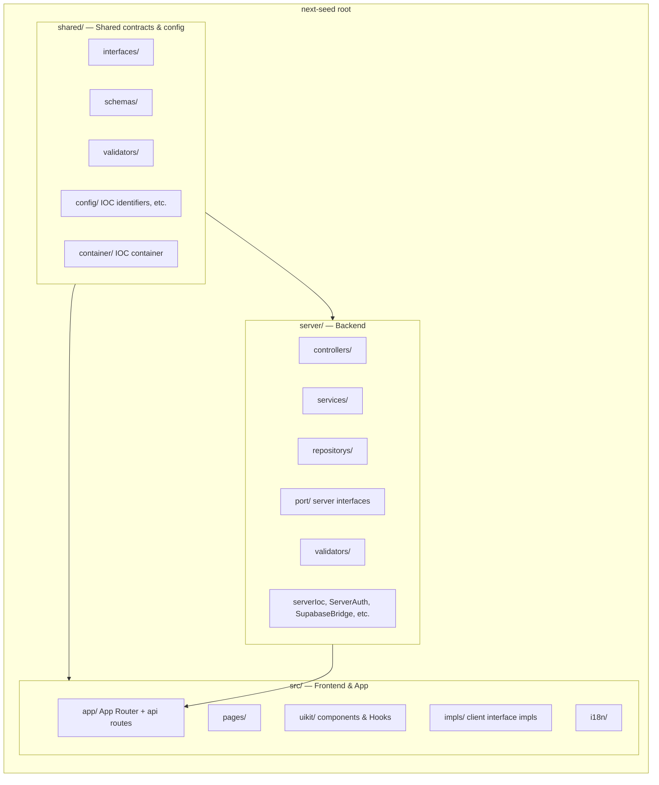
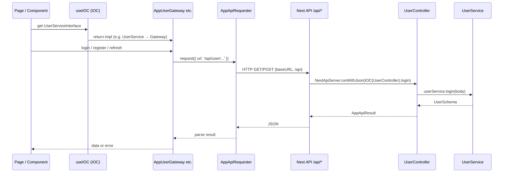
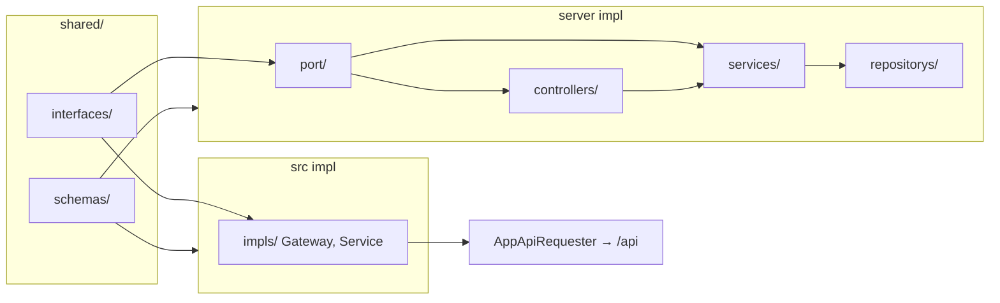

# Next Seed

> 中文: [README.md](./README.md)

**TL;DR**: `npm install` → copy `.env.template` to `.env` → `npm run dev` (default port **3100**, `APP_ENV=localhost`) → production: `npm run build` then `npm start` (default port **3101**).

A full-stack Next.js seed with clear layering, front–back separation, and interface-oriented design.

---

## Tech Stack

| Category            | Technologies                                  |
| ------------------- | --------------------------------------------- |
| **Framework**       | Next.js 16, App Router, React 19              |
| **Validation**      | Zod (schemas and request/response validation) |
| **Data & Auth**     | Supabase (DB, SSR auth, PostgREST)            |
| **UI**              | Ant Design 5, Tailwind CSS 4                  |
| **i18n**            | next-intl                                     |
| **Theme**           | next-themes                                   |
| **DI**              | Container (Inversify, SimpleIOCContainer)     |
| **Utils**           | dayjs, lodash, clsx                           |
| **AI**              | OpenAI SDK (optional)                         |
| **Language & Lint** | TypeScript 5, ESLint, Prettier                |

**Runtime:** Node.js ^20.17.0 or >=22.9.0.

---

## 1. Project Layered Structure

The repo is split into three top-level directories: **server**, **src**, and **shared**.

### Directory structure



### `server/` — Backend (API & business logic)

Runs in Node/Next server context. Holds all server-side API and business logic.

| Path                  | Description                                                                        |
| --------------------- | ---------------------------------------------------------------------------------- |
| `server/controllers/` | HTTP/API handlers that delegate to services                                        |
| `server/services/`    | Business logic (e.g. `UserService`, `ApiLocaleService`, `AIService`)               |
| `server/repositorys/` | Data access (e.g. `LocalesRepository`)                                             |
| `server/port/`        | **Server-side interfaces** (controllers, services, DB, auth)                       |
| `server/validators/`  | Request/input validation for controllers                                           |
| `server/` (root)      | Server bootstrap, IOC registration (`serverIoc.ts`), auth, config, Supabase bridge |

Controllers depend on **interfaces** in `server/port/` (e.g. `UserServiceInterface`, `ServerAuthInterface`); implementations live in `server/services/` and related modules.

### `src/` — Frontend & Next app

User-facing app and Next.js structure.

| Path         | Description                                                                                                                                                            |
| ------------ | ---------------------------------------------------------------------------------------------------------------------------------------------------------------------- |
| `src/app/`   | Next.js App Router: pages, layouts, and **API routes** (`app/api/`)                                                                                                    |
| `src/pages/` | Page components (e.g. admin, auth, about)                                                                                                                              |
| `src/uikit/` | Shared UI: components, Hooks, context (e.g. `useIOC`, `useI18nMapping`, `AdminLayout`)                                                                                 |
| `src/impls/` | **Client implementations** of shared interfaces: Gateways (e.g. `AppUserGateway`), services (`UserService`, `RouterService`, `I18nService`), bootstraps, API requester |
| `src/i18n/`  | i18n routing and message loading                                                                                                                                       |

`src/impls/` implements interfaces from `shared/interfaces/` (e.g. `UserServiceGatewayInterface`, `AppUserApiInterface`), wired via IOC so callers depend on interfaces, not concrete classes.

### `shared/` — Shared contracts & config

Shared by **server** and **src** for a single source of truth.

| Path                 | Description                                                                                                                        |
| -------------------- | ---------------------------------------------------------------------------------------------------------------------------------- |
| `shared/interfaces/` | **Shared interfaces**: API contracts (`AppUserApiInterface`), service interfaces (`UserServiceInterface`, `RouterInterface`), etc. |
| `shared/schemas/`    | Shared data shapes (`UserSchema`, `LoginSchema`, `LocalesSchema`, `PaginationSchema`)                                              |
| `shared/validators/` | Validators and validator interface, used by both client and server                                                                 |
| `shared/config/`     | App config: routes, i18n identifiers/mappings, theme, cookies, nav, IOC identifiers                                                |
| `shared/container/`  | IOC container and DI utilities (e.g. Inversify bindings)                                                                           |

Both sides import from `shared/` to keep contracts and types aligned.

### Summary

- **server**: Backend API, controllers, services, repositories, and server-only ports/implementations.
- **src**: Next app, pages, UI kit, and **client implementations** of shared interfaces; talks to backend via `/api`.
- **shared**: Interfaces, schemas, validators, config, and container — single source of truth for contracts and shared types.

---

## 2. Front–back separation

Same repo and Next app; frontend and backend are separated by responsibility and call flow.

### Front–back flow



### How it runs

- **Backend**: Implemented as **Next.js API routes** under `src/app/api/` (e.g. `app/api/user/login/route.ts`, `app/api/user/session/route.ts`). Each route uses `NextApiServer` and server IOC to run the corresponding Controller/Service.
- **Frontend**: UI in `src/app/` and `src/pages/` talks to the backend only over HTTP. The client uses `AppApiRequester` (and Gateways on top) with `baseURL: '/api'`; all requests go to same-origin `/api/*`.
- **Deploy**: `next start` serves both app and API; no separate backend process. Local dev: `npm run dev` on one port (e.g. 3100).

### Environments

Scripts switch environment (e.g. for different backends or config):

- `dev` — local (`APP_ENV=localhost`)
- `dev:staging` — staging
- `dev:prod` — production-like

Frontend and backend share types and contracts in `shared/` so API and DTOs stay in sync.

---

## 3. Interface-oriented programming

The codebase is organized around **interfaces as contracts** and **dependency injection (IOC)** so both server and client depend on abstractions, not concrete implementations.

### Interface vs implementation



### Interfaces as contracts

**All behavior should be understandable from the interface layer**: callers see what can be done and the in/out types without opening implementations.

Example — user-related capabilities:

```ts
// shared/interfaces/AppUserApiInterface.ts (client API contract)
interface AppUserApiInterface {
  login(params: LoginSchema): Promise<UserSchema>;
  register(params: LoginSchema): Promise<UserSchema>;
  logout(params?: unknown): Promise<void>;
}

// server/port/UserServiceInterface.ts (server user contract)
interface UserServiceInterface {
  login(params: { email: string; password: string }): Promise<UserSchema>;
  register(params: UserServiceRegisterParams): Promise<UserSchema>;
  logout(): Promise<void>;
  refresh(): Promise<UserSchema>;
  getUser(): Promise<UserSchema>;
}
```

Implementations live in `server/` (Controller, UserService) and `src/impls/` (e.g. `AppUserGateway` calling `/api/user/*`); callers depend only on the interfaces above.

### How to follow project flow via interfaces (SeedBootstrapInterface example)

**1. Read the interface** → Flow is “get plugins → startup”:

```ts
// shared/interfaces/SeedBootstrapInterface.ts
export interface SeedBootstrapInterface<Plugin> {
  startup(): void;
  startup(): Promise<unknown>;
  getPlugins(seedConfig: SeedConfigInterface): Plugin[];
}
```

**2. Find implementors** → Search for `implements SeedBootstrapInterface` → `BootstrapClient` (frontend), `BootstrapServer` (server). Frontend calls it from layout via `BootstrapsProvider`:

```ts
// src/uikit/components/BootstrapsProvider.tsx
const [bootstrap] = useState(() => new BootstrapClient(IOC));
useStrictEffect(() => {
  bootstrap.startup(window).then(() => setIocMounted(true));
}, []);
```

**3. Read the plugin list** → Open `BootstrapClient#getPlugins` to see the startup steps in order:

```ts
// src/impls/bootstraps/BootstrapClient.ts (excerpt)
public getPlugins(appConfig: SeedConfigInterface, pathname?: string): BootstrapExecutorPlugin[] {
  const i18nService = this.IOC(I.I18nServiceInterface);
  i18nService.setPathname(pathname ?? '');
  const bootstrapList: BootstrapExecutorPlugin[] = [
    i18nService,                    // 1. i18n
    new AppUserApiBootstrap(...),   // 2. register User API
    restoreUserService             // 3. restore session
  ];
  if (!appConfig.isProduction) bootstrapList.push(printBootstrap);
  bootstrapList.push(IocIdentifierTest);
  return bootstrapList;
}
```

Inside `startup()`, the code runs `bootstrap.initialize()`, then `bootstrap.use(plugins)` and `bootstrap.start()`, so plugins run in the order above. **Use the interface to see the flow, then open implementations for details.**

### Dependency injection (IOC)

Server **strictly** resolves dependencies via IOC; frontend uses IOC **sparingly** for performance and bundle size, preferring plain objects/functions and using `useIOC` only for a few capabilities (e.g. user, router, i18n).

**Server example** (API route; no direct `new` of concrete classes):

```ts
// src/app/api/user/login/route.ts
export async function POST(req: NextRequest) {
  const requestBody = await req.json();
  return await new NextApiServer().runWithJson(
    async ({ parameters: { IOC } }) => IOC(UserController).login(requestBody)
  );
}
```

**Frontend example** (resolve user capability via `useIOC`; use plain functions elsewhere):

```ts
// Inside a component or Hook
const userService = useIOC(I.UserServiceInterface);
await userService.login({ email, password });
```

Identifier `I` comes from `shared/config/ioc-identifiter.ts`. After the root provides the client IOC via `IOCContext.Provider`, the tree can call `useIOC(I.xxx)`.

### Benefits

- **Testability**: Any interface can be replaced with a mock/stub in tests.
- **Swappable implementations**: e.g. different UserService or DB bridge per environment without changing call sites.
- **Clear boundaries**: Frontend and backend agree on `shared/` interfaces and schemas; contract changes are explicit and centralized.

**Summary:** Define interfaces and schemas in **shared/**; implement them in **server** (API) and **src/impls** (client); wire with **IOC** so both sides program against the same contracts.
