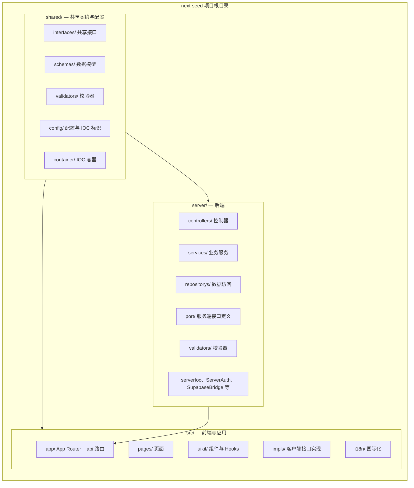
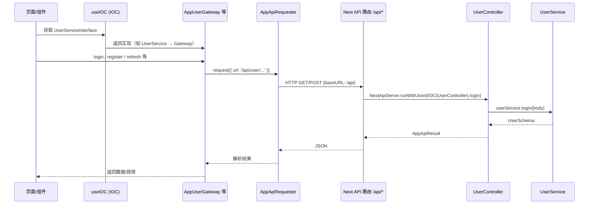
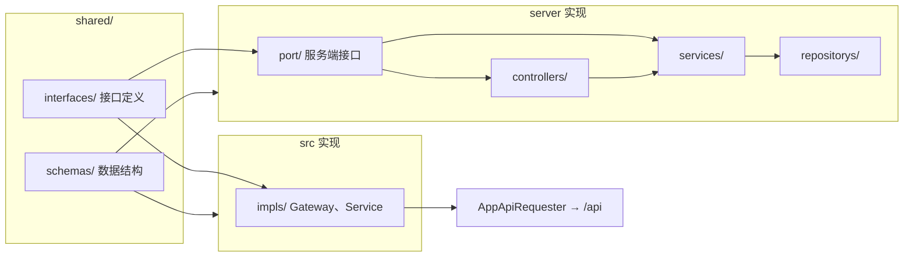

# Next Seed

基于 Next.js 的全栈种子项目，采用清晰分层、前后端分离与面向接口编程。

---

## 技术栈

| 类别           | 技术                                    |
| -------------- | --------------------------------------- |
| **框架**       | Next.js 16、App Router、React 19        |
| **校验**       | Zod（Schema 与请求/响应校验）           |
| **数据与鉴权** | Supabase（数据库、SSR 鉴权、PostgREST） |
| **UI**         | Ant Design 5、Tailwind CSS 4            |
| **国际化**     | next-intl                               |
| **主题**       | next-themes                             |
| **依赖注入**   | 容器(内置Inversify,SimpleIOCContainer)  |
| **工具库**     | dayjs、lodash、clsx                     |
| **AI**         | OpenAI SDK（可选）                      |
| **语言与规范** | TypeScript 5、ESLint、Prettier          |

## 运行环境：Node.js ^20.17.0 或 >=22.9.0。

## 1. 项目分层结构

项目顶层分为三个主目录：**server**、**src**、**shared**，职责分明。

### 目录结构图



### `server/` — 后端（API 与业务逻辑）

运行在 Node/Next 服务端，承载所有服务端 API 与业务逻辑。

| 路径                  | 说明                                                                |
| --------------------- | ------------------------------------------------------------------- |
| `server/controllers/` | 接收请求并委托给服务的 HTTP/API 处理层                              |
| `server/services/`    | 业务逻辑（如 `UserService`、`ApiLocaleService`、`AIService`）       |
| `server/repositorys/` | 数据访问（如 `LocalesRepository`）                                  |
| `server/port/`        | **服务端接口**（控制器、服务、DB、鉴权等契约）                      |
| `server/validators/`  | 请求/入参校验，供控制器使用                                         |
| `server/` 根目录      | 服务端启动、IOC 注册（`serverIoc.ts`）、鉴权、配置、Supabase 桥接等 |

控制器依赖 `server/port/` 中的**接口**（如 `UserServiceInterface`、`ServerAuthInterface`），具体实现在 `server/services/` 等模块。

### `src/` — 前端与 Next 应用

面向用户的应用与 Next 应用结构。

| 路径         | 说明                                                                                                                                      |
| ------------ | ----------------------------------------------------------------------------------------------------------------------------------------- |
| `src/app/`   | Next.js App Router：页面、布局及 **API 路由**（`app/api/`）                                                                               |
| `src/pages/` | 页面组件（如 admin、auth、about）                                                                                                         |
| `src/uikit/` | 通用 UI：组件、Hooks、Context（如 `useIOC`、`useI18nMapping`、`AdminLayout`）                                                             |
| `src/impls/` | **客户端对共享接口的实现**：Gateway（如 `AppUserGateway`）、服务（`UserService`、`RouterService`、`I18nService`）、启动逻辑、API 请求封装 |
| `src/i18n/`  | 国际化路由与文案加载                                                                                                                      |

`src/impls/` 实现 `shared/interfaces/` 中定义的接口（如 `UserServiceGatewayInterface`、`AppUserApiInterface`），通过 IOC 注入给页面与组件使用，使调用方依赖接口而非具体类。

### `shared/` — 共享契约与配置

**server** 与 **src** 共用，统一契约与配置。

| 路径                 | 说明                                                                                                     |
| -------------------- | -------------------------------------------------------------------------------------------------------- |
| `shared/interfaces/` | **共享接口**：API 契约（`AppUserApiInterface`）、服务接口（`UserServiceInterface`、`RouterInterface`）等 |
| `shared/schemas/`    | 共享数据结构（如 `UserSchema`、`LoginSchema`、`LocalesSchema`、`PaginationSchema`）                      |
| `shared/validators/` | 校验器及校验接口，前后端共用                                                                             |
| `shared/config/`     | 应用配置：路由、i18n 标识/映射、主题、Cookie、导航、IOC 标识等                                           |
| `shared/container/`  | IOC 容器与 DI 工具（如 Inversify 绑定）                                                                  |

前后端通过引用 `shared/` 的接口与 Schema 保持契约一致。

### 小结

- **server**：后端 API、控制器、服务、仓储及仅服务端的 port 与实现。
- **src**：Next 应用、页面、UI 库及**客户端对共享接口的实现**，通过 `/api` 访问后端。
- **shared**：接口、Schema、校验器、配置与容器，作为契约与共享类型的唯一来源。

---

## 2. 前后端分离开发

在同一个仓库、同一套 Next 应用下，从职责与调用关系上区分前端与后端。

### 前后端协作流程图



### 运行方式

- **后端**：以 **Next.js API 路由** 形式存在于 `src/app/api/`（如 `app/api/user/login/route.ts`、`app/api/user/session/route.ts`）。每个路由通过 `NextApiServer` 与 server IOC 调用对应的 Controller/Service。
- **前端**：`src/app/` 与 `src/pages/` 中的 UI 仅通过 HTTP 与后端通信。客户端使用 `AppApiRequester`（及基于它的 Gateway），`baseURL` 为 `/api`，所有请求发往同源的 `/api/*`。
- **部署**：生产环境 `next start` 同时提供页面与 API，无需单独起后端进程；本地开发通过 `npm run dev` 在同一端口（如 3100）跑完整应用。

### 环境区分

通过脚本切换环境，便于对接不同后端或配置：

- `dev` — 本地（如 `APP_ENV=localhost`）
- `dev:staging` — 预发
- `dev:prod` — 生产态

前后端共用 `shared/` 中的类型与契约，保证 API 与 DTO 一致，避免重复定义。

---

## 3. 面向接口编程

整体以**接口为契约**、**依赖注入（IOC）** 的方式组织，服务端与客户端都依赖抽象而非具体实现。

### 接口与实现关系图



### 接口即契约

**所有功能逻辑都应能从接口层直接看清**：调用方只需看接口定义，无需翻实现即可知道“能做什么、入参出参是什么”。

例如用户相关能力，看接口即可明确：

```ts
// shared/interfaces/AppUserApiInterface.ts（前端调 API 的契约）
interface AppUserApiInterface {
  login(params: LoginSchema): Promise<UserSchema>;
  register(params: LoginSchema): Promise<UserSchema>;
  logout(params?: unknown): Promise<void>;
}

// server/port/UserServiceInterface.ts（服务端用户能力的契约）
interface UserServiceInterface {
  login(params: { email: string; password: string }): Promise<UserSchema>;
  register(params: UserServiceRegisterParams): Promise<UserSchema>;
  logout(): Promise<void>;
  refresh(): Promise<UserSchema>;
  getUser(): Promise<UserSchema>;
}
```

实现分别在 `server/`（Controller、UserService）与 `src/impls/`（如 `AppUserGateway` 调 `/api/user/*`），调用方只依赖上述接口。

### 如何通过接口查看项目流程（以 SeedBootstrapInterface 为例）

**1. 看接口** → 流程骨架是“取插件 → 启动”：

```ts
// shared/interfaces/SeedBootstrapInterface.ts
export interface SeedBootstrapInterface<Plugin> {
  startup(): void;
  startup(): Promise<unknown>;
  getPlugins(seedConfig: SeedConfigInterface): Plugin[];
}
```

**2. 看谁实现** → 搜 `implements SeedBootstrapInterface`，得到前端入口 `BootstrapClient`、服务端入口 `BootstrapServer`。前端在 layout 里由 `BootstrapsProvider` 调用：

```ts
// src/uikit/components/BootstrapsProvider.tsx
const [bootstrap] = useState(() => new BootstrapClient(IOC));
useStrictEffect(() => {
  bootstrap.startup(window).then(() => setIocMounted(true));
}, []);
```

**3. 看插件列表** → 打开 `BootstrapClient#getPlugins`，即启动时依次执行的步骤：

```ts
// src/impls/bootstraps/BootstrapClient.ts 片段
public getPlugins(appConfig: SeedConfigInterface, pathname?: string): BootstrapExecutorPlugin[] {
  const i18nService = this.IOC(I.I18nServiceInterface);
  i18nService.setPathname(pathname ?? '');
  const bootstrapList: BootstrapExecutorPlugin[] = [
    i18nService,                              // 1. 国际化
    new AppUserApiBootstrap(...),            // 2. 注册 User API
    restoreUserService                      // 3. 恢复登录态
  ];
  if (!appConfig.isProduction) bootstrapList.push(printBootstrap);
  bootstrapList.push(IocIdentifierTest);
  return bootstrapList;
}
```

`startup()` 内会先 `bootstrap.initialize()`，再 `bootstrap.use(plugins)`、`bootstrap.start()`，即按上述列表顺序执行。**先看 interface 定流程，再找实现看细节**。

### 依赖注入（IOC）

服务端**严格用 IOC** 解析依赖；前端为性能与打包**少用 IOC**，以 普通对象/function 为主，仅对少数能力（如用户、路由、国际化）用 `useIOC`。

**服务端示例**（API 路由内，只依赖接口，不 `new` 具体类）：

```ts
// src/app/api/user/login/route.ts
export async function POST(req: NextRequest) {
  const requestBody = await req.json();
  return await new NextApiServer().runWithJson(
    async ({ parameters: { IOC } }) => IOC(UserController).login(requestBody)
  );
}
```

**前端示例**（需要用户能力时用 `useIOC` 取接口实现，其余用普通 function）：

```ts
// 组件或 Hook 内
const userService = useIOC(I.UserServiceInterface);
await userService.login({ email, password });
```

标识符 `I` 来自 `shared/config/ioc-identifiter.ts`；根组件用 `IOCContext.Provider` 注入 client IOC 后，子树即可使用 `useIOC(I.xxx)`。

### 带来的好处

- **可测试**：任意接口都可在测试中替换为 Mock/Stub。
- **可替换实现**：例如按环境切换不同的 UserService 或 DB 桥接，而调用方不变。
- **边界清晰**：前后端以 `shared/` 的接口与 Schema 为契约，变更集中、显式。

总结：在 **shared/** 定义接口与 Schema，在 **server** 提供 API 侧实现、在 **src/impls** 提供客户端实现，通过 **IOC** 装配，两端都面向同一套契约编程。
