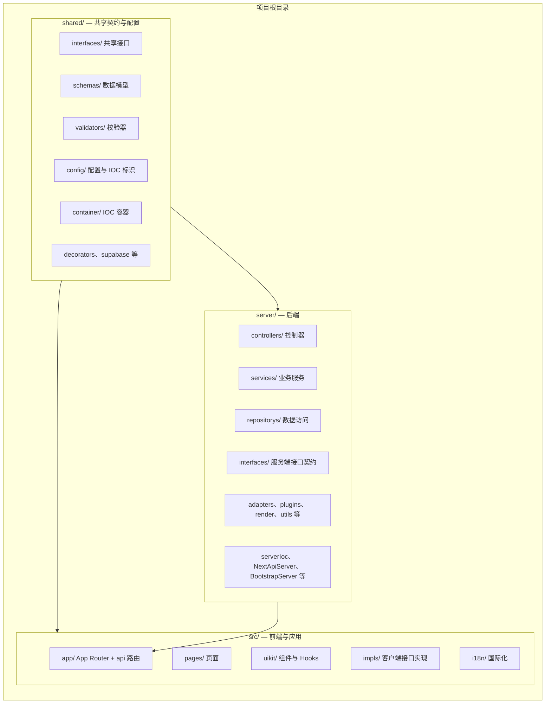
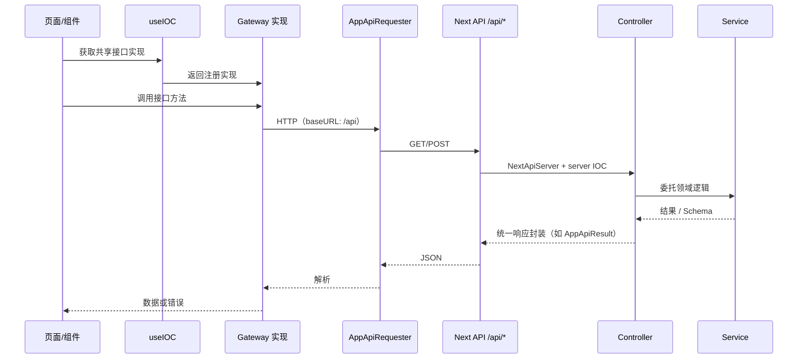
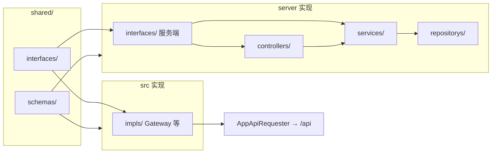

# xOranj Web（`@xOranj/web`）

> English: [README.en.md](./README.en.md)

**TL;DR**：`npm install` → 将 `.env.template` 复制为 `.env` 并按注释填写 → `npm run dev`（默认端口 **3100**，`APP_ENV=localhost`）→ 生产：`npm run build` 后 `npm start`（默认端口 **3101**）。

基于 **Next.js** 的全栈应用（分层思路与早期 **next-seed** 一致）：**清晰分层**、**前后端职责分离**、**面向接口编程**。契约集中在 `shared/`，服务端与客户端通过 **接口 + IOC（Inversify + 项目内 SimpleIOCContainer 等）** 装配。

---

## 技术栈

| 类别           | 技术                                     |
| -------------- | ---------------------------------------- |
| **框架**       | Next.js 16、App Router、React 19         |
| **校验**       | Zod（Schema 与请求/响应校验）            |
| **数据与鉴权** | Supabase（数据库、SSR 鉴权、PostgREST）  |
| **UI**         | Ant Design 5、Tailwind CSS 4             |
| **国际化**     | next-intl                                |
| **主题**       | next-themes                              |
| **依赖注入**   | Inversify、SimpleIOCContainer（项目内）  |
| **工具库**     | dayjs、lodash、clsx                      |
| **AI**         | OpenAI 兼容 SDK（可选，用于对话/向量等） |
| **语言与质量** | TypeScript 5、ESLint、Prettier、Vitest   |

**运行环境**：Node.js `^20.17.0` 或 `>=22.9.0`，npm `>=10.0.0`（见 `package.json` 的 `engines`）。

---

## 快速开始

1. 安装依赖：`npm install`
2. 复制 `.env.template` 为 `.env`，按注释填写；未尽变量见 `server/ServerConfig.ts`
3. 数据库脚本在 `makes/sql/`，按部署环境执行
4. 开发：`npm run dev`（默认端口 **3100**，`APP_ENV=localhost`）
5. 生产：`npm run build` 后 `npm start`（默认端口 **3101**）

常用脚本还包括：`dev:staging` / `dev:prod`、`type-check`、`test`、`lint`、`format` 等，详见 `package.json` 的 `scripts`。

---

## 1. 项目分层结构

顶层分为 **`server/`**、**`src/`**、**`shared/`**；另有 **`docs/`**（领域与设计文档）、**`makes/sql/`**（库表脚本）、**`tools/`**（工程脚本）、**`public/`**、**`__tests__/`** 等。

### 目录结构图



### `server/` — 后端（API 与业务逻辑）

运行在 Node/Next 服务端，承载所有服务端 API 与领域逻辑。

| 路径                  | 说明                                                                                              |
| --------------------- | ------------------------------------------------------------------------------------------------- |
| `server/controllers/` | 接收请求并委托给服务的 HTTP/API 处理层                                                            |
| `server/services/`    | 业务服务（编排、领域逻辑）                                                                        |
| `server/repositorys/` | 数据访问与持久化封装                                                                              |
| `server/interfaces/`  | **服务端接口契约**（控制器、服务、外部适配等依赖的抽象）                                          |
| `server/adapters/` 等 | 对外部系统或协议的适配；`plugins/`、`render/`、`utils/` 为插件、渲染辅助与工具                    |
| `server/` 根目录      | `serverIoc.ts`（服务端 IOC 注册）、`NextApiServer.ts`、`BootstrapServer.ts`、`ServerConfig.ts` 等 |

控制器依赖 **`server/interfaces/`** 中的抽象，具体实现分布在 `services/`、`repositorys/`、`adapters/` 等模块。**入参/响应校验**优先复用 **`shared/validators/`** 与 Zod Schema，在控制器或服务边界使用。

### `src/` — 前端与 Next 应用

面向用户的应用与 Next 应用结构。

| 路径          | 说明                                                                                             |
| ------------- | ------------------------------------------------------------------------------------------------ |
| `src/app/`    | Next.js App Router：布局、页面及 **API 路由**（`app/api/`）                                      |
| `src/pages/`  | 页面组件（如 admin、auth 等业务页面）                                                            |
| `src/uikit/`  | 通用 UI：组件、Hooks、Context（如 `useIOC`、`AdminLayout` 等）                                   |
| `src/impls/`  | **客户端对共享接口的实现**：Gateway、`AppApiRequester` 封装、与启动/Bootstrap 相关的客户端逻辑等 |
| `src/i18n/`   | 国际化路由与文案加载                                                                             |
| `src/styles/` | 全局与模块样式                                                                                   |

`src/impls/` 实现 **`shared/interfaces/`** 中定义的契约，通过 IOC 注入给页面与组件，使调用方依赖接口而非具体类。

### `shared/` — 共享契约与配置

**server** 与 **src** 共用，统一契约与配置。

| 路径                 | 说明                                                                               |
| -------------------- | ---------------------------------------------------------------------------------- |
| `shared/interfaces/` | **共享接口**：API/Gateway 契约、路由/用户等跨端服务接口等                          |
| `shared/schemas/`    | 共享数据结构（Zod Schema 与推导类型）                                              |
| `shared/validators/` | 校验器及校验相关约定，前后端可共用                                                 |
| `shared/config/`     | 应用配置：路由、i18n、主题、Cookie、导航、**IOC 标识符**（如 `ioc-identifiter`）等 |
| `shared/container/`  | IOC 容器与 DI 辅助（如 Inversify 绑定）                                            |
| 其他                 | `decorators/`、`supabase/` 等与横切能力或类型共享相关的定义                        |

前后端通过引用 **`shared/`** 的接口与 Schema 保持 **API 与 DTO 一致**，避免重复定义。

### 小结

- **server**：后端 API、控制器、服务、仓储及服务端专用接口与实现。
- **src**：Next 应用、页面、UI 及**客户端对接口的实现**，通过 `/api` 访问后端。
- **shared**：接口、Schema、校验器、配置与容器，作为契约与共享类型的主要来源。

---

## 2. 前后端分离（同一进程内）

在同一个 Next 应用内，从职责与调用关系上区分前端与后端：**浏览器只访问同源 `/api/*`**，不直接依赖服务端实现类。

### 协作流程图



### 运行方式

- **后端**：以 **Next.js Route Handlers** 形式位于 `src/app/api/`。每个路由通过 **`NextApiServer`** 与 **server IOC** 调用对应 Controller → Service。
- **前端**：UI 仅通过 HTTP 与后端通信；客户端使用 **`AppApiRequester`**（及基于它的 Gateway），`baseURL` 为 **`/api`**，请求发往同源 `/api/*`。
- **部署**：生产环境 **`next start`** 同时提供页面与 API，无需单独起后端进程；本地 **`npm run dev`** 在同一端口调试全栈。

### 环境脚本

通过脚本切换运行配置，便于对接不同环境：

- `dev` — 本地（如 `APP_ENV=localhost`）
- `dev:staging` — 预发
- `dev:prod` — 生产配置态

**前后端共用 `shared/` 中的类型与契约**，保证 API 路径、入参与响应形状一致，减少联调成本。

---

## 3. 面向接口编程

整体以**接口为契约**、**依赖注入（IOC）** 组织：服务端与客户端都依赖抽象，具体类在入口或模块内注册。

### 接口与实现关系图



### 接口即契约

**功能边界应能从接口层直接看清**：调用方只需阅读 **`shared/interfaces/`** 与相关 **Schema**，即可知道「能做什么、入参/出参是什么」，再按需下钻到 `server/` 或 `src/impls/` 的实现。

### 如何通过接口追代码（以启动流程为例）

1. **看接口**：在 `shared/interfaces/` 中找到 **`SeedBootstrapInterface`**，弄清启动生命周期（如 `startup`、`getPlugins` 等约定）。
2. **找实现**：在仓库中搜索 **`implements SeedBootstrapInterface`**，对应 **客户端** `BootstrapClient`、**服务端** `BootstrapServer`。
3. **看挂载与顺序**：客户端在布局侧由 **`BootstrapsProvider`** 等触发 `startup`；插件执行顺序由各自 **`getPlugins`** 返回列表决定（具体插件名与业务相关，以代码为准）。

遵循 **「先接口定边界，再实现看细节」**，可快速建立对一条链路的心智模型。

### 契约写法（示意）

共享层描述「客户端如何调 API」，服务端 **`server/interfaces/`** 描述「领域服务承诺什么」，类型与 **`shared/schemas/`** 对齐：

```ts
// shared/interfaces：跨端/Gateway 能力（形态示意）
interface ExampleGatewayInterface {
  fetchSomething(params: SomeInputSchema): Promise<SomeOutputSchema>;
}

// server/interfaces：服务端领域端口（形态示意）
interface ExampleServiceInterface {
  run(params: SomeInputSchema): Promise<SomeOutputSchema>;
}
```

### 依赖注入（IOC）

- **服务端**：在 API 路由中**统一通过 IOC** 解析 Controller / Service，避免在 `route.ts` 里散落 `new` 具体类。

```ts
// src/app/api/.../route.ts（模式示意）
export async function POST(req: NextRequest) {
  const body = await req.json();
  return await new NextApiServer().runWithJson(
    async ({ parameters: { IOC } }) => IOC(YourController).yourMethod(body)
  );
}
```

- **客户端**：为性能与打包体积，**仅对少数横切能力**（如用户会话、路由、国际化等）使用 **`useIOC`**；其余逻辑可用普通函数或局部状态。标识符 **`I`** 来自 **`shared/config`** 中的 IOC 标识定义；根组件通过 **`IOCContext.Provider`**（见 `src/uikit`）注入 client IOC 后，子树内可使用 `useIOC(I.xxx)`。

```ts
const gateway = useIOC(I.YourGatewayInterface);
await gateway.fetchSomething(payload);
```

### 带来的好处

- **可测试**：接口可在测试中替换为 Mock / Stub。
- **可替换实现**：按环境或版本切换 Gateway、仓储或桥接实现，调用方不变。
- **边界清晰**：前后端以 **`shared/`** 与 **`server/interfaces/`** 为变更入口，契约显式、集中。
- **减少重复**：DTO 与校验规则不前后各写一套，降低漂移风险。

---

**总结**：在 **`shared/`** 定义接口与 Schema，在 **`server/`** 实现 API 侧能力，在 **`src/impls`** 实现客户端侧能力，通过 **IOC** 装配；**单一 Next 进程**内完成全栈交付，开发时用 **`npm run dev`** 即可同时调试页面与 `/api`。
