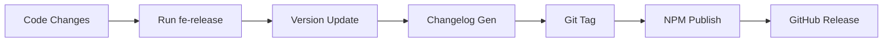
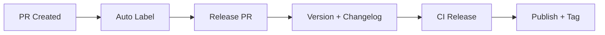

# Fe-release

[](https://www.npmjs.com/package/@qlover/fe-release)
[](https://github.com/your-repo/fe-release/blob/main/LICENSE)

A professional front-end release automation tool built on top of [@changesets/cli](https://github.com/changesets/changesets), providing enhanced workflows for automated PR management and release processes.

## 📚 Table of Contents

- [Features](#features)
- [Installation](#installation)
- [Quick Start](#quick-start)
- [Usage](#usage)
- [Configuration](#configuration)
- [Workflows](#workflows)
- [Plugin System](#plugin-system)
- [API Reference](#api-reference)
- [Troubleshooting](#troubleshooting)
- [Contributing](#contributing)
- [License](#license)

## ✨ Features

- **Automated Version Management**
  - Powered by `@changesets/cli` for reliable version control
  - Automatic version bumping based on changes
  - Configurable version increment strategies

- **Flexible Release Workflows**
  - Manual release process for direct control
  - PR-based automated release workflow (GitHub)
  - Customizable release strategies

- **GitHub Integration**
  - Automated PR creation and management
  - Smart PR labeling system
  - Automated release notes generation
  - GitHub Actions integration

- **Workspace Support**
  - First-class monorepo support
  - Multi-package release coordination
  - Dependency graph awareness
  - Selective package publishing

- **Extensive Configuration**
  - Rich CLI options
  - Configurable via `fe-config.json`
  - Environment variable support
  - Plugin system for customization

## 🚀 Installation

```bash
# Using npm
npm install @qlover/fe-release

# Using yarn
yarn add @qlover/fe-release

# Using pnpm
pnpm add @qlover/fe-release
```

## 🏃 Quick Start

1. **Basic Release**
```bash
# Create a release PR
fe-release -P

# Perform a dry run
fe-release --dry-run
```

2. **Workspace Release**
```bash
# Release multiple packages
fe-release --workspaces.change-labels=pkg1,pkg2 -P
```

## 💻 Usage

### Command Line Interface

```bash
fe-release [options]
```

#### Core Options

| Option | Description | Default |
|--------|-------------|---------|
| `-v, --version` | Output version | - |
| `-d, --dry-run` | Preview without making changes | `false` |
| `-V, --verbose` | Show detailed logs | `false` |
| `-p, --publish-path` | Package publish path | - |
| `-P, --githubPR.release-PR` | Create release PR | `false` |

#### Advanced Options

| Option | Description | Default |
|--------|-------------|---------|
| `-b, --branch-name` | Release branch template | `release-${pkgName}-${tagName}` |
| `-s, --source-branch` | Source branch | `master` |
| `-i, --changelog.increment` | Version increment type | `patch` |
| `--changelog.skip` | Skip changelog generation | `false` |
| `--packages-directories` | Changed package directories | - |
| `-l, --workspaces.change-labels` | Change labels | - |

## ⚙️ Configuration

### Environment Variables

| Variable | Description | Default |
|----------|-------------|---------|
| `FE_RELEASE` | Enable/disable release | `true` |
| `FE_RELEASE_BRANCH` | Source branch | - |
| `FE_RELEASE_ENV` | Release environment | - |

### fe-config.json

```json
{
  "release": {
    "publishPath": "",
    "autoMergeReleasePR": false,
    "autoMergeType": "squash",
    "branchName": "release-${pkgName}-${tagName}",
    "PRTitle": "[${pkgName} Release] Branch:${branch}, Tag:${tagName}, Env:${env}",
    "packagesDirectories": ["packages/*"],
    "maxWorkspace": 3,
    "multiWorkspaceSeparator": "_",
    "workspaceVersionSeparator": "@"
  }
}
```

#### Configuration Options

| Option | Description | Default |
|--------|-------------|---------|
| `publishPath` | Package publish directory | - |
| `autoMergeReleasePR` | Auto-merge release PRs | `false` |
| `autoMergeType` | Merge strategy | `squash` |
| `branchName` | Branch name template | `release-${pkgName}-${tagName}` |
| `PRTitle` | PR title template | See above |
| `maxWorkspace` | Max workspaces per release | `3` |

## 🔄 Workflows

### Manual Release Flow



### PR-based Release Flow (GitHub)



## 🔌 Plugin System

### Built-in Plugins

- **GithubPR**: Handles GitHub PR automation
- **Workspaces**: Manages workspace releases
- **Changelog**: Generates changelogs

### Custom Plugin Example

```typescript
import { Plugin } from '@qlover/fe-release';

class CustomPlugin extends Plugin {
  async apply(context) {
    // Plugin logic
  }
}
```

## 🔍 Troubleshooting

### Common Issues

1. **Release Skipped**
   ```bash
   Error: Skip Release
   ```
   Solution: Check `FE_RELEASE` environment variable

2. **PR Creation Failed**
   - Verify GitHub token permissions
   - Check repository access
   - Validate branch existence

### Debug Mode

Enable verbose logging:
```bash
fe-release -V
```

## 🤝 Contributing

1. Fork the repository
2. Create your feature branch
3. Commit your changes
4. Push to the branch
5. Create a Pull Request

## 📄 License

This project is licensed under the MIT License - see the [LICENSE](LICENSE) file for details.

## 🙏 Acknowledgments

- [@changesets/cli](https://github.com/changesets/changesets) team
- All contributors to this project

---

For more information, please visit our [documentation](https://your-docs-url.com).
