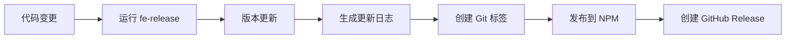

# Fe-release

[](https://www.npmjs.com/package/@qlover/fe-release)
[](https://github.com/qlover/fe-release/blob/main/LICENSE)
[](https://github.com/qlover/fe-release/pulls)

一个基于 [@changesets/cli](https://github.com/changesets/changesets) 构建的专业前端发布自动化工具，提供增强的工作流程，用于自动化 PR 管理和发布流程。

## 📚 目录

- [特性](#特性)
- [安装](#安装)
- [快速开始](#快速开始)
- [使用方法](#使用方法)
- [配置](#配置)
- [工作流程](#工作流程)
- [插件系统](#插件系统)
- [常见问题](#常见问题)
- [贡献指南](#贡献指南)
- [许可证](#许可证)

## ✨ 特性

- **自动化版本管理**
  - 基于 `@changesets/cli` 的可靠版本控制
  - 根据变更自动进行版本更新
  - 可配置的版本递增策略
  - 支持语义化版本（Semantic Versioning）

- **灵活的发布工作流**
  - 手动发布流程，提供直接控制
  - 基于 PR 的自动化发布工作流（GitHub）
  - 可自定义的发布策略
  - 支持多环境发布（开发、测试、生产）

- **GitHub 集成**
  - 自动化 PR 创建和管理
  - 智能 PR 标签系统
  - 自动生成发布说明
  - GitHub Actions 集成
  - 支持自动合并和冲突解决

- **工作区支持**
  - 一流的 monorepo 支持
  - 多包发布协调
  - 依赖图感知
  - 选择性包发布
  - 支持私有包发布

- **丰富的配置选项**
  - 丰富的 CLI 选项
  - 通过 `fe-config.json` 配置
  - 环境变量支持
  - 插件系统支持自定义扩展

## 🚀 安装

```bash
# 使用 npm
npm install @qlover/fe-release --save-dev

# 使用 yarn
yarn add @qlover/fe-release --dev

# 使用 pnpm
pnpm add @qlover/fe-release -D
```

## 🏃 快速开始

1. **基础发布**
```bash
# 创建发布 PR
fe-release -P

# 预览发布（不实际执行）
fe-release --dry-run

# 指定版本类型发布
fe-release --changelog.increment=major
```

2. **工作区发布**
```bash
# 发布多个包
fe-release --workspaces.change-labels=pkg1,pkg2 -P

# 指定发布目录
fe-release --publish-path=packages/core
```

3. **环境发布**
```bash
# 发布到测试环境
fe-release --env=test -P

# 发布到生产环境
fe-release --env=prod -P
```

## 💻 使用方法

### 命令行接口

```bash
fe-release [options]
```

#### 核心选项

| 选项 | 描述 | 默认值 |
|------|------|--------|
| `-v, --version` | 显示版本号 | - |
| `-d, --dry-run` | 预览模式，不实际执行更改 | `false` |
| `-V, --verbose` | 显示详细日志 | `false` |
| `-p, --publish-path` | 包发布路径 | - |
| `-P, --githubPR.release-PR` | 创建发布 PR | `false` |
| `--env` | 发布环境 | `prod` |

#### 高级选项

| 选项 | 描述 | 默认值 |
|------|------|--------|
| `-b, --branch-name` | 发布分支模板 | `release-${pkgName}-${tagName}` |
| `-s, --source-branch` | 源分支 | `master` |
| `-i, --changelog.increment` | 版本递增类型 | `patch` |
| `--changelog.skip` | 跳过更新日志生成 | `false` |
| `--packages-directories` | 变更包目录 | - |
| `-l, --workspaces.change-labels` | 变更标签 | - |

## ⚙️ 配置

### 环境变量

| 变量 | 描述 | 默认值 |
|------|------|--------|
| `FE_RELEASE` | 启用/禁用发布 | `true` |
| `FE_RELEASE_BRANCH` | 源分支 | - |
| `FE_RELEASE_ENV` | 发布环境 | - |
| `FE_RELEASE_TOKEN` | GitHub Token | - |

### fe-config.json

```json
{
  "release": {
    "publishPath": "",
    "autoMergeReleasePR": false,
    "autoMergeType": "squash",
    "branchName": "release-${pkgName}-${tagName}",
    "PRTitle": "[${pkgName} Release] Branch:${branch}, Tag:${tagName}, Env:${env}",
    "PRBody": "This PR includes version bump to ${tagName}",
    "packagesDirectories": ["packages/*"],
    "githubPR": {
      "commitArgs": ["--no-verify"],
      "pushChangedLabels": true,
      "releaseName": "Release ${name} v${version}",
      "commitMessage": "chore(tag): ${name} v${version}"
    },
    "changelog": {
      "gitChangelogOptions": {
        "types": [
          { "type": "feat", "section": "#### ✨ Features", "hidden": false },
          { "type": "fix", "section": "#### 🐞 Bug Fixes", "hidden": false },
          { "type": "chore", "section": "#### 🔧 Chores", "hidden": true },
          { "type": "docs", "section": "#### 📝 Documentation", "hidden": false },
          { "type": "refactor", "section": "#### ♻️ Refactors", "hidden": false },
          { "type": "perf", "section": "#### 🚀 Performance", "hidden": false },
          { "type": "test", "section": "#### 🚨 Tests", "hidden": true },
          { "type": "style", "section": "#### 🎨 Styles", "hidden": true },
          { "type": "ci", "section": "#### 🔄 CI", "hidden": true },
          { "type": "build", "section": "#### 🚧 Build", "hidden": false },
          { "type": "revert", "section": "#### ⏪ Reverts", "hidden": true },
          { "type": "release", "section": "#### 🔖 Releases", "hidden": true }
        ]
      }
    }
  }
}
```

## 🔄 工作流程

### 手动发布流程



### PR 发布流程（GitHub）


## 🔌 插件系统

### 内置插件

- **GithubPR**: 处理 GitHub PR 自动化
- **Workspaces**: 管理工作区发布
- **Changelog**: 生成更新日志
- **Version**: 版本管理
- **Publish**: 包发布

### 自定义插件示例

```typescript
import { Plugin } from '@qlover/fe-release';

class CustomPlugin extends Plugin {
  async apply(context) {
    // 插件逻辑
    const { config, logger } = context;
    
    // 在发布前执行
    this.hooks.beforePublish.tap('custom-plugin', async () => {
      logger.info('执行自定义发布前操作');
    });
    
    // 在发布后执行
    this.hooks.afterPublish.tap('custom-plugin', async () => {
      logger.info('执行自定义发布后操作');
    });
  }
}
```

## 🔍 常见问题

### 常见问题

1. **发布被跳过**
   ```bash
   Error: Skip Release
   ```
   解决方案：
   - 检查 `FE_RELEASE` 环境变量
   - 确认是否有需要发布的变更
   - 验证包版本是否需要更新

2. **PR 创建失败**
   - 验证 GitHub token 权限
   - 检查仓库访问权限
   - 确认分支是否存在
   - 检查 PR 标题格式

3. **发布失败**
   - 确认 npm 登录状态
   - 检查包名是否重复
   - 验证版本号是否合法
   - 检查网络连接

### 调试模式

启用详细日志：
```bash
fe-release -V
```

## 🤝 贡献指南

1. Fork 本仓库
2. 创建特性分支
3. 提交变更
4. 推送到分支
5. 创建 Pull Request

## 📄 许可证

本项目采用 MIT 许可证 - 详见 [LICENSE](LICENSE) 文件

## 🙏 致谢

- [@changesets/cli](https://github.com/changesets/changesets) 团队
- 所有项目贡献者

---

更多信息，请访问我们的[文档](https://qlover.github.io/fe-release)。
