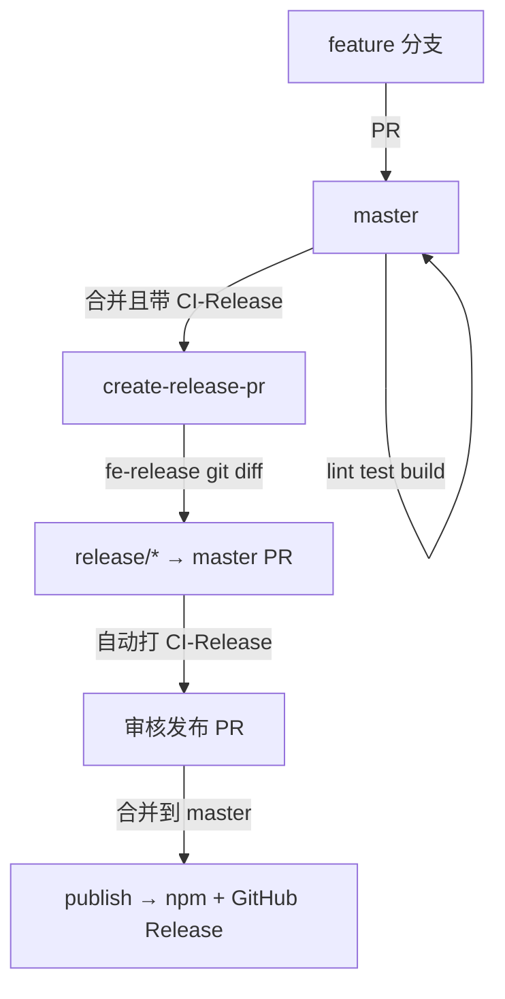

# Fe-release

[](https://www.npmjs.com/package/@qlover/fe-release)
[](https://github.com/qlover/fe-release/blob/main/LICENSE)
[](https://github.com/qlover/fe-release/pulls)

一个基于 [@changesets/cli](https://github.com/changesets/changesets) 构建的专业前端发布自动化工具，提供增强的工作流程，用于自动化 PR 管理和发布流程。

## 📚 目录

- [特性](#特性)
- [安装](#安装)
- [快速开始](#快速开始)
- [使用方法](#使用方法)
- [配置](#配置)
- [工作流程](#工作流程)
- [常见问题](#常见问题)
- [贡献指南](#贡献指南)
- [许可证](#许可证)

## ✨ 特性

- **自动化版本管理**
  - 基于 `@changesets/cli` 的可靠版本控制
  - 根据变更自动进行版本更新
  - 可配置的版本递增策略
  - 支持语义化版本（Semantic Versioning）

- **灵活的发布工作流**
  - 手动发布流程，提供直接控制
  - 基于 PR 的自动化发布工作流（GitHub）
  - 可自定义的发布策略
  - 支持多环境发布（开发、测试、生产）

- **GitHub 集成**
  - 自动化 PR 创建和管理
  - 智能 PR 标签系统
  - 自动生成发布说明
  - GitHub Actions 集成
  - 支持自动合并和冲突解决

- **工作区支持**
  - 一流的 monorepo 支持
  - 多包发布协调
  - 依赖图感知
  - 选择性包发布
  - 支持私有包发布

- **丰富的配置选项**
  - 丰富的 CLI 选项
  - 通过 `fe-config.json` 配置
  - 环境变量支持
  - 插件系统支持自定义扩展

## 🚀 安装

```bash
# 使用 npm
npm install @qlover/fe-release --save-dev

# 使用 yarn
yarn add @qlover/fe-release --dev

# 使用 pnpm
pnpm add @qlover/fe-release -D
```

## 🏃 快速开始

1. **本地创建发布 PR（预览）**

```bash
# 从 master 创建发布 PR（dry-run）
fe-release -d -V -s master --github.push-change-labels

# 指定版本递增
fe-release -i patch -s master
fe-release -i minor -s master
```

2. **Monorepo 选择性发布**

```bash
# 只发布带 changes 标签的包
fe-release -l "changes:packages/fe-release" -i patch -s master

# 指定包目录
fe-release --workspaces.packages-directories packages/fe-release,packages/fe-scripts -i patch
```

3. **仅发布（版本已在 release PR 中更新）**

```bash
fe-release --changesetVersion.skip-changeset --changesetVersion.mode publish
```

## 💻 使用方法

### 命令行接口

```bash
fe-release [options]
```

#### 核心选项

| 选项                               | 描述                     | 默认值   |
| ---------------------------------- | ------------------------ | -------- |
| `-v, --version`                    | 显示版本号               | -        |
| `-d, --dry-run`                    | 预览模式，不实际执行更改 | `false`  |
| `-V, --verbose`                    | 显示详细日志             | `false`  |
| `-s, --source-branch`              | 发布 PR 的目标分支       | `master` |
| `-i, --changesetVersion.increment` | 版本递增类型             | `patch`  |

#### 高级选项

| 选项                                             | 描述                           | 默认值                             |
| ------------------------------------------------ | ------------------------------ | ---------------------------------- |
| `-b, --github.branch-name`                       | 发布分支名模板                 | `release/${repoName}-${releaseId}` |
| `-l, --workspaces.change-labels`                 | 变更标签（过滤发布范围）       | -                                  |
| `--workspaces.packages-directories`              | 扫描的包目录                   | `find-workspaces`                  |
| `--github.push-change-labels`                    | 将 changes 标签附加到发布 PR   | `false`                            |
| `--github.skip-create-release-pr`                | 跳过创建 GitHub PR             | `false`                            |
| `--changesetVersion.mode`                        | `version` / `publish` / `both` | `version`                          |
| `--changesetVersion.skip-changeset`              | 跳过 changeset 文件生成        | `false`                            |
| `--changesetVersion.ignore-non-updated-packages` | 恢复仅因依赖而变更的包         | `false`                            |

## ⚙️ 配置

### 环境变量

| 变量                                | 描述                                | 默认值   |
| ----------------------------------- | ----------------------------------- | -------- |
| `FE_RELEASE`                        | 启用/禁用发布                       | `true`   |
| `FE_RELEASE_BRANCH`                 | 当前工作分支（CI 中设为 `master`）  | `master` |
| `FE_RELEASE_ENV`                    | 发布环境                            | -        |
| `GITHUB_TOKEN` / `FE_RELEASE_TOKEN` | GitHub Token                        | -        |
| `NPM_TOKEN`                         | npm 发布令牌                        | -        |

### fe-config.json

```json
{
  "release": {
    "changesetVersion": {
      "changesetRoot": ".changeset",
      "ignoreNonUpdatedPackages": false
    },
    "github": {
      "label": { "name": "CI-Release" },
      "autoMergeReleasePR": false
    }
  }
}
```

配置项通过 `release.<plugin>.*` 与 CLI 的 `--<plugin>.*` 对应，详见 `src/cli.ts` 与 `src/defaults.ts`。

## 🔄 工作流程

fe-base 采用 **master 单线** 发布：功能合入 `master`，需要发版时打上 `CI-Release`。

### 分支与阶段

```
feature/*  ──PR──►  master  ──fe-release──►  release/*  ──PR──►  master  ──►  npm
                 (+ CI-Release)
```

| 阶段           | 触发条件                                                       | CI 工作流                           | 工具                                              |
| -------------- | -------------------------------------------------------------- | ----------------------------------- | ------------------------------------------------- |
| 1. 功能开发    | PR 目标为 `master`                                             | `general-check.yml`                 | lint / test / build                               |
| 2. 创建发布 PR | 合入 `master` 且带 `CI-Release`（且 head 不是 `release/*`）    | `release.yml` → `create-release-pr` | `fe-release`（version 模式，git diff 找包）       |
| 3. 发布        | 发布 PR（`release/* → master`）合并且带 `CI-Release`           | `release.yml` → `publish`           | `fe-release`（publish 模式，不再 bump 版本）      |

### 阶段 1：功能 PR（目标分支 `master`）

1. 从 `master` 拉功能分支，开发并提交（遵循 Conventional Commits）。
2. 创建 PR，目标分支为 **`master`**。
3. CI 自动执行质量检查（lint / test / build）。
4. 可选：在 PR 上添加版本递增标签 `increment:major` / `increment:minor` / `increment:patch`（默认 patch）。

### 阶段 2：创建发布 PR（手动打 `CI-Release` 触发）

功能 PR **合并到 master 之前**，在 PR 上添加 **`CI-Release`** 标签（合并时必须仍保留该标签）：

1. 合并时触发 `release.yml` 的 `create-release-pr` job（`closed` 事件）。
2. 检出 `master`，运行 `fe-release`（默认 **`changesetVersion` version 模式**）：
   - 通过 **git diff** 检测变更包
   - 生成 changelog、更新 `CHANGELOG.md`、 bump 版本号
3. 推送 `release/<repo>-<id>` 分支，创建指向 **`master`** 的发布 PR（自动带 `CI-Release`）。

> 合入 master 时**没有** `CI-Release` 标签 → **不会**自动创建发布 PR。  
> 若已合并但未打标签，可在 Actions 里手动运行 **Release sub packages**（`workflow_dispatch`）。

带 **`CI-Release`** 的功能 PR 在打开期间会跳过 `general-check`。

### 阶段 3：发布（合并发布 PR 到 master）

1. 审核并合并带 `CI-Release` 的**发布 PR**（`release/* → master`）到 **`master`**。
2. `release.yml` 的 `publish` job 运行 `fe-release --changesetVersion.mode publish`：
   - **不再**生成 changelog 或 bump 版本（`skip-changeset`）
   - 打 tag、发布 npm、创建 GitHub Release

### 标签说明

| 标签          | 来源                                                                  | 作用                                                                      |
| ------------- | --------------------------------------------------------------------- | ------------------------------------------------------------------------- |
| `CI-Release`  | 手动打在功能 PR 上（触发创建发布 PR）；发布 PR 上由 `fe-release` 自动添加 | 触发 version 流程；跳过 general-check；`release/*` 合入 master 后触发 publish |
| `increment:*` | 手动添加                                                              | 覆盖 semver 递增策略                                                      |

> 发布 PR 统一使用 **`CI-Release`** 一个标签即可，无需再单独创建 `Release` 标签。

### 手动触发发布

在 GitHub Actions 中手动运行 **Release sub packages** 工作流（`workflow_dispatch`），
会从当前 `master` 创建发布 PR，无需等待某次功能合并。

### 流程图


```mermaid
graph TD
    A[feature 分支] -->|PR| B[master]
    B -->|lint test build| B
    B -->|合并且带 CI-Release| C[create-release-pr]
    C -->|fe-release git diff| D[release/* → master PR]
    D -->|自动打 CI-Release| E[审核发布 PR]
    E -->|合并到 master| F[publish → npm + GitHub Release]
```

更完整的模块说明见 `src/index.ts` 顶部注释。

## 🔍 常见问题

### 常见问题

1. **发布被跳过**

   ```bash
   Error: Skip Release
   ```

   解决方案：
   - 检查 `FE_RELEASE` 环境变量
   - 确认是否有需要发布的变更
   - 验证包版本是否需要更新

2. **PR 创建失败**
   - 验证 GitHub token 权限
   - 检查仓库访问权限
   - 确认分支是否存在
   - 检查 PR 标题格式

3. **发布失败**
   - 确认 npm 登录状态
   - 检查包名是否重复
   - 验证版本号是否合法
   - 检查网络连接

### 调试模式

启用详细日志：

```bash
fe-release -V
```
