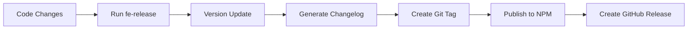
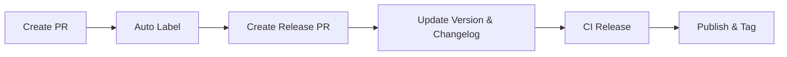

# Fe-release

[](https://www.npmjs.com/package/@qlover/fe-release)
[](https://github.com/qlover/fe-release/blob/main/LICENSE)
[](https://github.com/qlover/fe-release/pulls)

A professional front-end release automation tool built on top of [@changesets/cli](https://github.com/changesets/changesets), providing enhanced workflows for automated PR management and release processes.

## 📚 Table of Contents

- [Features](#features)
- [Installation](#installation)
- [Quick Start](#quick-start)
- [Usage](#usage)
- [Configuration](#configuration)
- [Workflows](#workflows)
- [Troubleshooting](#troubleshooting)
- [Contributing](#contributing)
- [License](#license)

## ✨ Features

- **Automated Version Management**

  - Powered by `@changesets/cli` for reliable version control
  - Automatic version bumping based on changes
  - Configurable version increment strategies
  - Support for Semantic Versioning

- **Flexible Release Workflows**

  - Manual release process for direct control
  - PR-based automated release workflow (GitHub)
  - Customizable release strategies
  - Multi-environment release support (dev, test, prod)

- **GitHub Integration**

  - Automated PR creation and management
  - Smart PR labeling system
  - Automated release notes generation
  - GitHub Actions integration
  - Support for auto-merge and conflict resolution

- **Workspace Support**

  - First-class monorepo support
  - Multi-package release coordination
  - Dependency graph awareness
  - Selective package publishing
  - Support for private package publishing

- **Extensive Configuration**
  - Rich CLI options
  - Configurable via `fe-config.json`
  - Environment variable support
  - Plugin system for customization

## 🚀 Installation

```bash
# Using npm
npm install @qlover/fe-release --save-dev

# Using yarn
yarn add @qlover/fe-release --dev

# Using pnpm
pnpm add @qlover/fe-release -D
```

## 🏃 Quick Start

1. **Basic Release**

```bash
# Create a release PR
fe-release -P

# Preview release (dry run)
fe-release --dry-run

# Release with specific version type
fe-release --changelog.increment=major
```

2. **Workspace Release**

```bash
# Release multiple packages
fe-release --workspaces.change-labels=pkg1,pkg2 -P

# Specify publish directory
fe-release --publish-path=packages/core
```

3. **Environment Release**

```bash
# Release to test environment
fe-release --env=test -P

# Release to production environment
fe-release --env=prod -P
```

## 💻 Usage

### Command Line Interface

```bash
fe-release [options]
```

#### Core Options

| Option                      | Description                         | Default |
| --------------------------- | ----------------------------------- | ------- |
| `-v, --version`             | Show version                        | -       |
| `-d, --dry-run`             | Preview mode without making changes | `false` |
| `-V, --verbose`             | Show detailed logs                  | `false` |
| `-p, --publish-path`        | Package publish path                | -       |
| `-P, --githubPR.release-PR` | Create release PR                   | `false` |
| `--env`                     | Release environment                 | `prod`  |

#### Advanced Options

| Option                           | Description                 | Default                         |
| -------------------------------- | --------------------------- | ------------------------------- |
| `-b, --branch-name`              | Release branch template     | `release-${pkgName}-${tagName}` |
| `-s, --source-branch`            | Source branch               | `master`                        |
| `-i, --changelog.increment`      | Version increment type      | `patch`                         |
| `--changelog.skip`               | Skip changelog generation   | `false`                         |
| `--packages-directories`         | Changed package directories | -                               |
| `-l, --workspaces.change-labels` | Change labels               | -                               |

## ⚙️ Configuration

### Environment Variables

| Variable            | Description            | Default |
| ------------------- | ---------------------- | ------- |
| `FE_RELEASE`        | Enable/disable release | `true`  |
| `FE_RELEASE_BRANCH` | Source branch          | -       |
| `FE_RELEASE_ENV`    | Release environment    | -       |
| `FE_RELEASE_TOKEN`  | GitHub Token           | -       |

### fe-config.json

```json
{
  "release": {
    "publishPath": "",
    "autoMergeReleasePR": false,
    "autoMergeType": "squash",
    "branchName": "release-${pkgName}-${tagName}",
    "PRTitle": "[${pkgName} Release] Branch:${branch}, Tag:${tagName}, Env:${env}",
    "PRBody": "This PR includes version bump to ${tagName}",
    "packagesDirectories": ["packages/*"],
    "githubPR": {
      "commitArgs": ["--no-verify"],
      "pushChangedLabels": true,
      "releaseName": "Release ${name} v${version}",
      "commitMessage": "chore(tag): ${name} v${version}"
    },
    "changelog": {
      "types": [
        { "type": "feat", "section": "#### ✨ Features", "hidden": false },
        { "type": "fix", "section": "#### 🐞 Bug Fixes", "hidden": false },
        { "type": "chore", "section": "#### 🔧 Chores", "hidden": true },
        {
          "type": "docs",
          "section": "#### 📝 Documentation",
          "hidden": false
        },
        {
          "type": "refactor",
          "section": "#### ♻️ Refactors",
          "hidden": false
        },
        { "type": "perf", "section": "#### 🚀 Performance", "hidden": false },
        { "type": "test", "section": "#### 🚨 Tests", "hidden": true },
        { "type": "style", "section": "#### 🎨 Styles", "hidden": true },
        { "type": "ci", "section": "#### 🔄 CI", "hidden": true },
        { "type": "build", "section": "#### 🚧 Build", "hidden": false },
        { "type": "revert", "section": "#### ⏪ Reverts", "hidden": true },
        { "type": "release", "section": "#### 🔖 Releases", "hidden": true }
      ]
    }
  }
}
```

## 🔄 Workflows

### Manual Release Flow



### PR-based Release Flow (GitHub)



## 🔍 Troubleshooting

### Common Issues

1. **Release Skipped**

   ```bash
   Error: Skip Release
   ```

   Solutions:

   - Check `FE_RELEASE` environment variable
   - Verify if there are changes to release
   - Validate package version needs update

2. **PR Creation Failed**

   - Verify GitHub token permissions
   - Check repository access
   - Confirm branch existence
   - Check PR title format

3. **Publish Failed**
   - Confirm npm login status
   - Check for duplicate package names
   - Validate version number format
   - Check network connection

### Debug Mode

Enable verbose logging:

```bash
fe-release -V
```

## 🤝 Contributing

1. Fork the repository
2. Create your feature branch
3. Commit your changes
4. Push to the branch
5. Create a Pull Request

## 📄 License

This project is licensed under the MIT License - see the [LICENSE](LICENSE) file for details.

## 🙏 Acknowledgments

- [@changesets/cli](https://github.com/changesets/changesets) team
- All project contributors

---

For more information, please visit our [documentation](https://qlover.github.io/fe-release).
