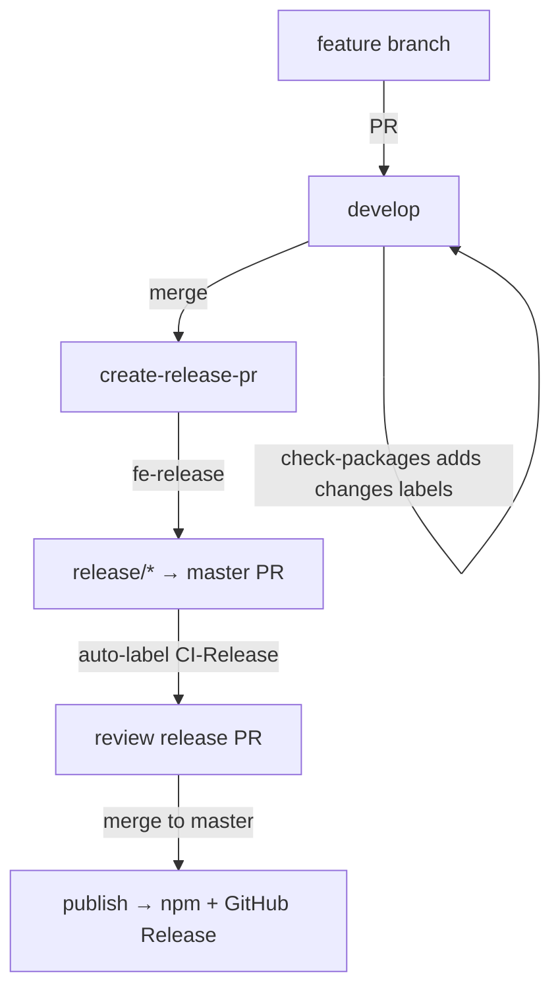

# Fe-release

[](https://www.npmjs.com/package/@qlover/fe-release)
[](https://github.com/qlover/fe-release/blob/main/LICENSE)
[](https://github.com/qlover/fe-release/pulls)

A professional front-end release automation tool built on top of [@changesets/cli](https://github.com/changesets/changesets), providing enhanced workflows for automated PR management and release processes.

## 📚 Table of Contents

- [Features](#features)
- [Installation](#installation)
- [Quick Start](#quick-start)
- [Usage](#usage)
- [Configuration](#configuration)
- [Workflows](#workflows)
- [Troubleshooting](#troubleshooting)
- [Contributing](#contributing)
- [License](#license)

## ✨ Features

- **Automated Version Management**
  - Powered by `@changesets/cli` for reliable version control
  - Automatic version bumping based on changes
  - Configurable version increment strategies
  - Support for Semantic Versioning

- **Flexible Release Workflows**
  - Manual release process for direct control
  - PR-based automated release workflow (GitHub)
  - Customizable release strategies
  - Multi-environment release support (dev, test, prod)

- **GitHub Integration**
  - Automated PR creation and management
  - Smart PR labeling system
  - Automated release notes generation
  - GitHub Actions integration
  - Support for auto-merge and conflict resolution

- **Workspace Support**
  - First-class monorepo support
  - Multi-package release coordination
  - Dependency graph awareness
  - Selective package publishing
  - Support for private package publishing

- **Extensive Configuration**
  - Rich CLI options
  - Configurable via `fe-config.json`
  - Environment variable support
  - Plugin system for customization

## 🚀 Installation

```bash
# Using npm
npm install @qlover/fe-release --save-dev

# Using yarn
yarn add @qlover/fe-release --dev

# Using pnpm
pnpm add @qlover/fe-release -D
```

## 🏃 Quick Start

1. **Create a release PR locally (preview)**

```bash
# Create release PR from develop to master (dry-run)
fe-release -d -V -s master --github.push-change-labels

# Specify version increment
fe-release -i patch -s master
fe-release -i minor -s master
```

2. **Monorepo selective release**

```bash
# Release only packages matching change labels
fe-release -l "changes:packages/fe-release" -i patch -s master

# Specify package directories
fe-release --workspaces.packages-directories packages/fe-release,packages/fe-scripts -i patch
```

3. **Publish only (versions already bumped in release PR)**

```bash
fe-release --changesetVersion.skip-changeset --changesetVersion.mode publish
```

## 💻 Usage

### Command Line Interface

```bash
fe-release [options]
```

#### Core Options

| Option                             | Description                         | Default  |
| ---------------------------------- | ----------------------------------- | -------- |
| `-v, --version`                    | Show version                        | -        |
| `-d, --dry-run`                    | Preview mode without making changes | `false`  |
| `-V, --verbose`                    | Show detailed logs                  | `false`  |
| `-s, --source-branch`              | Target branch for the release PR    | `master` |
| `-i, --changesetVersion.increment` | Version increment type              | `patch`  |

#### Advanced Options

| Option                                           | Description                             | Default                            |
| ------------------------------------------------ | --------------------------------------- | ---------------------------------- |
| `-b, --github.branch-name`                       | Release branch name template            | `release/${repoName}-${releaseId}` |
| `-l, --workspaces.change-labels`                 | Change labels (filter release scope)    | -                                  |
| `--workspaces.packages-directories`              | Package directories to scan             | `find-workspaces`                  |
| `--github.push-change-labels`                    | Attach change labels to release PR      | `false`                            |
| `--github.skip-create-release-pr`                | Skip GitHub PR creation                 | `false`                            |
| `--changesetVersion.mode`                        | `version` / `publish` / `both`          | `version`                          |
| `--changesetVersion.skip-changeset`              | Skip changeset file generation          | `false`                            |
| `--changesetVersion.ignore-non-updated-packages` | Restore dependency-only workspace bumps | `false`                            |

## ⚙️ Configuration

### Environment Variables

| Variable                            | Description                             | Default  |
| ----------------------------------- | --------------------------------------- | -------- |
| `FE_RELEASE`                        | Enable/disable release                  | `true`   |
| `FE_RELEASE_BRANCH`                 | Working branch (set to `develop` in CI) | `master` |
| `FE_RELEASE_ENV`                    | Release environment                     | -        |
| `GITHUB_TOKEN` / `FE_RELEASE_TOKEN` | GitHub Token                            | -        |
| `NPM_TOKEN`                         | npm publish token                       | -        |

### fe-config.json

```json
{
  "release": {
    "workspaces": {
      "packagesDirectories": ["packages"],
      "changePackagesLabel": "changes:${name}"
    },
    "changesetVersion": {
      "changesetRoot": ".changeset",
      "ignoreNonUpdatedPackages": false
    },
    "github": {
      "label": { "name": "CI-Release" },
      "autoMergeReleasePR": false
    }
  }
}
```

Options map to `release.<plugin>.*` in config and `--<plugin>.*` on the CLI.
See `src/cli.ts` and `src/defaults.ts` for the full reference.

## 🔄 Workflows

fe-base uses a **develop → master** two-stage release aligned with CI workflows.

### Branches and phases

```
feature/*  ──PR──►  develop  ──fe-release──►  release/*  ──PR──►  master  ──►  npm
```

| Phase                  | Trigger                                            | CI workflow                         | Tool                                         |
| ---------------------- | -------------------------------------------------- | ----------------------------------- | -------------------------------------------- |
| 1. Feature development | PR targets `develop`                               | `general-check.yml`                 | lint / test / build + `check-packages`       |
| 2. Create release PR | `CI-Release` on merged develop PR (or `workflow_dispatch`) | `release.yml` → `create-release-pr` | `fe-release` (version mode) |
| 3. Publish | Release PR (`release/* → master`) merged | `release.yml` → `publish` | `fe-release` (publish mode, no version bump) |

### Phase 1 — Feature PR (base: `develop`)

1. Branch from `develop`, develop, and commit (Conventional Commits).
2. Open a PR targeting **`develop`**.
3. CI runs quality checks; `check-packages` adds labels for changed packages, e.g.:
   - `changes:packages/fe-release`
   - `changes:packages/fe-scripts`
4. Optional: add `increment:major` / `increment:minor` / `increment:patch` on the PR (default: patch).

### Phase 2 — Create release PR (manual `CI-Release` gate)

After a feature PR is **merged into develop**, add the **`CI-Release`** label on that PR (or add it before merge):

1. The `create-release-pr` job runs (`closed` on merge, or `labeled` when `CI-Release` is added after merge).
2. Checks out `develop`, runs `fe-release` in default **`changesetVersion` version** mode:
   - Generates changelog, updates `CHANGELOG.md`, bumps versions
3. Pushes `release/<repo>-<id>`, opens a PR to **`master`** (auto-labeled `CI-Release`).
4. `changes:*` labels from the feature PR are forwarded to scope the release.

> Merges into `develop` **without** `CI-Release` do **not** create a release PR.

Open feature PRs with **`CI-Release`** skip `general-check`.

### Phase 3 — Publish (merge release PR into master)

1. Review and merge the **release PR** (`release/* → master`) into **`master`**.
2. The `publish` job runs `fe-release --changesetVersion.mode publish`:
   - Does **not** regenerate changelog or bump versions (`skip-changeset`)
   - Tags, npm publish, GitHub Release

### Labels

| Label                     | Source                        | Purpose                                                                         |
| ------------------------- | ----------------------------- | ------------------------------------------------------------------------------- |
| `changes:packages/<name>` | `check-packages` (feature PR) | Marks changed packages; filters release scope                                   |
| `CI-Release` | Manual on merged develop PR (gate); auto on release PR | Triggers version flow; skips general-check; publish on merge to master |
| `increment:*`             | Manual                        | Overrides semver increment strategy                                             |

> Use a single **`CI-Release`** label for release PRs — no separate `Release` label is needed.

### Manual release trigger

Run the **Release sub packages** workflow manually (`workflow_dispatch`) in GitHub Actions
to create a release PR from current `develop` without waiting for a feature merge.

### Flow diagram


```mermaid
graph TD
    A[feature branch] -->|PR| B[develop]
    B -->|check-packages adds changes labels| B
    B -->|merge| C[create-release-pr]
    C -->|fe-release| D[release/* → master PR]
    D -->|auto-label CI-Release| E[review release PR]
    E -->|merge to master| F[publish → npm + GitHub Release]
```

See the module docblock at the top of `src/index.ts` for the full technical reference.

## 🔍 Troubleshooting

### Common Issues

1. **Release Skipped**

   ```bash
   Error: Skip Release
   ```

   Solutions:
   - Check `FE_RELEASE` environment variable
   - Verify if there are changes to release
   - Validate package version needs update

2. **PR Creation Failed**
   - Verify GitHub token permissions
   - Check repository access
   - Confirm branch existence
   - Check PR title format

3. **Publish Failed**
   - Confirm npm login status
   - Check for duplicate package names
   - Validate version number format
   - Check network connection

### Debug Mode

Enable verbose logging:

```bash
fe-release -V
```
