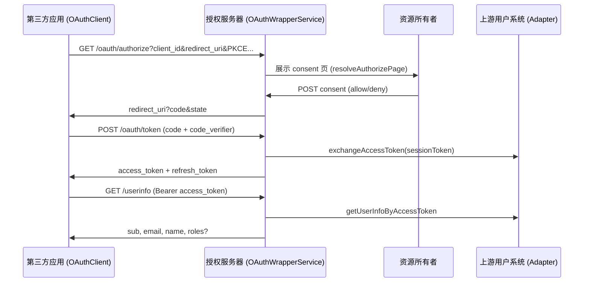

# @qlover/oauth-wrapper

> English: [README_EN.md](./README_EN.md)

与上游登录 API 无关的 **OAuth 2.0 授权服务器协议内核**：授权码流、PKCE、consent 编排、换票、`userinfo` 映射、OAuth Client 管理逻辑。

通过 Port 接口接入任意用户系统（`OAuthUserAdapterInterface`）、持久化（`OAuthWrapperRepositoryInterface`）与会话（`OAuthSessionInterface`）。本包**不包含**具体 Adapter、数据库实现或 Web 框架路由。

## 特性

| 能力        | 说明                                                         |
| ----------- | ------------------------------------------------------------ |
| 授权码流    | 仅支持 `response_type=code`                                  |
| PKCE        | 公开客户端强制 S256；机密客户端可选 PKCE 或 `client_secret`  |
| Token 端点  | `authorization_code` / `refresh_token` 换票                  |
| Token 撤销  | RFC 7009，撤销 middleware 层 `refresh_token`（幂等）         |
| UserInfo    | 将 Adapter 用户资料映射为 `sub` / `email` / `name` / `roles` |
| Client 管理 | 开发者控制台 CRUD、密钥轮换                                  |
| 浏览器 SDK  | `OAuthClient` + `OAuthGateway`，内置 PKCE 会话与回调去重     |

## 安装

```bash
pnpm add @qlover/oauth-wrapper zod
```

`zod` 为 peer dependency（`^3` 或 `^4`），用于请求/响应 Schema 校验。

## 包入口

| 子路径                         | 用途                                               |
| ------------------------------ | -------------------------------------------------- |
| `@qlover/oauth-wrapper`        | 服务端：Services、Utils、Core 再导出               |
| `@qlover/oauth-wrapper/core`   | 共享契约：Port 接口、Zod Schema、RFC 错误码        |
| `@qlover/oauth-wrapper/client` | 浏览器端：`OAuthClient`、`OAuthGateway`、PKCE 工具 |

## 架构概览

```
┌─────────────────────────────────────────────────────────────┐
│                     你的 HTTP 框架层                          │
│          (Next.js Route / Express / 等 — 自行挂载)            │
└──────────────────────────┬──────────────────────────────────┘
                           │
┌──────────────────────────▼──────────────────────────────────┐
│  OAuthWrapperService  │  OAuthTokenService  │ OAuthClientsService │
└──────────┬────────────┴──────────┬───────────┴─────────────────────┘
           │                       │
┌──────────▼──────────┐ ┌─────────▼─────────┐ ┌──────────────────────┐
│ OAuthSessionInterface│ │OAuthUserAdapter   │ │OAuthWrapperRepository│
│ (登录会话)            │ │Interface (上游用户)│ │Interface (持久化)     │
└─────────────────────┘ └───────────────────┘ └──────────────────────┘
```

**设计原则**：协议逻辑与基础设施解耦。你实现三个 Port，组装 Service，再把 HTTP 路由接到任意框架即可。

## 授权码流（服务端 + 浏览器）



## 服务端快速开始

### 1. 实现三个 Port

**`OAuthUserAdapterInterface`** — 对接上游用户/身份系统：

```ts
interface OAuthUserAdapterInterface {
  login(email: string, password: string): Promise<OAuthUserCredentials>;
  exchangeAccessToken(params: {
    token: string;
    lang?: string;
  }): Promise<OAuthUserAccessToken>;
  getUserInfo(sessionToken: string): Promise<OAuthUserProfile>;
  getUserInfoByAccessToken(accessToken: string): Promise<OAuthUserProfile>;
}
```

**`OAuthSessionInterface`** — 授权服务器侧登录会话（consent 前用户必须已登录）：

```ts
type OAuthSessionPayload = {
  userId: number;
  email: string;
  name: string;
  providerSessionToken: string;
};
```

**`OAuthWrapperRepositoryInterface`** — 授权码、refresh token、用户凭证、Client 注册信息持久化（继承 `OAuthClientsRepositoryInterface`）。

### 2. 组装 Services

```ts
import {
  OAuthWrapperService,
  OAuthTokenService,
  OAuthClientsService,
  type OAuthUserAdapterInterface,
  type OAuthWrapperRepositoryInterface,
  type OAuthSessionInterface
} from '@qlover/oauth-wrapper';

const tokenService = new OAuthTokenService(
  tokenEncryption, // EncryptorInterface — 加密 provider refresh_token
  userAdapter,
  oauthRepo
);

const oauthService = new OAuthWrapperService(
  oauthSession,
  userAdapter,
  tokenService,
  oauthRepo
);

const clientsService = new OAuthClientsService(oauthRepo);
```

### 3. 挂载 HTTP 端点

约定路径（可通过 `OAuthWrapperEndpoints` 引用）：

| 方法 | 路径               | Service 方法                  | 说明                                        |
| ---- | ------------------ | ----------------------------- | ------------------------------------------- |
| GET  | `/oauth/authorize` | `resolveAuthorizePage(query)` | 校验参数，返回 consent 页数据               |
| POST | consent 路由       | `processConsent(body)`        | `action: allow \| deny`，返回 `redirectUrl` |
| POST | `/oauth/token`     | `exchangeToken(formFields)`   | `application/x-www-form-urlencoded`         |
| POST | `/oauth/revoke`    | `revokeToken(formFields)`     | RFC 7009，幂等                              |
| GET  | `/userinfo`        | `getUserInfo(bearerToken)`    | `Authorization: Bearer …`                   |

**`processConsent` 请求体**（`OAuthConsentBodySchema`）：

```ts
{
  action: 'allow' | 'deny';
  client_id: string;
  redirect_uri: string;
  scope?: string;
  state?: string;
  code_challenge?: string;       // 与 authorize 一致
  code_challenge_method?: 'S256';
  trust?: boolean;               // 预留，暂未持久化
}
```

**Token 请求**（`OAuthTokenRequestSchema`）支持：

- `grant_type=authorization_code` — 需 `code`、`redirect_uri`、`client_id`；公开客户端需 `code_verifier`，机密客户端无 PKCE 时需 `client_secret`
- `grant_type=refresh_token` — 需 `refresh_token`、`client_id`

授权码 TTL：**5 分钟**。Middleware refresh token TTL：**90 天**（轮换式 refresh，旧 token 使用后即撤销）。

### 4. 错误处理

- 授权页校验失败：`resolveAuthorizePage` 返回 `{ ok: false, error: { errorKey, message } }`，`errorKey` 为 `OAuthRfcCodes` 常量
- Token / UserInfo 失败：抛出 `OAuthWrapperError`（继承 `ExecutorError`），含 RFC `error` 与 HTTP `status`
- Consent 失败：抛出 `ExecutorError`

```ts
import { OAuthRfcCodes, OAuthWrapperError } from '@qlover/oauth-wrapper';

// OAuthRfcCodes: invalid_request, invalid_client, invalid_grant,
// invalid_token, unauthorized_client, invalid_scope, access_denied, …
```

## 浏览器端快速开始

从 `@qlover/oauth-wrapper/client` 导入：

```ts
import { OAuthClient } from '@qlover/oauth-wrapper/client';

const oauthClient = new OAuthClient({
  serverUrl: 'https://auth.example.com',
  clientId: 'your-client-id',
  scope: 'openid profile email',
  redirectPath: 'oauth/callback',
  origin: window.location.origin,
  routerPrefix: '/app', // 可选
  locale: 'en', // 可选，支持 path/query/header
  mapUser: (userinfo, accessToken, refreshToken) => ({
    id: userinfo.sub,
    email: userinfo.email,
    name: userinfo.name
  })
});

// 1. 发起登录（生成 PKCE、state，跳转 authorize）
await oauthClient.startOAuthLogin();

// 2. 回调页处理
const params = oauthClient.parseOAuthCallbackSearchParams(
  new URLSearchParams(window.location.search)
);
const user = await oauthClient.completeOAuthCallback(params);

// 3. 撤销 refresh token（登出时）
await oauthClient.revokeToken(refreshToken);
```

### OAuthClient 核心 API

| 方法                               | 说明                                          |
| ---------------------------------- | --------------------------------------------- |
| `isConfigured()`                   | `serverUrl` + `clientId` 是否就绪             |
| `startOAuthLogin(params?)`         | 保存 PKCE 会话并跳转 authorize                |
| `completeOAuthCallback(params?)`   | 校验 state、换票、拉 userinfo、调用 `mapUser` |
| `parseOAuthCallbackSearchParams()` | 从 URL 解析 `code` / `state` / `error`        |
| `fetchUserInfo(accessToken)`       | 单独拉取 userinfo                             |
| `revokeToken(refreshToken?)`       | POST `/oauth/revoke`                          |
| `getGateway()`                     | 获取底层 `OAuthGateway`                       |
| `patchConfig(partial)`             | 运行时更新配置（如切换 locale）               |

`OAuthGateway` 单独使用时需先通过 `PKCESessionStore` 写入 PKCE 会话；`OAuthClient` 已封装此流程。回调处理内置 **code+state 去重**，避免 React Strict Mode 双调用。

### 配置项（`OAuthClientConfig`）

| 字段                  | 默认                          | 说明                                            |
| --------------------- | ----------------------------- | ----------------------------------------------- |
| `serverUrl`           | `''`                          | 授权服务器根 URL                                |
| `clientId`            | `''`                          | OAuth Client ID                                 |
| `scope`               | `'openid profile email'`      | 授权 scope                                      |
| `redirectPath`        | `'oauth/callback'`            | 回调路径（相对 origin）                         |
| `origin`              | 当前 `window.location.origin` | 用于拼 redirect_uri                             |
| `routerPrefix`        | —                             | 路由前缀（如 `/en`）                            |
| `locale` / `localeIn` | `'en'` / `'path'`             | 多语言：`path` \| `query` \| `header` \| `none` |

PKCE 会话默认存于 `sessionStorage`，键名 `oauth-wrapper-pkcesession`，可通过 `pkceStorage` / `pkceStorageKey` 自定义。

## Client 管理（开发者控制台）

`OAuthClientsService` 提供按 `ownerUserId` 隔离的 CRUD：

| 方法                              | 说明                                       |
| --------------------------------- | ------------------------------------------ |
| `listForOwner(userId)`            | 列出所属 Client                            |
| `getByClientId(userId, clientId)` | 详情                                       |
| `create(userId, input)`           | 创建；机密客户端返回一次性 `client_secret` |
| `update(userId, clientId, input)` | 更新名称、URI、redirect_uris               |
| `rotateSecret(userId, clientId)`  | 轮换密钥（仅 confidential）                |
| `delete(userId, clientId)`        | 删除                                       |

创建/更新 Schema：`OAuthClientCreateSchema`、`OAuthClientUpdateSchema`（`redirect_uris` 支持 HTTPS 与 custom scheme）。

## Core 模块参考

### Services（`@qlover/oauth-wrapper`）

| 类                    | 职责                                                                        |
| --------------------- | --------------------------------------------------------------------------- |
| `OAuthWrapperService` | 授权页解析、`processConsent`、换票/revoke 委托、`getUserInfo`、`logoutUser` |
| `OAuthTokenService`   | Token 端点：校验 client、消费授权码、PKCE、签发 middleware refresh token    |
| `OAuthClientsService` | 开发者控制台 Client 业务逻辑                                                |

### Schema（`@qlover/oauth-wrapper/core`）

| Schema                                     | 用途                              |
| ------------------------------------------ | --------------------------------- |
| `OAuthAuthorizeQuerySchema`                | GET authorize 查询参数            |
| `OAuthConsentBodySchema`                   | Consent POST body                 |
| `OAuthTokenRequestSchema`                  | Token 端点（discriminated union） |
| `OAuthTokenRevokeSchema`                   | Revoke 端点                       |
| `OAuthClientCreateSchema` / `UpdateSchema` | Client 管理                       |
| `OAuthUserInfoResponseSchema`              | UserInfo 响应                     |
| `OAuthTokenResponseSchema`                 | Token 响应                        |

### Utils（服务端）

| 工具                                                             | 说明                       |
| ---------------------------------------------------------------- | -------------------------- |
| `validatePkceParams` / `normalizeQuery` / `isRedirectUriAllowed` | 授权请求校验               |
| `buildOAuthRedirectUrl` / `parseScopeList`                       | Redirect 构建与 scope 解析 |
| `verifyPkceS256` / `isValidCodeChallenge`                        | PKCE S256                  |
| `hashClientSecret` / `verifyClientSecret`                        | Client secret 哈希         |
| `OAuthWrapperError`                                              | 带 HTTP status 的 RFC 错误 |

### Utils（浏览器端 `@qlover/oauth-wrapper/client`）

| 工具                                                                     | 说明               |
| ------------------------------------------------------------------------ | ------------------ |
| `generatePkceVerifier` / `computePkceS256Challenge` / `randomOAuthState` | PKCE 与 CSRF state |
| `buildOAuthAuthorizeUrl` / `buildOAuthRedirectUri`                       | URL 构建           |
| `parseOAuthTokenResponse` / `parseOAuthUserInfoResponse`                 | 响应解析           |
| `PKCESessionStore`                                                       | 会话级 PKCE 存储   |

## Monorepo 示例

| 示例                                                               | 说明                                                                            |
| ------------------------------------------------------------------ | ------------------------------------------------------------------------------- |
| [`examples/next-oauth-wrapper`](../../examples/next-oauth-wrapper) | 完整授权服务器部署：Adapter、Repository、Session、Next.js 路由、开发者控制台 UI |
| [`examples/react-seed`](../../examples/react-seed)                 | 浏览器端 `OAuthClient` 集成（`SeedOAuthClient` + `useOAuthLogin`）              |

## 版本

当前版本见 [package.json](./package.json) 与 [CHANGELOG.md](./CHANGELOG.md)。
