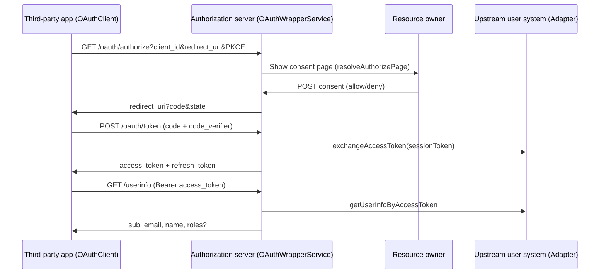

# @qlover/oauth-wrapper

> 中文: [README.md](./README.md)

Provider-agnostic **OAuth 2.0 authorization server core**: authorization code flow, PKCE, consent orchestration, token exchange, userinfo mapping, and OAuth client management.

Integrate any user system via `OAuthUserAdapterInterface`, storage via `OAuthWrapperRepositoryInterface`, and sessions via `OAuthSessionInterface`. This package does **not** ship concrete adapters, databases, or web framework routes.

## Features

| Capability | Description |
| ---------- | ----------- |
| Authorization code flow | `response_type=code` only |
| PKCE | S256 required for public clients; confidential clients may use PKCE or `client_secret` |
| Token endpoint | `authorization_code` / `refresh_token` exchange |
| Token revocation | RFC 7009, revokes middleware-layer `refresh_token` (idempotent) |
| UserInfo | Maps adapter profiles to `sub` / `email` / `name` / `roles` |
| Client management | Developer console CRUD and secret rotation |
| Browser SDK | `OAuthClient` + `OAuthGateway` with PKCE session storage and callback deduplication |

## Install

```bash
pnpm add @qlover/oauth-wrapper zod
```

`zod` is a peer dependency (`^3` or `^4`) used for request/response schema validation.

## Package entry points

| Subpath | Purpose |
| ------- | ------- |
| `@qlover/oauth-wrapper` | Server: Services, Utils, re-exports Core |
| `@qlover/oauth-wrapper/core` | Shared contracts: Port interfaces, Zod schemas, RFC error codes |
| `@qlover/oauth-wrapper/client` | Browser: `OAuthClient`, `OAuthGateway`, PKCE utilities |

## Architecture overview

```
┌─────────────────────────────────────────────────────────────┐
│                     Your HTTP framework layer                │
│          (Next.js Route / Express / etc. — mount yourself)   │
└──────────────────────────┬──────────────────────────────────┘
                           │
┌──────────────────────────▼──────────────────────────────────┐
│  OAuthWrapperService  │  OAuthTokenService  │ OAuthClientsService │
└──────────┬────────────┴──────────┬───────────┴─────────────────────┘
           │                       │
┌──────────▼──────────┐ ┌─────────▼─────────┐ ┌──────────────────────┐
│ OAuthSessionInterface│ │OAuthUserAdapter   │ │OAuthWrapperRepository│
│ (login session)      │ │Interface (upstream)│ │Interface (persistence)│
└─────────────────────┘ └───────────────────┘ └──────────────────────┘
```

**Design principle**: protocol logic is decoupled from infrastructure. Implement the three ports, compose services, and wire HTTP routes in any framework.

## Authorization code flow (server + browser)



## Server quick start

### 1. Implement three ports

**`OAuthUserAdapterInterface`** — connect to your upstream user/identity system:

```ts
interface OAuthUserAdapterInterface {
  login(email: string, password: string): Promise<OAuthUserCredentials>;
  exchangeAccessToken(params: {
    token: string;
    lang?: string;
  }): Promise<OAuthUserAccessToken>;
  getUserInfo(sessionToken: string): Promise<OAuthUserProfile>;
  getUserInfoByAccessToken(accessToken: string): Promise<OAuthUserProfile>;
}
```

**`OAuthSessionInterface`** — authorization-server login session (user must be signed in before consent):

```ts
type OAuthSessionPayload = {
  userId: number;
  email: string;
  name: string;
  providerSessionToken: string;
};
```

**`OAuthWrapperRepositoryInterface`** — persist authorization codes, refresh tokens, user credentials, and registered clients (extends `OAuthClientsRepositoryInterface`).

### 2. Compose services

```ts
import {
  OAuthWrapperService,
  OAuthTokenService,
  OAuthClientsService,
  type OAuthUserAdapterInterface,
  type OAuthWrapperRepositoryInterface,
  type OAuthSessionInterface
} from '@qlover/oauth-wrapper';

const tokenService = new OAuthTokenService(
  tokenEncryption, // EncryptorInterface — encrypts provider refresh_token
  userAdapter,
  oauthRepo
);

const oauthService = new OAuthWrapperService(
  oauthSession,
  userAdapter,
  tokenService,
  oauthRepo
);

const clientsService = new OAuthClientsService(oauthRepo);
```

### 3. Mount HTTP endpoints

Conventional paths (reference via `OAuthWrapperEndpoints`):

| Method | Path | Service method | Description |
| ------ | ---- | -------------- | ----------- |
| GET | `/oauth/authorize` | `resolveAuthorizePage(query)` | Validate params, return consent page data |
| POST | consent route | `processConsent(body)` | `action: allow \| deny`, returns `redirectUrl` |
| POST | `/oauth/token` | `exchangeToken(formFields)` | `application/x-www-form-urlencoded` |
| POST | `/oauth/revoke` | `revokeToken(formFields)` | RFC 7009, idempotent |
| GET | `/userinfo` | `getUserInfo(bearerToken)` | `Authorization: Bearer …` |

**`processConsent` request body** (`OAuthConsentBodySchema`):

```ts
{
  action: 'allow' | 'deny';
  client_id: string;
  redirect_uri: string;
  scope?: string;
  state?: string;
  code_challenge?: string;       // must match authorize request
  code_challenge_method?: 'S256';
  trust?: boolean;               // reserved, not persisted yet
}
```

**Token requests** (`OAuthTokenRequestSchema`) support:

- `grant_type=authorization_code` — requires `code`, `redirect_uri`, `client_id`; public clients need `code_verifier`; confidential clients without PKCE need `client_secret`
- `grant_type=refresh_token` — requires `refresh_token`, `client_id`

Authorization code TTL: **5 minutes**. Middleware refresh token TTL: **90 days** (rotating refresh — old token revoked after use).

### 4. Error handling

- Authorize page validation failure: `resolveAuthorizePage` returns `{ ok: false, error: { errorKey, message } }` where `errorKey` is an `OAuthRfcCodes` constant
- Token / UserInfo failure: throws `OAuthWrapperError` (extends `ExecutorError`) with RFC `error` and HTTP `status`
- Consent failure: throws `ExecutorError`

```ts
import { OAuthRfcCodes, OAuthWrapperError } from '@qlover/oauth-wrapper';

// OAuthRfcCodes: invalid_request, invalid_client, invalid_grant,
// invalid_token, unauthorized_client, invalid_scope, access_denied, …
```

## Browser quick start

Import from `@qlover/oauth-wrapper/client`:

```ts
import { OAuthClient } from '@qlover/oauth-wrapper/client';

const oauthClient = new OAuthClient({
  serverUrl: 'https://auth.example.com',
  clientId: 'your-client-id',
  scope: 'openid profile email',
  redirectPath: 'oauth/callback',
  origin: window.location.origin,
  routerPrefix: '/app', // optional
  locale: 'en', // optional; supports path/query/header
  mapUser: (userinfo, accessToken, refreshToken) => ({
    id: userinfo.sub,
    email: userinfo.email,
    name: userinfo.name
  })
});

// 1. Start login (generate PKCE + state, redirect to authorize)
await oauthClient.startOAuthLogin();

// 2. Handle callback page
const params = oauthClient.parseOAuthCallbackSearchParams(
  new URLSearchParams(window.location.search)
);
const user = await oauthClient.completeOAuthCallback(params);

// 3. Revoke refresh token (on logout)
await oauthClient.revokeToken(refreshToken);
```

### OAuthClient core API

| Method | Description |
| ------ | ----------- |
| `isConfigured()` | Whether `serverUrl` + `clientId` are ready |
| `startOAuthLogin(params?)` | Save PKCE session and redirect to authorize |
| `completeOAuthCallback(params?)` | Validate state, exchange code, fetch userinfo, call `mapUser` |
| `parseOAuthCallbackSearchParams()` | Parse `code` / `state` / `error` from URL |
| `fetchUserInfo(accessToken)` | Fetch userinfo only |
| `revokeToken(refreshToken?)` | POST `/oauth/revoke` |
| `getGateway()` | Access underlying `OAuthGateway` |
| `patchConfig(partial)` | Update config at runtime (e.g. switch locale) |

When using `OAuthGateway` directly, you must write the PKCE session via `PKCESessionStore` first; `OAuthClient` wraps this flow. Callback handling includes **code+state deduplication** to avoid double invocation under React Strict Mode.

### Configuration (`OAuthClientConfig`)

| Field | Default | Description |
| ----- | ------- | ----------- |
| `serverUrl` | `''` | Authorization server base URL |
| `clientId` | `''` | OAuth Client ID |
| `scope` | `'openid profile email'` | Authorization scope |
| `redirectPath` | `'oauth/callback'` | Callback path (relative to origin) |
| `origin` | current `window.location.origin` | Used to build redirect_uri |
| `routerPrefix` | — | Route prefix (e.g. `/en`) |
| `locale` / `localeIn` | `'en'` / `'path'` | i18n: `path` \| `query` \| `header` \| `none` |

PKCE session defaults to `sessionStorage` under key `oauth-wrapper-pkcesession`; customize via `pkceStorage` / `pkceStorageKey`.

## Client management (developer console)

`OAuthClientsService` provides owner-scoped CRUD by `ownerUserId`:

| Method | Description |
| ------ | ----------- |
| `listForOwner(userId)` | List owned clients |
| `getByClientId(userId, clientId)` | Get details |
| `create(userId, input)` | Create; confidential clients return a one-time `client_secret` |
| `update(userId, clientId, input)` | Update name, URI, redirect_uris |
| `rotateSecret(userId, clientId)` | Rotate secret (confidential only) |
| `delete(userId, clientId)` | Delete |

Create/update schemas: `OAuthClientCreateSchema`, `OAuthClientUpdateSchema` (`redirect_uris` supports HTTPS and custom URL schemes).

## Core module reference

### Services (`@qlover/oauth-wrapper`)

| Class | Responsibility |
| ----- | -------------- |
| `OAuthWrapperService` | Authorize page parsing, `processConsent`, token/revoke delegation, `getUserInfo`, `logoutUser` |
| `OAuthTokenService` | Token endpoint: client validation, code consumption, PKCE, middleware refresh token issuance |
| `OAuthClientsService` | Developer console client business logic |

### Schemas (`@qlover/oauth-wrapper/core`)

| Schema | Purpose |
| ------ | ------- |
| `OAuthAuthorizeQuerySchema` | GET authorize query params |
| `OAuthConsentBodySchema` | Consent POST body |
| `OAuthTokenRequestSchema` | Token endpoint (discriminated union) |
| `OAuthTokenRevokeSchema` | Revoke endpoint |
| `OAuthClientCreateSchema` / `UpdateSchema` | Client management |
| `OAuthUserInfoResponseSchema` | UserInfo response |
| `OAuthTokenResponseSchema` | Token response |

### Utils (server)

| Utility | Description |
| ------- | ----------- |
| `validatePkceParams` / `normalizeQuery` / `isRedirectUriAllowed` | Authorize request validation |
| `buildOAuthRedirectUrl` / `parseScopeList` | Redirect building and scope parsing |
| `verifyPkceS256` / `isValidCodeChallenge` | PKCE S256 |
| `hashClientSecret` / `verifyClientSecret` | Client secret hashing |
| `OAuthWrapperError` | RFC errors with HTTP status |

### Utils (browser `@qlover/oauth-wrapper/client`)

| Utility | Description |
| ------- | ----------- |
| `generatePkceVerifier` / `computePkceS256Challenge` / `randomOAuthState` | PKCE and CSRF state |
| `buildOAuthAuthorizeUrl` / `buildOAuthRedirectUri` | URL building |
| `parseOAuthTokenResponse` / `parseOAuthUserInfoResponse` | Response parsing |
| `PKCESessionStore` | Session-scoped PKCE storage |

## Monorepo examples

| Example | Description |
| ------- | ----------- |
| [`examples/next-oauth-wrapper`](../../examples/next-oauth-wrapper) | Full authorization server: Adapter, Repository, Session, Next.js routes, developer console UI |
| [`examples/react-seed`](../../examples/react-seed) | Browser `OAuthClient` integration (`SeedOAuthClient` + `useOAuthLogin`) |

## Version

See [package.json](./package.json) and [CHANGELOG.md](./CHANGELOG.md) for the current version.
